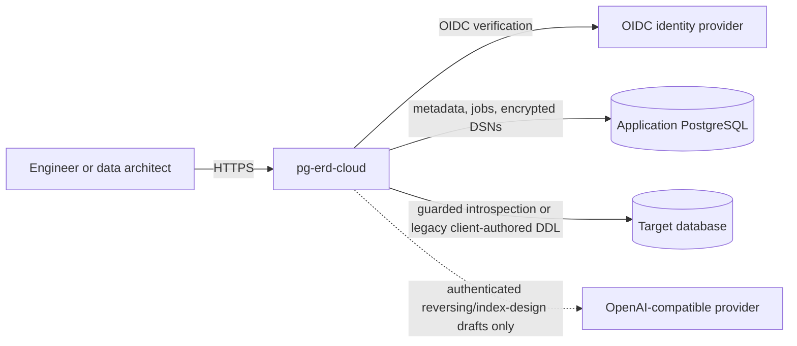
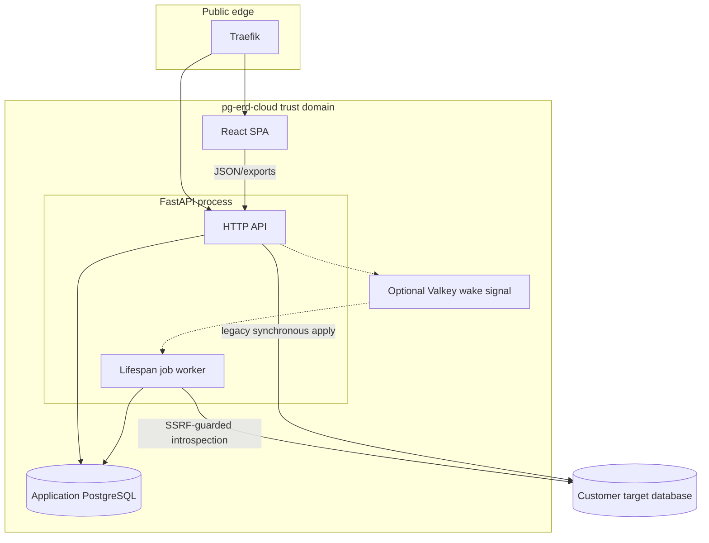

# pg-erd-cloud Architecture

Status date: 2026-08-09
Authority: protected `main` plus explicitly labelled `active_pr` evidence
Default lifecycle labels: `implemented_on_main`, `active_pr`, `planned`,
`research_only`, `downstream`, `deprecated`, and `out_of_scope`

This document is the architectural entry point. It deliberately separates
running behavior from the production Forward Engineering target. A Figma
screen, pull-request body, or planned data model is not evidence that a
capability is shipped.

## System context

The product is independently deployable. Other ContextualWisdomLab services
are optional integrations through versioned HTTP or artifact contracts; they
never share pg-erd-cloud's private tables or credentials.

## Runtime components and deployment units

| Component | Responsibility | Lifecycle | Evidence |
| --- | --- | --- | --- |
| React/Vite SPA | Workspace, ERD canvas, local model editing and exports are the base SPA; the read-only public viewer and Figma-aligned shell are the current change | Base SPA `implemented_on_main`; public viewer and Figma alignment `active_pr` | `frontend/src`, PR #824 |
| FastAPI API | Authentication, authorization, project resources, snapshots, exports and share APIs | `implemented_on_main`; share hardening is `active_pr` | `backend/app/api`, PR #824 |
| FastAPI lifespan worker (in-process) | Each API process starts a worker that claims persistent queued rows with `FOR UPDATE SKIP LOCKED`; no lease/reclaim exists for stranded running work | `implemented_on_main` with recovery gap | `backend/app/main.py`, `backend/app/jobs/worker.py` |
| Application PostgreSQL | Tenant metadata, encrypted target connections, snapshots and job source of truth | `implemented_on_main` | `backend/app/models.py`, Alembic migrations |
| Target connectors | PostgreSQL current path and optional Snowflake extra; MySQL/MariaDB adapter code lacks packaged driver/UI/complete dialect contract | PostgreSQL `implemented_on_main`; MySQL `research_only` | `backend/app/db_introspect.py` |
| Traefik edge | Production-style HTTP routing and edge security headers; TLS termination is external | `implemented_on_main` with deployment requirement | `compose.prod.yaml`, `deploy/traefik` |
| Governed Forward Engineering planner/executor | Versioned model-to-plan compilation, isolated dry-run, approval, apply and convergence proof | `planned` | [ADR-0004](docs/adr/0004-server-authoritative-forward-engineering.md), [TRD](docs/TRD.md) |

## Runtime component model

Valkey is only a wake-up optimization. PostgreSQL remains authoritative for
job state. The current synchronous `/api/connections/{id}/apply-sql` path is
not the target commercial architecture: it accepts client-authored text after
a conservative validator and performs transactional execution against the
target. It does not bind a plan to a stored model revision, durable job,
approval, target fingerprint, statement digest, or convergence result.

## Primary data flows

### Reverse engineering (`implemented_on_main`)

1. An editor stores a target DSN; application code encrypts it before writing
   `db_connection`.
2. Snapshot creation writes `schema_snapshot` and a queued `job_queue` row.
3. A worker claims the job, decrypts the DSN in memory, applies the connector's
   network/SSRF guard, introspects catalog metadata, and writes
   `schema_snapshot_data`.
4. The SPA renders the stored snapshot and may add transient local graph edits.
   Backend DDL/diff/migration/spec artifacts continue to derive from stored
   snapshots; frontend DBML/Mermaid/Prisma/dictionary outputs may derive from
   the current local graph, and `/api/dbml/convert` accepts separate
   design-first input. None is a durable desired-model revision today.

### Public sharing (`active_pr` in PR #824)

1. A project owner creates a bearer share link with a configurable expiry and
   may revoke it early through the authenticated project API.
2. `/share/{id}` loads the public API and renders a read-only ERD.
3. Public APIs return only successful snapshots and redact comments,
   `example_value`, and failure diagnostics.
4. Public callers cannot trigger the paid live-LLM draft path.

### Forward engineering (`planned` target)

The server will persist an editable model revision, compile it and the observed
target fingerprint into an immutable structured plan, dry-run that plan in an
isolated compatible PostgreSQL environment, obtain explicit authorization,
recheck target drift and privileges, execute through a durable serialized job,
and re-introspect to prove semantic convergence. See the [TRD](docs/TRD.md),
[UML](docs/UML.md), and [ERD](docs/ERD.md).

## Trust boundaries and invariants

- Project membership and role checks precede access to connections, snapshots,
  views, annotations, and share creation.
- DSNs and encryption keys never enter logs or public responses. Runtime
  migration from environment-backed settings to a credential registry remains
  `planned` and is tracked in `AGENTS.md`.
- The browser is presentation and editing state, not DDL execution authority.
- Public share links are bearer capabilities and expose a deliberately smaller
  DTO/export surface than authenticated project APIs.
- Public bearer existence and expiry checks use the primary session; optional
  read-replica routing cannot extend a revoked link during replication lag.
- Schema metadata can contain PII or commercially sensitive names. Current
  controls provide authorization, encrypted DSN storage, and selective public
  disclosure. Retention schedules and tamper-evident auditability remain
  planned rather than current product guarantees.
- PostgreSQL DDL can lock, scan, rewrite, or partially commit. A transaction
  followed by rollback is not evidence of harmless production safety.
- New database objects use descriptive two-or-more-word `snake_case` names.
  Legacy single-word columns are inventoried in [ERD](docs/ERD.md) and require
  a compatibility migration rather than an undocumented destructive rename.

## Design authority

The authoritative design file is `csnpEEJfmqFWB0vNUoTkWA`. Its live page
inventory and precedence rules are recorded in
[`docs/ui-ux/figma-contract.md`](docs/ui-ux/figma-contract.md). Concrete screen
nodes override free-standing tokens unless Developer Handoff explicitly maps
the property. Accessibility corrections override visually supplied values that
fail WCAG 2.2.

## Architecture decisions and evidence

- [ADR index](docs/adr/README.md)
- [Product requirements](docs/PRD.md)
- [Technical requirements](docs/TRD.md)
- [API contract and compatibility](docs/API.md)
- [Forward Engineering capability matrix](docs/forward-engineering-support-matrix.md)
- [UML and behavior diagrams](docs/UML.md)
- [Current and target logical ERDs](docs/ERD.md)
- [Threat model](docs/threat-model.md)
- [Test strategy](docs/test-strategy.md)
- [Operations runbook](docs/operations-runbook.md)
- [Release and recovery plan](docs/release-plan.md)
- [Traceability matrix](docs/traceability-matrix.md)
- [Documentation coverage](docs/documentation-coverage-matrix.md)
- [Commercial work-loop automation contract](docs/automation-contract.md)
- [APA 7 references](docs/references.md)
