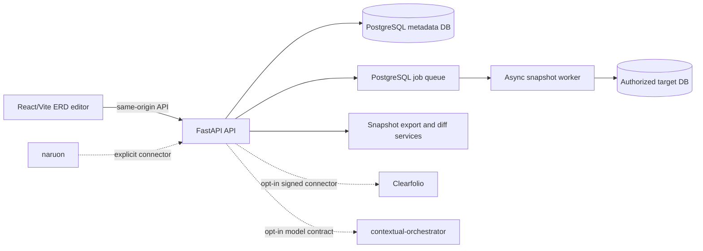

# pg-erd-cloud architecture

## Product boundary

pg-erd-cloud is a standalone PostgreSQL ERD collaboration product. It accepts
an authorized database connection, creates an immutable schema snapshot,
renders and edits an ERD, and exports DDL, DBML, Mermaid, data dictionaries,
Prisma, and reversing specifications. It must run by itself and remain
importable as a module by the ContextualWisdomLab ecosystem.

The product owns ERD projects, members, encrypted connection metadata, schema
snapshots, diagram views, annotations, share links, API keys, and the
PostgreSQL-backed snapshot job queue. It does not own email/PIM knowledge
graphs, document viewing, or general-purpose LLM routing:

- `naruon` owns the knowledge-graph/PIM hub;
- `clearfolio` owns document conversion and viewing;
- `contextual-orchestrator` owns model discovery, routing, and orchestration;
- central `.github` owns reusable review, security, Strix, Noema, and merge
  governance workflows.

## Runtime shape

The frontend is independently buildable. The backend is independently
deployable behind Hypercorn and Traefik. PostgreSQL is the source of truth for
job state; Valkey/Redis is only an optional wake-up signal. Snapshot
introspection never runs synchronously in an HTTP request.

## Data and security decisions

- Ownership and membership remain separate relations. Database objects use
  multi-word `snake_case` names, and migrations are committed with model
  changes.
- Snapshot JSON is immutable evidence, not a reason to call the surrounding
  relational model normalized. A future 3NF/functional-dependency audit must
  document this justified payload exception and any hot-queue partition plan.
- DSNs are encrypted at rest and target connections are guarded against local
  or restricted network targets. Runtime secret/config reads are migrating
  from environment transport to the organization credential registry.
- Share links are read-only, project-scoped, rate-limited, and redact
  sensitive snapshot fields. PII protection is access control, encryption,
  auditability, and least privilege—not indiscriminate masking that stops the
  user's work.

## UI authority

Figma is the visual source of intent. Storybook stories, shared design tokens,
keyboard interaction tests, and browser checks are the executable UI contract.
The live design authority recorded by ADR-0002 is:

- Figma File ID: `csnpEEJfmqFWB0vNUoTkWA`;
- supplemental Figma File ID: `OTN0rBGtnVy0P7y4Iv9Si`.

PR #944 is the current Storybook/design-token inventory lane. It remains
unmerged until its exact-head checks and protected review requirements pass.

## Change authority

Use the product/technical gap baseline and ADR-0002 for release decisions.
Every merge decision requires current-head checks, current review threads,
normal protected-branch semantics, migration proof, and an updated changelog
when the change is release-visible. Research traceability and APA 7 references
live in `docs/doctoring/product-technical-gap-baseline.md`.
