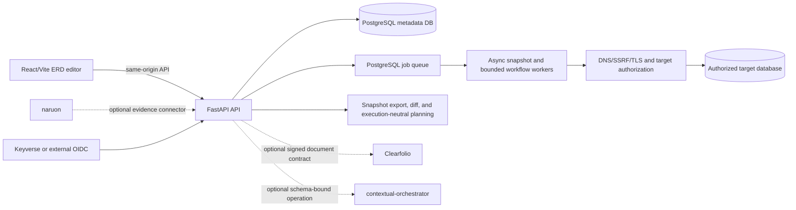
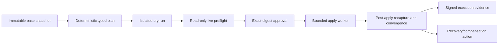

# pg-erd-cloud architecture

## Product boundary

pg-erd-cloud is a standalone PostgreSQL-focused ERD collaboration product. It accepts an authorized database connection, creates an immutable schema snapshot asynchronously, renders and edits an ERD, stores project-scoped views and annotations, computes diffs and migration-risk evidence, and exports DDL, DBML, Mermaid, Prisma, data dictionaries, and reversing specifications.

It must run by itself and remain consumable as a module by the ContextualWisdomLab ecosystem.

### Authority map

pg-erd-cloud owns:

- ERD projects and project membership;
- encrypted connection metadata and target-policy references;
- immutable schema snapshots and snapshot lifecycle metadata;
- diagram views, annotations, and read-only share links;
- API keys issued by this product;
- schema diff/export and migration plan/run evidence;
- its PostgreSQL metadata database and job queue.

It does not own:

- identity credentials, federation, or lifecycle provisioning — `keyverse` or the configured external issuer owns them;
- document conversion/viewing — `clearfolio` owns that runtime;
- provider/model discovery, routing, fallback, or LLM orchestration — `contextual-orchestrator` owns those responsibilities;
- email/PIM/knowledge-graph state — `naruon` owns its control plane;
- organization-wide review, Strix, Noema, security, and merge workflow implementations — central `.github` owns them.

Integrations use explicit, versioned, tenant/purpose/provenance-aware contracts. No CWL service requires direct SQL access to another product's database.

## Deployment profiles

### `single_tenant_managed`

This is the initial GA target defined by ADR-0002 and issue #950:

- one customer organization per deployment and metadata database;
- project-level RBAC inside that organization;
- OIDC organization binding or an explicitly approved local development profile;
- customer/deployer-controlled network, secret, backup, restore, and retention policies;
- optional connectors;
- no cross-customer SaaS claim.

### `multi_tenant_saas`

This profile remains non-GA until #950 proves tenant authority and isolation at every persistence, queue, cache, export, telemetry, connector, encryption, backup/restore, and identity-lifecycle boundary. Project membership alone is not tenant isolation.

## Runtime shape

The frontend is independently buildable. The backend is independently deployable. PostgreSQL is authoritative for job state; Valkey/Redis is only an optional wake-up signal. Snapshot introspection and other long-running operations never execute synchronously inside an HTTP request.

## Data decisions

- Database object names use two-or-more-word `snake_case` unless an external protocol requires a fixed name.
- Ownership, membership, credentials, connections, snapshots, views, annotations, shares, lifecycle facts, and audit facts remain separate normalized relations.
- Snapshot JSON is immutable source evidence. Its presence does not establish that the surrounding model is normalized; #947 owns dependency/3NF evidence and justified JSON exceptions.
- Schema snapshot identity is content- and source-scoped. #948 owns promotion, valid/system time, typed derivations, retention, legal hold, and metadata recovery.
- Queue/event/snapshot growth and hot-key strategies require workload evidence. #951 owns capacity/SLO measurement; #947 owns workload-backed partition assessment.
- Migrations and ORM metadata change together and require real PostgreSQL clean-install and upgrade proof. PR #936/#838 own the current drift repair lane.

## Security decisions

- DSNs are encrypted at rest. Target acquisition enforces authorization plus DNS/SSRF/TLS policy and repeats exact-target validation where the workflow requires it.
- Environment variables or mounted files are explicit bootstrap transports, not the desired unaudited runtime secret authority. #946 owns the credential-provider, rotation, revocation, and DSN re-encryption contract.
- PII/schema metadata must remain usable for authorized work. Protection is achieved through purpose and access policy, least privilege, encryption, controlled disclosure, telemetry/broadcast minimization, retention, and audit—not indiscriminate masking.
- Public share links are read-only, project-scoped, expiring/revocable, separately rate-limited, and must not disclose sensitive snapshot fields or another project's existence.
- LLM output is untrusted proposed content. #952 requires bounded evidence, prompt/model/provenance records, independent grounding verification, and no automatic publication or migration authority.
- Persistent forward-engineering apply remains default-deny and non-GA until #949's sandbox, approval, execution, convergence, and recovery contracts close.

## Forward-engineering maturity

Only the earlier/export and execution-neutral portions are currently implemented or under review. PR #834 contains a large partial foundation. Issue #949 requires bounded stacked PRs and keeps live apply disabled until the whole authority and recovery path is proven.

## UI and design authority

Figma is the source of reviewed visual intent. Shared design tokens, Storybook stories, component/accessibility tests, browser interaction tests, and production code are the executable UI contract. Screenshots are QA evidence only.

The live design identifiers recorded in ADR-0002 are:

- **Figma File ID:** `csnpEEJfmqFWB0vNUoTkWA`
- **Supplemental Figma File ID:** `OTN0rBGtnVy0P7yq4Iv9Si`

PR #944 owns the first Storybook/design-token inventory. Issues #899 and #928 own reusable toolbar action and minimap state work. Figma, Storybook, product requirements, implementation, tests, PRs, and review findings require explicit traceability.

## Operability and performance

- Liveness and dependency-aware readiness are separate contracts.
- OpenTelemetry traces, metrics, and structured logs must preserve operational evidence without DSNs, tokens, document contents, schema values, or uncontrolled high-cardinality labels.
- Queue lag, retry/failure, target acquisition, share abuse, migration attempts, and metadata-database saturation require dashboards and alerts.
- #951 owns large-schema workload profiles, capacity limits, browser/backend SLO evidence, and any measured Rust/WASM/service boundary.
- Rust adoption requires a stable bounded interface, parity fixtures, fuzzing, packaging, cancellation, observability, rollback, and material measured improvement. A language change is not itself a performance or security claim.

## Ecosystem contracts

Issue #952 owns three optional workflows:

1. durable project/snapshot/table reference-document attachment through Clearfolio;
2. evidence-grounded reversing specification through contextual-orchestrator;
3. read-only policy-filtered evidence projection for naruon/context-fabric consumers.

Every connector must support unavailable, access-denied, consent, processing, retry, cancellation, revoked, expired, unsupported, and verified states while preserving standalone operation.

## Change and release authority

- ADR-0002 defines the living baseline and initial GA claim boundary.
- `docs/product-technical-gap-baseline.md` maps current implementation and PRs to issues #946–#953.
- #953 owns release integration, versioning, migration/backup rehearsal, operability, SBOM, SLSA provenance, signed artifacts, and truthful GA/beta/experimental claims.
- PR #943 is the proposed hourly entry point to the central OpenCode review/fix loop. It cannot bypass protected review or merge rules.
- Every merge decision refetches the exact head, required contexts, reviews, unresolved threads, and checks; predecessor evidence is historical only.
- Release-visible changes update `CHANGELOG.md`; a release tag is created only from protected `main` with a complete immutable release manifest.

Research and standards traceability lives in `docs/doctoring/product-technical-gap-baseline.md`.