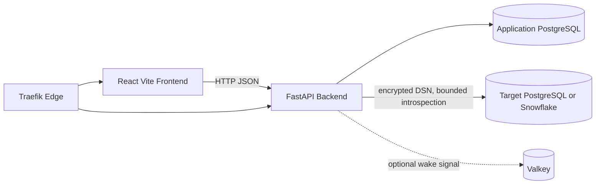

# Architecture

## Product responsibility

`ContextualWisdomLab/pg-erd-cloud` is the PostgreSQL-first ERD collaboration product in the ContextualWisdomLab ecosystem. It owns project-scoped target-database connections, schema snapshots, saved ERD views, annotations, share/export behavior, and asynchronous introspection orchestration. It does not own ecosystem identity-provider implementation, general-purpose LLM routing, or unrelated mathematical/data-science kernels.

## Deployable topology

The application PostgreSQL database is authoritative for product metadata and background-job state. Valkey is an optimization signal only. Long-running introspection is executed asynchronously through the job subsystem.

## Bounded contexts

### ERD Project Collaboration

Core product context. Aggregates include `ProjectSpace`, `SchemaSnapshot`, `DiagramView`, and `TableAnnotation`. `ProjectSpace` membership is the authorization boundary for child resources.

`DiagramView` is identified by `diagram_view_uuid`. Its owned display-name vocabulary is `diagram_name`. The historical HTTP JSON field `name` is retained only as an API compatibility alias; database, ORM, and new Python code use `diagram_name`.

### Target Database Introspection

Supporting context. Provider-specific PostgreSQL/Snowflake metadata is translated into the repository-owned snapshot representation before product/export logic consumes it. Target databases remain outside the application aggregate boundary.

### Background Job Processing

Supporting context. PostgreSQL `job_queue` rows are authoritative. Worker claims must preserve transaction/locking semantics, including the existing `FOR UPDATE SKIP LOCKED` path. Any queue-schema naming repair must update raw SQL, ORM, indexes, retry state, and operational migration evidence together.

### Identity and Access

Generic/supporting context. OIDC/API-key principals are translated into project membership/role decisions. External identity vocabulary is an anti-corruption boundary rather than the product's core domain model.

## Persistence rules

Organization-owned database objects use semantically specific multiword snake_case where the bounded context provides a qualifier. Existing migration history is immutable; schema repairs are appended as new Alembic revisions.

The `diagram_view.name` → `diagram_view.diagram_name` migration is a metadata rename with no row rewrite. PostgreSQL may require an `ACCESS EXCLUSIVE` table lock for `ALTER TABLE`; revision `0008_diagram_view_semantic_name` bounds acquisition wait with a transaction-local five-second `lock_timeout`. Deployments must drain mixed-version backends before applying that rename because historical processes issue SQL against `name`. Downgrade reverses the catalog name.

The rename does not change 3NF, partitioning, indexes, UPSERT behavior, or read/write database topology. `diagram_view` has no UPSERT path in the current API.

## API compatibility

FastAPI/Pydantic is the explicit adapter between organization-owned semantic names and stable customer wire contracts. For Saved Diagram View, `diagram_name` is authoritative internally while alias `name` preserves existing frontend/client JSON. New code must not treat the compatibility alias as the domain term.

## Security and operability

- Target DSNs are encrypted before persistence and must not be logged.
- Project membership checks precede project-owned reads/writes; missing and unauthorized resources use uniform responses where required to prevent existence enumeration.
- Public share/export paths remain read-only and redacted.
- Runtime configuration/secrets are intended to migrate to the organization credential/KV registry; current environment-backed settings remain a documented gap.
- Alembic migrations are applied before backend startup and must accompany model changes.
- Required GitHub security, dependency, coverage, review, and CI gates are merge authority; findings are repaired rather than suppressed.

## Testing contract

Backend typing/tests and frontend typecheck/tests/build run under repository CI. Public definitions are expected to retain 100% docstring coverage. Contract-affecting naming changes require tests that demonstrate both the semantic internal name and any retained compatibility wire alias. Persisted-name changes require migration/rollback/locking analysis.

## Traceability

Product/DDD/gap status is indexed in `docs/product-technical-gap-baseline.md`. Naming/migration rationale and operational evidence for Saved Diagram View is recorded in `docs/doctoring/diagram-view-semantic-identifiers.md`. User-visible release evidence is recorded in `CHANGELOG.md`.
