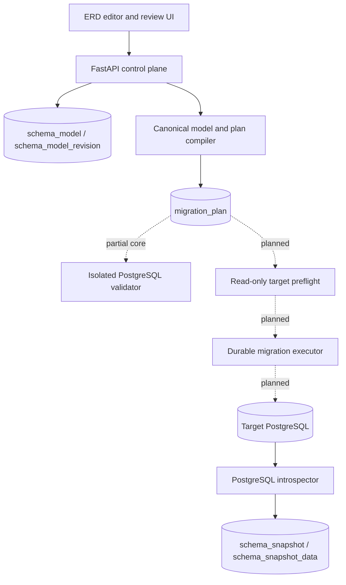

# pg-erd-cloud Architecture

## Status legend

- **Implemented**: present in production source and covered by repository tests.
- **Partial**: a safe bounded subset exists; unsupported behavior fails closed.
- **Planned**: approved design only; the product must not claim runtime support.

## Bounded contexts

Solid arrows are current control-plane or reverse-engineering paths. Dotted
arrows are accepted target architecture and do not claim deployed runtime
support.

## Component status

| Component | Responsibility | Status |
|---|---|---|
| React/Vite ERD editor | Snapshot visualization, editing, export | **Implemented existing product**; typed browser transport is **Partially implemented** for immutable plan retrieval, exact dry-run/apply intent creation, run polling, and version-bound cancellation; the plan review panel is **Partially implemented** as a read-only provenance/risk/blocker/statement surface with no action authority; fixed loading/error/retry behavior and stale-response suppression is **Partially implemented** around exact plan retrieval; the Forward Engineering modal shell is **Partially implemented** with dialog focus/Escape/restoration behavior and one bounded dry-run intent action; the dry-run intent control is **Partially implemented** with server `can_dry_run`/blocker gating, exact plan digest submission, single-flight protection, and same-key ambiguous-failure retry, but it adds no browser SQL, target credential, worker, or apply authority; the apply intent control is **Partially implemented** with exact passed-dry-run/plan/base binding, typed target confirmation, conditional destructive acknowledgement, single-flight protection, and immutable-body same-key retry, but the server persists only a non-dispatched intent; the run status and audit panel is **Partially implemented** as an optional read-only exact-run view that announces state and renders verified event-chain metadata without rendering generic evidence payloads; sequential terminal-aware polling is **Partially implemented** and stops after the first terminal response; the cancellation intent control is **Partially implemented** for non-terminal exact state versions with single-flight submission, accepted-state refresh, and refresh-only handling of ambiguous results; Forward UI remains **Planned** |
| FastAPI control plane | Auth, tenancy, revisions, plan creation | **Partially implemented** |
| Canonical model/compiler | Validate, hash, compile operations/blockers | **Implemented for narrow v1 subset** |
| Metadata PostgreSQL | Snapshots, models, revisions, plans, jobs | Phase 1 entities, run/event/outbox storage, verified polling, dry-run creation/cancellation acknowledgement, terminal no-replay settlement, lease-bound hashed worker-attempt primitives, and the exact dual-lease adapter **Implemented**; application worker wiring **Planned** |
| Isolated PostgreSQL validator | Exact-plan executable dry run | Signed-plan/version/base/transaction/convergence execution core and `complete_isolated_dry_run` server-derived success CAS **Partially implemented**; provisioning, dependency materialization, isolation proof, cleanup, and worker **Planned** |
| Live preflight/apply worker | Read-only evidence, locked execution, recovery | Bounded structured read-query, canonical snapshot/base-digest comparison, DB-durable hashed attempt acquire/renew/finish primitives, deterministic structured existing-table lock-plan compilation, and a signed-plan pre-apply revalidation manifest are **Implemented**; `execute_bound_live_preflight` binds a caller-owned capture callback and checks to one read-only repeatable-read transaction, and `complete_live_preflight` derives the only valid terminal CAS classification. Consumer-to-attempt binding is **Implemented** as an execution-neutral dual-lease adapter. The manifest binds exact plan/base/target/version metadata to lock targets, structured database `CREATE`/schema `CREATE`/table `OWNER` requirements, checks, and zero/no-op or one ordered all-transactional segment. Fixed parameterized privilege-probe compilation and pure observation assessment are **Implemented** input boundaries; the latter rejects incomplete or positionally mismatched caller evidence and derives only non-authorizing booleans. They parse no rendered SQL, open no target connection, and acquire no lock; the manifest checks no target privilege. Application startup wiring, credential binding, worker execution, target lock acquisition, observation freshness/connection proof, apply-time revalidation, transaction execution/rollback proof, and apply remain **Planned**. |
| External target PostgreSQL | Reverse source and future apply target | Reverse **Implemented**; target apply workflow **Planned** |

Modal orchestration keeps one active run audit identity: an accepted dry-run
replaces the supplied run surface for that open session, while closing and
reopening the modal discards the session-created identity and restores the
caller-supplied run. This avoids duplicate polling/live regions without making
the browser an execution authority.

The browser is an intent and review surface, never a SQL authority. The API
persists immutable model revisions. The compiler validates a deliberately small
PostgreSQL 14–18 model, renders a structured transactional plan, associates
each statement with dependencies, privileges, preconditions and operational
risk, and binds the plan to an exact model revision, connection and succeeded
snapshot. Mixed-case, Unicode, reserved-word and quoted identifiers are
preserved and quoted server-side.

## Current implementation boundary

Implemented in the initial safe vertical slice:

- optimistic versioned model persistence using a strong revision-UUID `ETag`
  and `If-Match` token (the content digest remains separate);
- canonical model hashing independent of OIDs and capture timestamps;
- immutable server-side plans for schemas, tables, columns, nullability, types
  and creation-time primary keys;
- explicit risk, lock, rewrite/scan/data-loss, privilege and precondition data;
- one read-only repeatable-read catalog snapshot with an explicit capability
  contract version, plus a strict adapter/compiler that reject stale or lossy input;
- optimistic compare-and-swap run transitions that update one exact state
  version and append the matching sanitized evidence event in the caller's
  transaction; dry-run `passed`/`drifted` transitions revalidate immutable plan
  integrity, require the canonical observed base digest, enforce match/mismatch
  semantics, and persist that digest on both the run and chained event;
- an internal PostgreSQL conflict-winner writer that creates or reuses one
  exact, unexpired, executable dry-run intent and atomically persists its
  sequence-one event plus identifier-only dispatch outbox;
- an editor-authorized `POST /api/migration-plans/{plan_uuid}/dry-runs`
  boundary that requires the exact reviewed digest and bounded
  `Idempotency-Key`, then returns only the queued durable identity without
  publishing the outbox or signaling a worker;
- a deployer-authorized `POST /api/migration-plans/{plan_uuid}/apply-runs`
  boundary that binds an exact immutable plan, same-plan passed dry run and
  observed base, typed target connection name, actor, idempotency key, and the
  exact destructive-confirmation requirement into a queued durable intent and
  hash-chained genesis event; it deliberately creates no dispatch, worker
  signal, credential access, SQL execution, or DDL authority;
- apply-intent creation locks the plan's schema-model row `FOR UPDATE` and
  rejects `stale_revision` unless the plan-bound revision UUID, number, digest,
  model, and project still match the current exact authority;
- lock-scoped relay primitives that claim one due dispatch with
  `FOR UPDATE SKIP LOCKED`, increment its attempt in the caller-owned
  transaction, publish only `migration_run_uuid` to a dedicated Valkey sorted
  set, and publish-state CAS only that exact identifier-only claim;
- an explicit opt-in application lifecycle repeatedly invokes that bounded
  publisher in one fresh metadata transaction per claim, rolls failed
  publication back, idles at a positive configured interval, and shuts down
  cooperatively; it does not load plans, consume signals, or execute SQL;
- UUID-only ready signals can be atomically moved to an isolated processing
  set with a bounded exact lease-token, renewable only before expiry, reclaimed
  after expiry, acknowledged only by the current token, or released for a
  scheduled retry. These are
  execution-neutral consumer contract and consumer-safety primitives only: no
  application consumer lifecycle or migration worker exists;
- DB-durable `migration_run_attempt` history serializes acquisition on the run,
  stores only SHA-256 hashes of bounded worker identity and the opaque signal
  lease token, permits one active attempt per run, reclaims only expired owners,
  renews monotonically by exact CAS while the run remains executable, and
  finishes only an unexpired exact owner. Consumer-to-attempt binding is
  **Implemented** by an execution-neutral dual-lease adapter, but no application
  startup task, credential, sandbox, target, or DDL authority exists;
- same-state, version-incrementing cancellation intent that forces a worker to
  observe cancellation before its next CAS transition can win;
- metadata-only terminal cancellation acknowledgement after a failed attempt
  acquisition locks and reloads the run, requires the persisted intent, and
  records `cancelled` before exact signal acknowledgement; already-terminal
  redelivery is settled without replaying sandbox or live preflight;
- an editor-authorized `POST /api/migration-runs/{run_uuid}/cancel` boundary
  that binds the exact state version, actor, and request correlation identity
  to that cancellation event and returns only stable sanitized error codes;
- a versioned SHA-256 event chain anchored on each run row; polling recomputes
  every link and fails closed on payload, ordering, predecessor, or anchor drift;
- a bounded live-preflight primitive compiles only the plan's structured
  `table_is_empty`, `no_null_values`, and `castable_values` preconditions into
  quoted PostgreSQL reads, executes them in one read-only repeatable-read
  transaction with server/client timeouts, and returns boolean-only evidence;
  `execute_bound_live_preflight` additionally runs a caller-owned fresh
  snapshot callback and those checks in the same read-only repeatable-read
  transaction, returning the canonical observed digest and plan-base match;
  `complete_live_preflight` accepts only that exact bounded result shape and
  derives `drifted`, `failed`, or `passed` plus bounded aggregate evidence for
  the existing durable CAS; neither function owns credentials, application
  worker wiring, or DDL authority;
- an execution-only isolated-dry-run primitive accepts no DSN or browser SQL,
  verifies the immutable plan/compiler/PostgreSQL-major/base bindings, executes
  only the compiler-owned all-transactional statement list with bounded
  timeouts, rolls failures back with fixed diagnostics, and requires a fresh
  strict snapshot to equal `target_digest`; PostgreSQL 14–18 CI supplies the
  real catalog round trip. `complete_isolated_dry_run` accepts only that exact
  success shape, revalidates it against the stored plan, and derives the fixed
  `live_preflight_running` CAS; sandbox provisioning, dependency
  materialization, network isolation, cleanup, and worker wiring remain absent;
- `viewer < editor < deployer < owner`, with persistent legacy SQL apply
  restricted to `deployer`.

Partial: the current compiler rejects foreign keys, indexes, defaults,
identity/generated columns, existing-primary-key changes, views, triggers,
partitions, extensions and distributed tables. This is a release blocker for
general forward engineering, not a silent omission.

Consumer-to-attempt binding is **Implemented** without execution authority.
Planned: isolated sandbox lifecycle, application startup wiring, deployed
in-flight process cancellation, and worker execution,
live-preflight credential binding around the durable attempt, plan approval,
idempotent apply, post-commit re-introspection, and the complete accessible
frontend apply/recovery flow. The caller-owned same-transaction snapshot
primitive is **Implemented** without credential or worker authority. The approved detailed design is in
`docs/superpowers/specs/2026-08-09-forward-engineering-design.md`.

## Trust and deployment boundaries

- Application PostgreSQL stores control-plane metadata; it must never be used
  as the DDL sandbox.
- Target credentials remain encrypted and are decrypted only inside guarded
  connection paths. Plans and queue payloads store identifiers and digests,
  never DSNs.
- The isolated validator must have no route or credentials to production.
- Live target operations retain SSRF target validation, verified TLS where
  configured, bounded timeouts and deterministic `search_path` handling.
- Other ContextualWisdomLab services integrate through versioned APIs; they do
  not share database ownership or bypass project authorization.

## References

Authoritative detail: [PRD](docs/PRD.md), [TRD](docs/TRD.md),
[ADR index](docs/adr/README.md), [v1 contract](docs/contracts/forward-engineering-v1.md),
[UML](docs/UML.md), and [metadata ERD](docs/DATA_MODEL.md). The
[Figma FigJam board](https://www.figma.com/board/MLWimuWoOWhatQ239QihfP) is a
non-authoritative visual companion.

PostgreSQL Global Development Group. (2026). *PostgreSQL 18 documentation:
Explicit locking*. https://www.postgresql.org/docs/18/explicit-locking.html

PostgreSQL Global Development Group. (2026). *PostgreSQL 18 documentation:
Transactions*. https://www.postgresql.org/docs/18/tutorial-transactions.html

Rae, I., Rollins, E., Shute, J., Sodhi, S., & Vingralek, R. (2013). Online,
asynchronous schema change in F1. *Proceedings of the VLDB Endowment, 6*(11),
1045–1056. https://doi.org/10.14778/2536222.2536230

Research applicability and limits are recorded in
[Standards and evidence](docs/STANDARDS.md#research-use-and-limits).
