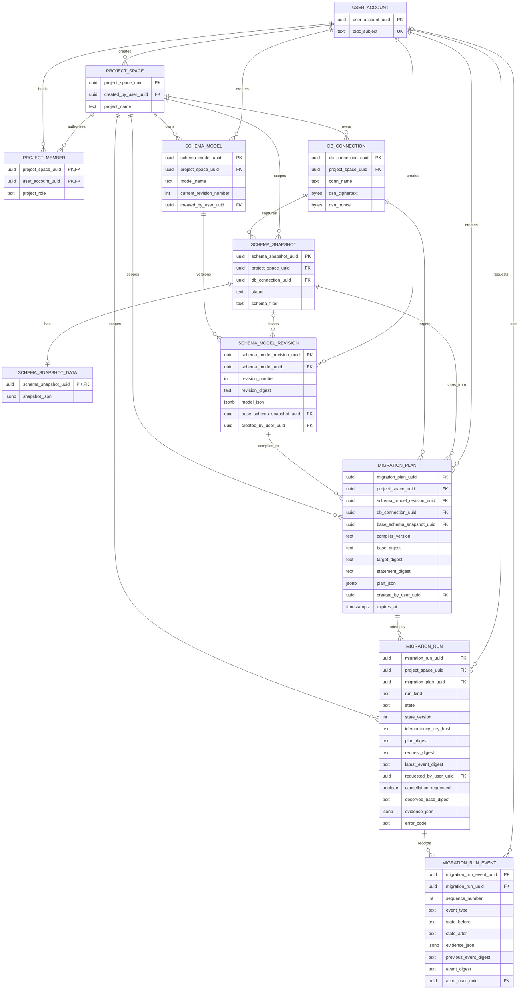
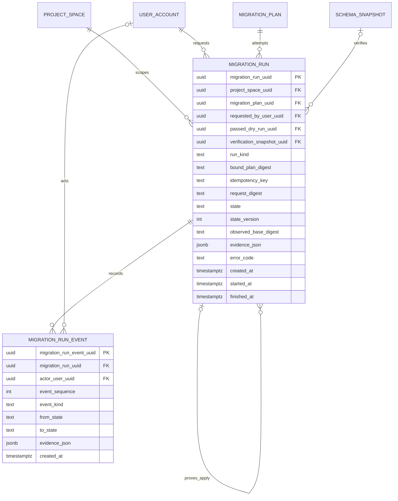

# Forward Engineering Data Model

- **Document status:** Current physical model plus accepted planned extension
- **Runtime status:** Partially implemented; not production-ready
- **Last reconciled with ORM and Alembic:** 2026-08-10

Repository migrations, ORM definitions, and the Mermaid ERDs below are
authoritative. The
[FigJam companion board](https://www.figma.com/board/MLWimuWoOWhatQ239QihfP)
is non-authoritative and exists to support visual review.

## Status legend

| Label | Meaning |
|---|---|
| **Implemented** | Table and foreign key exist in `backend/app/models.py` and Alembic. |
| **Partially implemented** | Physical storage exists, but a stronger invariant is enforced only by application code or is not yet enforced. |
| **Planned** | Accepted logical entity or relationship; no table or ORM class exists. |
| **Rejected** | Deliberately not stored or not accepted in this boundary. |

## Implemented metadata ERD

The diagram shows the implemented forward-engineering ownership and provenance
slice. It intentionally omits unrelated saved views, annotations, shares, API
keys, revoked tokens, and the generic queue.

### Implemented key and deletion semantics

| Child foreign key | Parent | Nullable | On parent delete | Implemented cardinality |
|---|---|---:|---|---|
| `project_member.project_space_uuid` | `project_space` | no | `CASCADE` | Each membership has exactly one project; a project has zero or more memberships at the database boundary. |
| `project_member.user_account_uuid` | `user_account` | no | `CASCADE` | Each membership has exactly one user; a user has zero or more memberships. |
| `db_connection.project_space_uuid` | `project_space` | no | `CASCADE` | Each connection belongs to one project; a project has zero or more connections. |
| `schema_snapshot.project_space_uuid` | `project_space` | no | `CASCADE` | Each snapshot is scoped to one project; a project has zero or more snapshots. |
| `schema_snapshot.db_connection_uuid` | `db_connection` | no | `CASCADE` | Each snapshot came from one connection; a connection has zero or more snapshots. |
| `schema_snapshot_data.schema_snapshot_uuid` | `schema_snapshot` | no; also PK | `CASCADE` | A snapshot has zero or one data row; each data row belongs to exactly one snapshot. |
| `schema_model.project_space_uuid` | `project_space` | no | `CASCADE` | Each model belongs to one project; a project has zero or more models. |
| `schema_model_revision.schema_model_uuid` | `schema_model` | no | `CASCADE` | Each revision belongs to one model; a model has zero or more revisions physically. Current APIs create the model with revision 1 atomically. |
| `schema_model_revision.base_schema_snapshot_uuid` | `schema_snapshot` | yes | `RESTRICT` | A revision has zero or one base snapshot; a snapshot can base zero or more revisions. |
| `migration_plan.project_space_uuid` | `project_space` | no | `CASCADE` | Each plan is scoped to one project; a project has zero or more plans. |
| `migration_plan.schema_model_revision_uuid` | `schema_model_revision` | no | `RESTRICT` | Each plan compiles one revision; a revision can produce zero or more plans. |
| `migration_plan.db_connection_uuid` | `db_connection` | no | `RESTRICT` | Each plan targets one connection; a connection can have zero or more plans. |
| `migration_plan.base_schema_snapshot_uuid` | `schema_snapshot` | no | `RESTRICT` | Each plan binds one base snapshot; a snapshot can base zero or more plans. |
| `migration_run.project_space_uuid` | `project_space` | no | `CASCADE` | Each durable run is scoped to one project; a project has zero or more runs. |
| `migration_run.migration_plan_uuid` | `migration_plan` | no | `RESTRICT` | Each durable run attempts one immutable plan; plan deletion is blocked while evidence remains. |
| `migration_run.requested_by_user_uuid` | `user_account` | no | `NO ACTION` | Each run records one requesting actor. |
| `migration_run_event.migration_run_uuid` | `migration_run` | no | `CASCADE` | Each event belongs to one run; approved run deletion removes its event sequence atomically. |
| `migration_run_event.actor_user_uuid` | `user_account` | yes | `NO ACTION` | Worker events may be system-authored; human actions retain an actor. |

All `created_by_user_uuid` columns shown are non-null foreign keys to
`user_account` with the database default delete behavior (`NO ACTION`).

### Physical invariants and application invariants

| Invariant | Enforcement | Status |
|---|---|---|
| Model name is unique inside a project. | Database unique constraint on `(project_space_uuid, model_name)`. | Implemented |
| Revision number is unique inside a model. | Database unique constraint on `(schema_model_uuid, revision_number)`. | Implemented |
| A model revision is immutable. | No update route; application convention. There is no database trigger preventing update. | Partially implemented |
| `current_revision_number` names an existing revision of the same model. | Current API transaction and row lock. No physical FK can express the composite pointer as modeled. | Partially implemented |
| Plan project, revision project, connection project, and snapshot project match; the snapshot came from that exact connection and succeeded. | `app.api.migration_plans.create_migration_plan` before insert. | Implemented in the API; not a database constraint |
| Plan SQL and execution fields cannot change. | No current update route. There is no database immutability trigger. | Partially implemented |
| Expired plans cannot execute. | Expiry is stored, but run creation/execution does not exist. | Planned |
| Secrets or raw SQL never appear in run evidence. | `canonicalize_run_evidence` recursively rejects SQL, DSN, password, secret, token, and credential field tokens and bounds depth, items, strings, and total JSON bytes. | Implemented at the evidence-construction boundary; all writers must use it |
| Duplicate run requests select one durable identity. | Unique `(project_space_uuid, run_kind, idempotency_key_hash)` plus separately persisted `request_digest`; the internal PostgreSQL conflict-winner writer reuses only the same request and rejects different reuse. | Implemented internal dry-run writer; HTTP mapping Planned |
| Run/event state tokens, sequence numbers, and digest links are valid. | Database checks plus exact application transition graph; the CAS writer matches UUID, kind, state, state version, and prior event anchor before appending the same-version event; event sequence is unique per run and polling recomputes every canonical digest. | Implemented persistence and polling boundary; workers Planned |

`migration_plan.statement_digest` stores the compiler's current `plan_digest`.
It is provenance, not a database idempotency key: the same logical SQL may be
planned for different targets or recreated after expiry.

`migration_plan.plan_json` separates executable `statements` from
`proposed_statements`. When any blocker exists, `statements` is empty and
`proposed_statements` retains independently supported deltas as review-only
evidence. `risk_summary` and `requires_destructive_confirmation` are computed
over all proposals, so a blocked plan can still disclose destructive risk. A
future executor must reject blocked plans and must never promote proposals to
execution input.

## Physical run foundation — Implemented

`migration_run` and `migration_run_event` now exist in the ORM and Alembic
revision `0010_migration_run` with the fields shown in the implemented ERD
above. The logical diagram below retains accepted **Planned extensions** such
as passed-dry-run and verification-snapshot references. Those extension fields
do not exist physically and must not be inferred from the implemented tables.

Planned foreign-key and cardinality rules:

| Child foreign key | Parent | Nullable / conditional rule | Target deletion and cardinality |
|---|---|---|---|
| `migration_run.project_space_uuid` | `project_space` | non-null | `RESTRICT`; every run has one project, and a project has zero or more runs. |
| `migration_run.migration_plan_uuid` | `migration_plan` | non-null | `RESTRICT`; every run attempts one immutable plan, and a plan has zero or more dry-run/apply attempts. |
| `migration_run.requested_by_user_uuid` | `user_account` | non-null | `RESTRICT`; every run has one requesting actor, and a user can request zero or more runs. |
| `migration_run.passed_dry_run_uuid` | `migration_run` | null for dry runs; required for apply and must reference a `passed` run for the same plan/digest | `RESTRICT`; one passed dry run can prove zero or more apply requests until evidence becomes stale. |
| `migration_run.verification_snapshot_uuid` | `schema_snapshot` | null until verification; required for `verified` | `RESTRICT`; a run has zero or one verification snapshot, and a snapshot can be referenced by zero or more runs physically. The service must create a dedicated snapshot per apply run. |
| `migration_run_event.migration_run_uuid` | `migration_run` | non-null | `CASCADE` only if a separately approved retention deletion removes the run; every event has one run, and a run has zero or more events at insert time. |
| `migration_run_event.actor_user_uuid` | `user_account` | nullable for worker/system transitions | `RESTRICT`; an event has zero or one human actor, and a user can act in zero or more events. |

Additional **Planned** invariants:

- Run creation and queue insertion are atomic; the queue payload contains only
  `migration_run_uuid`.
- One database uniqueness rule plus `request_digest` implements idempotency:
  identical reuse returns the original run, while different effective input
  returns `409`.
- State changes compare-and-swap `state_version`; events are append-only and
  ordered uniquely by `(migration_run_uuid, event_sequence)`.
- Project, plan, dry-run evidence, target connection, and verification
  snapshot tenancy must agree. Conditional state invariants require service
  transactions and database constraints where PostgreSQL can express them.
- Event/evidence JSON contains bounded identifiers, digests, counts, durations,
  and sanitized diagnostics only. DSNs, decrypted secrets, SQL batches, and
  sampled row values are **Rejected**.

## Related authority

- [Forward-engineering v1 contract](contracts/forward-engineering-v1.md)
- [UML and state machines](UML.md)
- [ADR-0004: durable runs and recovery](adr/ADR-0004-durable-runs-and-recovery.md)
- [Threat model](security/forward-engineering-threat-model.md)
- [Operational runbook](runbooks/forward-engineering.md)
