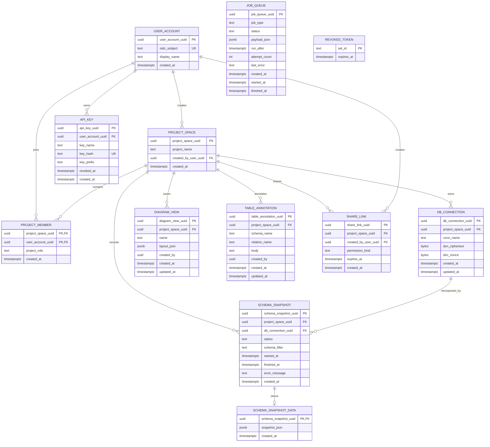
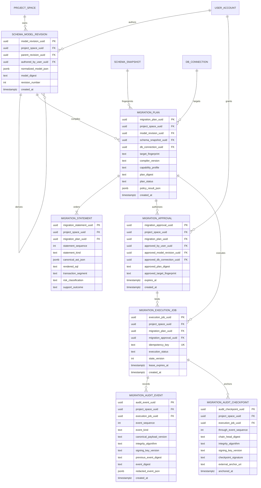

# Logical Entity-Relationship Models

Status date: 2026-08-09
Authority: ORM plus Alembic for current state; ADR-0004 for planned state

This is a logical model, not a substitute for inspecting the exact migration
chain. Relationships shown as solid edges have declared foreign keys. Payload
references inside `job_queue.payload_json` are deliberately not drawn as
relational integrity.

## Current application model (`implemented_on_main`)

### Current integrity notes

- `schema_snapshot` redundantly stores both project and connection. API and job
  code must keep those scopes consistent; the database has no composite
  foreign key proving that the connection belongs to the same project.
- `diagram_view.created_by` and `table_annotation.created_by` are UUID values
  without foreign-key constraints.
- `job_queue.payload_json` refers to domain UUIDs without relational foreign
  keys; handlers perform validation.
- ORM declarations use PostgreSQL `JSONB`, while some historical migrations use
  generic `JSON`; physical drift must be reconciled in a forward migration,
  never by rewriting applied migration history.
- PR #824's public share reads a successful `schema_snapshot_data` payload. It
  does not share `diagram_view`, `table_annotation`, or an immutable edited
  model revision.

## Naming-policy inventory

All current table names contain at least two descriptive snake-case tokens.
Four legacy columns violate the two-or-more-word column rule, and two creator
columns are semantically under-specified:

| Current column | Planned compatibility name | Reason |
| --- | --- | --- |
| `schema_snapshot.status` | `snapshot_status` | Single-token legacy name |
| `job_queue.status` | `job_status` | Single-token legacy name |
| `diagram_view.name` | `view_name` | Single-token legacy name |
| `table_annotation.body` | `annotation_body` | Single-token legacy name |
| `diagram_view.created_by` | `created_by_user_uuid` | Clarify identity and add FK |
| `table_annotation.created_by` | `created_by_user_uuid` | Clarify identity and add FK |

Several constraint/index names contain a double underscore (for example
`ix_job_queue__status_run_after`). Under a strict single-separator snake-case
policy these are also legacy exceptions. Renaming them is operational metadata
work and must be performed through Alembic with compatibility and rollback
evidence.

No current field is renamed by this documentation PR. The safe path is an
expand/backfill/dual-read/contract migration with API compatibility tests;
existing deployed databases must not be broken to make a style check green.

## Planned Forward Engineering model (`planned`)

All planned tables and columns have two or more descriptive snake-case tokens.
Stable UUIDs identify logical objects, while exact database identifiers remain
data values so quoted, mixed-case, Unicode, and dialect-specific names are not
silently normalized. Plaintext credentials are never copied into plan or audit
rows.

## Planned integrity invariants

The logical diagram does not make these constraints optional. The implementing
migration and ORM contract must prove them with database constraints plus
concurrency tests; application-only checks are insufficient where a composite
foreign key or uniqueness constraint can express the rule.

| Aggregate | Required database and immutability contract |
| --- | --- |
| Model revision | `UNIQUE(project_space_uuid, revision_number)`; a parent revision belongs to the same project through a composite FK; normalized payload, parent and digest are append-only; the digest covers a versioned canonical serialization and parent identity. |
| Plan | Project/model/snapshot/connection references are tenant-consistent composite FKs; `UNIQUE(project_space_uuid, plan_digest)`; compiler version, capability profile, fingerprint, ordered statements and policy result become immutable when the plan reaches its ready state. |
| Statement | `UNIQUE(migration_plan_uuid, statement_sequence)` with `CHECK(statement_sequence > 0)`; compiler validation additionally proves a contiguous order and dependency graph; statement rows cannot change after plan finalization. |
| Approval | Stored project, plan, model revision, connection, target fingerprint and plan digest must exactly match the finalized plan in one primary-consistent transaction; the row is immutable, expiring, actor-bound and cannot authorize a different target or revision. |
| Execution job | `UNIQUE(project_space_uuid, idempotency_key)`; plan and approval use tenant-consistent composite FKs; `state_version >= 0` and allowed execution states/transitions are CHECK/CAS guarded; one active job per target serialization key is enforced. |
| Audit event | `UNIQUE(execution_job_uuid, event_sequence)` with a positive sequence; events are insert-only to the application role and use canonical payload version, algorithm/key version, previous digest and event digest. |
| Audit checkpoint | `UNIQUE(execution_job_uuid, through_event_sequence)`; its chain head must equal the referenced event and be signed/HMAC-authenticated by a key outside the application database, then anchored to an immutable external sink. Verification and key rotation must preserve old key/version evidence. |

Every planned Forward Engineering table carries `project_space_uuid`; composite
keys prevent a UUID from one tenant being attached to another tenant's plan,
approval, job, event, or checkpoint. The exact CHECK values and partial indexes
are versioned with the state machine rather than left as prose-only enums.

The planned model is not present in migrations or runtime code. Its acceptance
criteria and execution semantics are defined by [ADR-0004](adr/0004-server-authoritative-forward-engineering.md),
[PRD](PRD.md), [TRD](TRD.md), and [test strategy](test-strategy.md).
