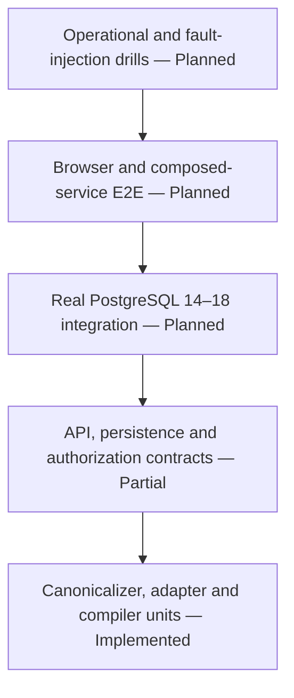

# Forward Engineering Test Strategy

- **Strategy status:** Active
- **Runtime status:** Partially implemented; production release gates remain
- **Scope:** PostgreSQL 14–18 model, plan, dry-run, apply, recovery, and UI
- **Last reconciled with the working tree:** 2026-08-09

This strategy separates tests that exist in the repository from evidence that
must still be produced. A test file's presence is not a claim that a particular
commit passed CI. Release evidence must identify the exact commit SHA, command,
environment, PostgreSQL version, and result.

Status labels are normative: **Implemented**, **Partially implemented**,
**Planned**, and **Rejected**.

## Quality contract

The forward-engineering release must prove all of these properties:

- every admitted model difference becomes a structured operation or blocker;
- unknown or unsupported semantics fail closed, suppress all executable
  statements, and retain independently supported deltas only as non-executable
  proposals whose risks remain visible;
- the server, not the browser, owns model canonicalization and SQL rendering;
- tenant, actor, model, plan, connection, snapshot, digest, and evidence binding
  cannot be crossed or raced;
- dry run executes exact DDL only in an isolated sandbox and uses read-only live
  preflight;
- apply revalidates after deterministic locks and executes one transactional
  segment without automatic replay;
- fault and timeout outcomes are classified honestly;
- only post-commit re-introspection equal to `target_digest` yields `verified`;
- keyboard and assistive-technology users receive equivalent risk, approval,
  progress, error, and recovery information; and
- production-owned backend and frontend code meets the repository's 100%
  statement and branch coverage policy on the exact release head.

## Test layers



| Layer | Purpose | Current evidence | Release expectation |
|---|---|---|---|
| Deterministic unit/property | Prove canonical JSON, quoting, digest stability, complete blocker behavior, plan ordering, risk and snapshot adaptation. | Focused forward unit tests exist. | Exact statement/branch coverage plus property/fuzz cases for every admitted grammar and unknown-field boundary. |
| API/service contract | Prove authorization, tenancy, optimistic concurrency, immutable persistence, size limits, expiry/idempotency/error semantics. | Model and plan route functions are tested mainly with faked sessions and mocks. | HTTP-level tests against migrated PostgreSQL, full role/IDOR/CSRF/CORS/error matrix, and database constraint races. |
| PostgreSQL integration | Prove real catalog mapping, executable SQL, locks, timeouts, transactions, privileges, fingerprinting, and convergence. | General introspection query/connection tests exist; no complete forward round trip against real PostgreSQL. | Ephemeral PostgreSQL 14, 15, 16, 17, and 18 matrix with real catalogs and concurrent sessions. |
| Browser E2E/accessibility | Prove editor-to-verified workflow, tamper resistance, state recovery, focus, keyboard, names, and live regions. | Existing ERD UI tests do not implement the forward workflow. | Composed backend/frontend/worker/sandbox/target E2E, automated accessibility checks, and manual keyboard/screen-reader evidence. |
| Operational/fault injection | Prove no-replay recovery, kill switch, alerts, runbook, retention, backup/restore, and uncertain commit handling. | No forward run worker or drills exist. | Controlled crash/network/lock/commit-acknowledgement tests and a recorded non-production game day. |

## Current repository evidence

| Area | Source/tests in the working tree | What they demonstrate | Status / limitation |
|---|---|---|---|
| Canonical model | `app/forward/schema_model.py`; `tests/test_forward_schema_model.py` | Identifier/type bounds, canonical order, stable digests, catalog-spelling type aliases, serial pseudo-type rejection, hostile type/default rejection, duplicates, unknown fields. | Implemented unit boundary; no browser/model round trip or broad generative grammar corpus. |
| Structured compiler | `app/forward/migration_plan.py`; `tests/test_forward_migration_plan.py` | Determinism, quoted identifiers, create/drop/alter subset, risk/preconditions, conservative destructive type-alter risk, blockers for PK/comment/order/schema-removal cases, and non-executable proposals/risk preservation for blocked plans. | Implemented bounded subset; no executor or real catalog convergence proof. |
| Snapshot adapter | `app/forward/snapshot_adapter.py`; `tests/test_forward_snapshot_adapter.py` | Capability-version recapture gate, OID removal, dropped-slot rejection, primary-key order/deferrability, actual default keys, PK backing index handling, constraint/partition/tablespace rejection. | Partially implemented; fixtures are in-memory and do not prove exhaustive real snapshot compatibility. |
| Model APIs | `app/api/schema_models.py`; `tests/test_api_schema_models.py` | Strong revision-UUID ETag, weak/stale `If-Match`, base-only successor protection, idempotent identical revision, non-member masking. | Mostly direct function tests with faked sessions; database transactions and concurrent writers need integration proof. |
| Plan API | `app/api/migration_plans.py`; `tests/test_api_migration_plans.py` | Revision/connection/snapshot binding, cross-project masking, statement cap, plan digest not misused as DB idempotency. | Mostly direct function tests; expiry is stored but no run gate exists. |
| Roles/legacy apply | `app/permissions.py`, `app/api/connections.py`; `tests/test_permissions.py`, `tests/test_api_apply_sql.py` | `deployer` ordering, deployer requirement for persistent legacy apply, conservative SQL rejection and DSN-redacted errors. | Implemented transitional path; it is not target workflow evidence. |
| PostgreSQL catalog query | `app/pg_introspect/queries.py`; `tests/test_pg_introspect_queries.py` | Query text includes current PK deferrability fields and catalog shape assertions. | Static query assertions; no multi-version catalog execution. |
| Network/secret boundary | `app/pg_introspect/dsn_guard.py`, `app/security.py`, `app/dsn_redaction.py`; related guard/security/redaction/fuzz tests | Host allowlist, restricted-range rejection, IP pinning, AES-GCM at rest, redaction robustness. | Application-level tests; deployment egress/TLS/key-separation evidence is absent. |
| Browser headers | `app/main.py`; `tests/test_security_headers.py` | `If-Match` is allowed and response `ETag` is CORS-exposed alongside auth/content/CSRF controls. | Header configuration evidence only; no complete credentialed browser workflow. |

The default `[tool.coverage.run]` include list in `backend/pyproject.toml` does
not currently include the new `app.forward` or forward API modules. CI runs
`pytest -q` without an explicit `--cov-fail-under` gate. Therefore the
repository's 100% production statement/branch policy is **not currently
enforced for this slice**. Closing that configuration gap is a release blocker;
passing the focused tests alone is insufficient.

## Required PostgreSQL integration matrix

Run the same accepted contract against ephemeral PostgreSQL majors 14, 15, 16,
17, and 18. Record exact server version and extension set.

### Catalog and canonicalization

- Empty database, empty schema, ordinary tables, nullable/non-null columns, and
  single/composite primary keys including deferrability and order.
- Lowercase, mixed-case, reserved-word, whitespace, embedded-quote, and Unicode
  identifiers at the 63-byte boundary.
- Actual `pg_catalog` rows for defaults, identity/generated columns, unique and
  check constraints, foreign keys, primary/secondary/expression/partial
  indexes, partitions, tablespaces, views, materialized views, triggers,
  functions, RLS/policies, grants, domains, enums, extensions, and Citus
  metadata when present. Every unrepresented class must produce a blocker.
- Snapshot canonicalization repeated across capture timestamps and changing
  OIDs must produce the same digest when semantics are unchanged.

### Executability and convergence

- Every admitted create/drop/add/type/nullability operation executes from the
  exact stored plan and re-introspects to the exact target digest.
- Catalog-equivalent aliases produce no false semantic diff; serial pseudo-types
  fail before planning; every actual type alteration remains destructive in the
  review and confirmation contract.
- Quoting and type rendering match PostgreSQL on every supported major.
- A blocked model exposes zero executable statements and produces zero
  execution calls, even when `proposed_statements` is non-empty; proposal risks
  remain visible and included in size bounds.
- A deliberately failing statement rolls back earlier operations in the v1
  segment and leaves the base digest.
- Unsupported or non-transactional work, including
  `CREATE INDEX CONCURRENTLY`, never enters the v1 executor.

### Concurrency, risk, and privileges

- `lock_timeout`, `statement_timeout`, and transaction timeout paths terminate
  within their bounds and produce redacted classified evidence.
- External `INSERT`/`UPDATE` attempts cannot invalidate NULL, table-empty, or
  castability preconditions between the in-lock check and commit.
- External DDL drift before dry run, before queue, before lock, and after dry
  run causes no plan DDL.
- Least-privilege roles demonstrate required privilege success and predictable
  denial; live preflight credentials cannot execute DDL.
- Large tables exercise scan/rewrite warnings and timeout behavior without
  using production data.

## API, database, and security matrix

For every current and planned model/plan/run/evidence route, cross product:

- missing resource, same-project resource, and other-project UUID;
- viewer, editor, deployer, owner, unauthenticated, public-share, and revoked
  session/API key as applicable;
- valid/missing/expired CSRF token and permitted/disallowed CORS header;
- valid, missing, weak, quoted, stale, or tampered ETag/digest/idempotency key;
- current/superseded revision, unexpired/expired plan, and
  passed/failed/drifted/wrong-plan dry run; and
- destructive/non-destructive plan with correct, missing, or altered typed
  confirmation.

Assertions must cover response status and structured error code, uniform IDOR
masking, zero target calls, zero secret/SQL leakage, and unchanged metadata for
rejected requests.

Database integration must prove:

- concurrent model revisions have one compare-and-swap winner;
- concurrent identical run submissions produce one effective run;
- idempotency-key reuse with different effective input returns `409`;
- run creation and queue/outbox insertion are atomic;
- state-version compare-and-swap admits only legal transitions;
- run events are append-only and uniquely ordered; and
- FK, uniqueness, expiry, retention, and conditional same-tenant invariants are
  enforced or fail atomically in the service transaction.

The current CI runs the migration-run/outbox acceptance against real
PostgreSQL 14–18 services. Each official image is pinned by multi-platform
index digest. The focused test applies every Alembic revision, verifies the
actual server major, creates a run/genesis/outbox transaction through the
production writer, proves identical-key reuse produces one run/event/dispatch,
asserts the dispatch schema has no execution payload, publishes the exact
dispatch attempt, then drives the real CAS/event writer through sandbox and
preflight states. The terminal transition verifies and persists the plan base
digest on the run and fourth chained event before the transaction is rolled
back and no partial identity survives. The same digest-pinned
matrix creates a quoted mixed-case/Unicode target fixture and executes the
production live-preflight primitive. It proves non-empty/NULL failures,
successful empty-table evidence, failing cast classification without database
detail propagation, read-transaction cleanup, and fixture cleanup on every
supported major. Until exact-head CI passes, these are acceptance requirements,
not completed evidence.

Focused relay tests prove that the bounded publisher claims and acknowledges
one exact attempt with a single caller clock, publishes only the run UUID on a
dedicated Valkey key, performs no transaction control, closes failed clients,
and leaves failed publication unacknowledged for caller rollback. Lifecycle
tests prove explicit opt-in/startup validation, one fresh transaction per
claim, commit/rollback context behavior, bounded empty/failure polling, fixed
non-secret failure logging, and cancellation of every application-owned task.
CI also runs
the production adapter against a digest-pinned real Valkey 8 service, proving
generic and migration UUIDs occupy separate sorted sets and that popping a
generic signal cannot consume the migration signal. Deployment restart/failover,
consumer restart, and worker execution remain release-blocking evidence.
The same real-service test moves a due UUID from ready to processing under an
exact lease-token, rejects a stale acknowledgement, releases for retry,
reclaims with a new token, and acknowledges cleanly. Focused consumer tests
prove handler-before-ack ordering, exact-lease retry release, lost-lease
failure, bounded timing, and fixed non-secret lifecycle logs. The
live-preflight unit contract proves exact quoting for mixed/quoted identifiers,
the three admitted structured preconditions, fail-closed unknown fields/types,
the 1,000-query ceiling, a single read-only repeatable-read transaction,
prepared-statement-only execution, parameter-bound transaction-local server
timeout plus client timeout bounds, boolean-only
evidence, rollback, fixed non-secret
database failures, and strict snapshot-to-plan-base canonical digest comparison.
Durable-run unit tests require that observed digest for terminal preflight CAS,
revalidate the immutable plan, persist it on the run and chained event, and
reject missing, malformed, `passed`-mismatched, `drifted`-matched, or unrelated
transition injection. Worker evidence cannot pre-author the reserved observed
digest field through snake-, camel-, kebab-case, or nested aliases.
Real-target privilege/audit assertions, worker-owned fresh capture/attempt
binding, and worker failure/recovery remain release blockers. The
execution-neutral consumer contract is **Implemented**; application startup
wiring and worker execution remain **Planned**. Deployment consumer lifecycle,
crash/restart orchestration, and worker execution remain release blockers.

## Fault-injection and recovery matrix

| Injection point | Expected evidence | Forbidden behavior |
|---|---|---|
| Before sandbox allocation | Retryable dry-run failure or queued lease recovery | Any live target access |
| During sandbox execution | `failed`, bounded diagnostics, sandbox cleanup | Marking live preflight passed |
| During live read-only preflight | `failed` or `drifted` | Live DDL or reuse of incomplete evidence |
| Before target locks | Non-success with no DDL proof | `failed_rolled_back` without a transaction |
| After locks, before first DDL | Rollback/release evidence | Automatic apply replay without new intent |
| Between plan statements | `failed_rolled_back` only when full rollback is proven | Partial-success or verified claim |
| Immediately before/after commit acknowledgement | Reconciliation by re-introspection | Blind queue retry or DDL replay |
| After known commit, before verification | `verification_failed` until read-only verification resumes | Reporting unchanged/rolled back |
| Verification finds target digest | Persisted snapshot and `verified` | Success without snapshot provenance |
| Verification finds third digest after known commit | `applied_with_drift` plus residual diff | Coercing result to verified |
| Reconciliation unavailable or finds third digest after uncertain commit | `outcome_unknown` and alert | Applied/not-applied claim or replay action |
| Kill switch during queued/applying states | Queued work cannot start; applying work reconciles | Process kill described as rollback proof |

## Browser and accessibility acceptance

The forward UI is **Planned**. Tests must cover the complete user-observable
state model, not only a happy-path button click:

- dirty/save/saved model state and `409` optimistic-concurrency recovery;
- exact connection/snapshot selection, plan supersession, blocker and risk
  review, read-only SQL, and digest display;
- editor versus deployer controls with server-side denial even when the client
  is tampered;
- dry-run evidence source labels, polling, reconnect/page reload, cancellation,
  drift, timeout, and redacted diagnostics;
- typed connection confirmation, separate destructive acknowledgement, and
  double-submit prevention;
- every terminal state, especially `failed_rolled_back`,
  `verification_failed`, `applied_with_drift`, and `outcome_unknown`;
- keyboard-only entry, logical focus order, trapped modal focus, Escape/cancel
  only where safe, restored focus, accessible names, headings, error
  association, and progress/status live regions; and
- automated WCAG 2.2 AA-oriented checks plus manual keyboard and representative
  screen-reader verification. Automation alone is not a conformance claim.

## Commands and evidence capture

The repository CI currently runs:

```bash
cd backend
PYTHONPATH=. mypy app
PYTHONPATH=. pytest -q

cd ../frontend
npm ci
npm run typecheck
npm run test
npm run build
```

Organization-required pull-request workflows additionally run `osv-scan`,
`dependency-review`, `trivy-fs`, OpenSSF Scorecard, and SAST Semgrep. Those
centrally operated workflows are authoritative dependencies: this leaf
repository must require their exact-head results and must not duplicate their
implementation. A queued, skipped, stale-head, or absent job is not passing
evidence.

The release workflow must add explicit statement and branch coverage commands
covering every forward production module, migrated PostgreSQL integration,
frontend forward-flow coverage, and composed browser E2E. It must also retain
the centrally operated security results for the exact release head. Do not copy
a historical pass count into documentation; attach machine output for the exact
release head.

An acceptable evidence record contains:

- commit SHA and clean/declared worktree state;
- tool and dependency lockfile versions;
- commands, exit codes, test/coverage totals, and skipped/xfail list;
- PostgreSQL image digests and server versions;
- sandbox/network/credential topology used for integration and E2E;
- failure-injection cases and observed terminal states; and
- accessibility automation output plus manual verification notes.

## Release exit criteria

Forward engineering remains not production-ready while any item is missing:

- all FE-INV and FE-AC rows in the
  [v1 contract](contracts/forward-engineering-v1.md) are Implemented with linked
  evidence;
- no unsupported semantic difference is silently omitted;
- real PostgreSQL 14–18 round-trip, concurrency, privilege, timeout, rollback,
  and commit-uncertainty suites pass;
- API/DB/browser/security coverage meets the exact owned-code 100%
  statement-and-branch policy;
- the composed accessible UI reaches every honest terminal state;
- the [threat model](security/forward-engineering-threat-model.md) has no
  unowned high-risk release blocker; and
- the [operational runbook](runbooks/forward-engineering.md), kill switch,
  alerts, backup/recovery, and no-replay drill have current evidence.

## Related authority

- [Forward-engineering v1 contract](contracts/forward-engineering-v1.md)
- [Standards baseline](STANDARDS.md)
- [Documentation audit and traceability](DOCUMENTATION_AUDIT.md)
- [Threat model](security/forward-engineering-threat-model.md)
- [Operational runbook](runbooks/forward-engineering.md)
