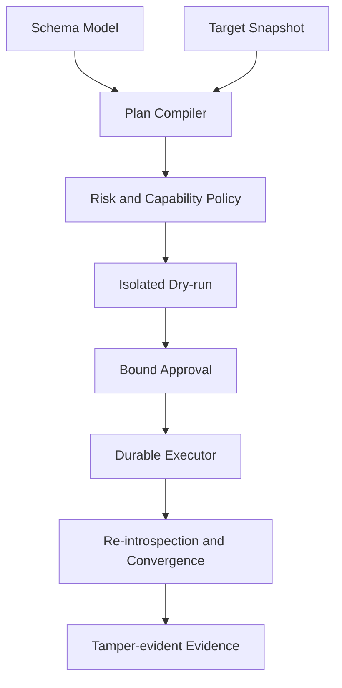

# Technical Requirements Document

Status: living authority
Last evaluated: 2026-08-09

## Technical objective

Preserve pg-erd-cloud's working reverse-engineering and collaboration product
while replacing the legacy client-authored SQL apply path with a server-owned,
versioned, explainable and recoverable Forward Engineering control plane.

## Current implementation baseline

| Layer | Technology and contract | Lifecycle |
| --- | --- | --- |
| Frontend | React 19, TypeScript, Vite, `@xyflow/react`; CSS semantic tokens | `implemented_on_main`; Figma alignment `active_pr` |
| API | Python 3.10+, FastAPI, Pydantic and async SQLAlchemy | `implemented_on_main` |
| Metadata store | PostgreSQL with Alembic; ORM declares JSONB while historical migrations use JSON for three payloads | `implemented_on_main` with drift to reconcile |
| Worker | In-process asynchronous loop, PostgreSQL `FOR UPDATE SKIP LOCKED`; optional Valkey wake signal; no in-flight reclaim | `implemented_on_main` with recovery gap |
| Target access | Guarded PostgreSQL connector; optional Snowflake extra; MySQL adapter/test code is un-packaged and contract-incomplete | PostgreSQL `implemented_on_main`; MySQL `research_only` |
| Edge/deployment | Docker Compose and Traefik; static SPA; committed production path is HTTP behind an external TLS terminator | `implemented_on_main` with deployment requirement |

## Current Forward Engineering limitation

`POST /api/connections/{db_connection_uuid}/apply-sql` currently accepts SQL
text from a client, validates a narrow unquoted-ASCII subset, then executes the
batch synchronously in one target transaction. Separately generated DDL can
contain quoted identifiers, foreign keys, comments and
`CREATE INDEX CONCURRENTLY`, so generator and validator do not share one
semantic contract. A rollback dry-run can still acquire locks, scan data and
consume resources. This path is therefore `deprecated`, not the production
Forward Engineering acceptance path.

## Target bounded contexts

### Schema Model

- Owns normalized, versioned desired database intent.
- Uses stable UUID identities internally while preserving exact external SQL
  identifiers, including quoted, mixed-case and Unicode names.
- Stores no executable SQL as authority.
- Records unsupported or externally owned constructs without flattening them.

### Plan Compiler

- Inputs: project, connection identity, desired model revision, observed target
  snapshot/fingerprint, compiler version and PostgreSQL capability profile.
- Output: immutable ordered statement graph with canonical AST, rendered SQL,
  dependencies, transactional segment, reversibility, data preconditions,
  required privileges, lock/rewrite risk and support outcome.
- One AST/plan representation is reused by diff, rendering, validation,
  dry-run, apply, audit and convergence comparison.

### Risk and Capability Policy

- Classifies each construct as supported, guarded, lossy, ambiguous,
  extension-owned or unsupported for the exact PostgreSQL version.
- Fails closed for unclassified constructs.
- Distinguishes syntax proof, isolated executability proof, target read-only
  preconditions and actual production authorization.

### Dry-run and target preflight

- Destructive or locking statements execute only in a disposable compatible
  PostgreSQL environment built from a sanitized schema/data-shape fixture or
  governed clone.
- Target preflight is read-only: version/extensions, dependencies, sizes,
  statistics, data preconditions, privileges, replication, conflicts and
  fingerprint drift with bounded timeouts.
- `CREATE INDEX CONCURRENTLY` and other non-transactional statements are
  segmented and validated under their real execution semantics.

### Approval and execution

- Approval binds the plan digest, model revision, target connection/fingerprint,
  actor, policy result and expiration.
- Immediate pre-apply revalidation rejects stale approvals or target drift.
- PostgreSQL advisory locking or an equivalent per-target serialization key
  prevents conflicting migrations.
- Durable jobs have idempotency keys, leases/heartbeats, cancellation rules,
  bounded retry and explicit partial-commit recovery.
- Every statement completion and state transition appends redacted audit
  evidence with a versioned canonical serialization, integrity algorithm, key
  version, previous-event digest, and event digest.
- Chain heads are periodically authenticated with an HMAC/signature key held
  outside the application database and anchored to an immutable external sink;
  an immutable external event sink can serve both roles. Verification,
  checkpoint cadence, key rotation/revocation, canonical-format migration, and
  recovery procedures are release requirements.
- Ordinary mutable rows or an unauthenticated hash chain stored only beside the
  events are not called tamper-evident.

## Planned API contract

The exact version prefix is selected during implementation. The semantic
operations are required even if route names change.

| Operation | Request authority | Response/evidence | Lifecycle |
| --- | --- | --- | --- |
| Create model revision | Normalized model + parent revision | Revision UUID and digest | `planned` |
| Compile plan | Stored revision + target connection | Immutable plan, statement graph, risks and digest | `planned` |
| Start isolated dry-run | Plan UUID + idempotency key | Durable execution job | `planned` |
| Read target preflight | Plan UUID | Fingerprint, privileges, preconditions and estimates | `planned` |
| Approve plan | Exact plan digest + policy confirmation | Bound expiring approval | `planned` |
| Apply plan | Plan UUID + approval + idempotency key | Durable serialized execution job | `planned` |
| Cancel job | Job UUID + expected state/version | Accepted/rejected transition | `planned` |
| Verify convergence | Successful job UUID | New snapshot and semantic residual diff | `planned` |

The existing `/apply-sql` route remains a compatibility surface only until the
new workflow replaces it; it must not gain support for more dangerous SQL.

## Planned persistence contract

The target logical model is defined in [ERD](ERD.md). All new table and column
names use descriptive two-or-more-word `snake_case`. The minimum entities are:

- `schema_model_revision`
- `migration_plan`
- `migration_statement`
- `migration_approval`
- `migration_execution_job`
- `migration_audit_event`

No plan row contains plaintext DSNs. Connection credentials remain referenced
through `db_connection` and are resolved into process memory only for an
authorized execution step.

## State and concurrency requirements

- State transitions use compare-and-set versioning; stale tabs cannot approve,
  cancel or apply a superseded plan.
- At-most-once intent is implemented through idempotency and serialization,
  while workers remain safe under at-least-once delivery/restart.
- Transactional segments commit atomically. Non-transactional segments persist
  their own completion evidence before the next segment begins.
- Cancellation is cooperative between statements and may be best-effort while
  PostgreSQL is executing one statement; the UI must describe that boundary.
- A failure after a non-transactional commit never reports global rollback.

## Security and privacy requirements

- OIDC/API-key principal, tenant and minimum project role are checked on every
  plan, approval, job and evidence lookup.
- Execution uses a least-privilege target identity and verified TLS; target
  allowlisting and DNS/IP pinning remain enforced.
- Safe `search_path`, identifier handling and parser/rendering boundaries are
  explicit; string scanning is not the SQL authority.
- Logs and metrics use opaque IDs and classifications, never DSNs, credentials,
  uncontrolled schema values or sampled business data.
- Public share DTOs remain separate from authenticated execution DTOs.
- Control evidence is designed to support CSAP and SOC 2 readiness, without
  claiming certification.

## Verification requirements

- Unit/property tests for AST normalization, dependency ordering, rendering,
  risk classification and digest stability.
- Real ephemeral PostgreSQL tests across the supported version matrix for
  round-trip semantic equivalence and real lock/transaction behavior.
- Failure tests for data preconditions, insufficient privilege, drift race,
  duplicate submission, restart, timeout, network loss, cancellation and
  partial non-transactional completion.
- Browser E2E for edit → diff → plan → dry-run → approval → apply → recovery →
  convergence, including keyboard/focus and stale-tab protection.
- Exact owned production coverage, type checks, security scanning, SBOM and
  provenance before release.

See [test strategy](test-strategy.md) and [traceability](traceability-matrix.md).
