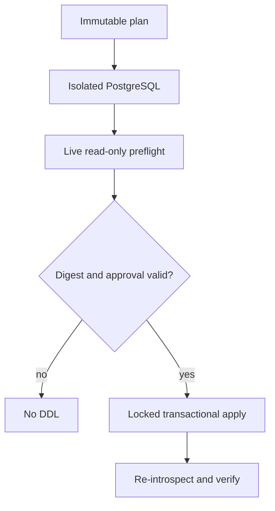

# Technical Requirements: Safe Forward Engineering

## Document control

- **Status:** Approved target architecture; Phase 1 control plane partially implemented
- **Date:** 2026-08-09
- **Normative detail:** [Forward Engineering v1 contract](contracts/forward-engineering-v1.md)
- **Decisions:** [ADR index](adr/README.md)
- **Architecture:** [Root architecture](../ARCHITECTURE.md), [UML](UML.md), and
  [data model](DATA_MODEL.md)

This TRD separates repository truth from target design. **Implemented** means
code exists in the current branch. **Partially implemented** means a bounded
fail-closed subset exists. **Planned** means no runtime claim is permitted.

## Technical outcome

The graphical workflow must convert untrusted semantic intent into a
server-owned, immutable, target-bound plan and later execute that exact plan
through an isolated validation and durable apply plane. The browser never owns
executable SQL, safety classification, approval truth, or recovery state.

## Current architecture and implementation boundary

### Implemented in Phase 1

- `app.forward.schema_model`: PostgreSQL 14–18 canonical model validation,
  deterministic JSON, and SHA-256 digest.
- `SchemaModel` and `SchemaModelRevision`: project identity plus immutable
  numbered revision rows; save uses row locking and a strong revision-UUID
  `ETag`/`If-Match` token distinct from the model content digest.
- `app.forward.snapshot_adapter`: strict translation of the proven live
  introspection subset; unsupported semantics return sanitized `422`.
- `app.forward.migration_plan`: deterministic structured transactional plans,
  risks, privileges, dependencies, preconditions, blockers, review-only
  proposals for supported deltas in a blocked plan, and plan digest.
- `MigrationPlan`: immutable plan JSON bound to project, revision, connection,
  succeeded base snapshot, actor, compiler version, and 24-hour expiry.
- Role order `viewer < editor < deployer < owner`; persistent legacy
  `apply-sql` requires deployer authority.

### Partially implemented foundation

- `MigrationRun`, identifier-only `MigrationRunDispatch`, and
  `MigrationRunEvent` ORM/Alembic persistence with database
  state/idempotency/dispatch/sequence constraints;
- a deterministic dry-run/apply transition contract, bounded hashed
  idempotency keys, and recursive rejection of SQL/credential-bearing event
  fields;
- an optimistic compare-and-swap transition writer that updates one exact
  `(state, state_version)` and appends the same-version event atomically in the
  caller-owned transaction;
- an internal dry-run creation writer using the database idempotency constraint
  as the concurrency winner, rejecting same-key/different-request reuse,
  expired/tampered/blocked plans, and every apply request;
- an editor-authorized dry-run creation HTTP boundary binding the exact
  reviewed plan digest, bounded `Idempotency-Key`, actor, and request
  correlation identity while atomically creating the run, genesis event, and
  dispatch outbox without signaling a worker;
- due-order outbox claim and publish-state CAS primitives using
  `FOR UPDATE SKIP LOCKED`; the relay owns one transaction across claim,
  identifier-only publication, and acknowledgement, and rollback restores a
  failed attempt; the bounded publisher places only `migration_run_uuid` on a
  dedicated Valkey key and never commits, loads a plan, or executes SQL;
- an opt-in scheduled relay lifecycle uses one fresh transaction per claim,
  bounded polling after empty/failure iterations, fixed non-secret failure
  logging, startup validation of the Valkey backend, and cooperative shutdown;
- bounded UUID-only ready-to-processing claim, expiry reclaim, exact lease
  renewal, acknowledgement, and retry-release primitives use an exact
  lease-token so a stale claimant cannot extend or complete a successor lease.
  An expired signal owner cannot renew, and renewal never shortens the current
  expiry. The execution-neutral consumer
  contract is **Implemented**: an injected handler receives the exact signal
  claim (run UUID plus opaque lease-token) and must succeed before exact-lease
  acknowledgement; sanitized failure releases only that lease at a bounded
  retry score. The queue payload remains UUID-only. Automatic heartbeat is
  **Implemented**: exact renewal runs while the injected handler is active;
  renewal loss cancels and retrieves the handler task and is never
  acknowledged as success. DB-durable attempt acquisition, renewal, expired
  takeover, and exact-owner finish are **Implemented** with hashed worker and
  signal-token identities. Consumer-to-attempt binding is **Implemented**: an
  execution-neutral adapter commits acquisition, renews through fresh metadata
  transactions, cancels on ownership loss, and finishes the exact owner before
  signal acknowledgement. Acquisition rejection now locks and inspects the run:
  a persisted dry-run or queued-apply cancellation intent becomes terminal
  `cancelled`, while an already-terminal redelivery is acknowledged without
  replay; either path marks a surviving active attempt `abandoned` in the same
  metadata transaction. The provider-neutral durable handler binds the exact
  attempt to injected sandbox and read-only capabilities in deterministic
  order; bounded whole-stage deadlines cancel and close hung capability
  contexts with fixed non-secret errors. Application startup wiring,
  credentials, concrete providers, and deployed worker execution remain
  **Planned**;
- idempotent cancellation intent that increments the shared state version and
  appends a same-state event, preventing a stale worker transition from winning;
- `complete_isolated_dry_run` revalidates an exact successful executor result
  against the stored plan and derives the fixed `live_preflight_running` CAS
  with bounded aggregate evidence rather than caller-selected transition data;
- `complete_live_preflight` validates the exact bounded preflight result,
  derives `drifted`, `failed`, or `passed` without caller-selected state, and
  delegates only aggregate check counts plus the server-authoritative observed
  digest to the existing durable CAS;
- an editor-authorized cancellation HTTP boundary with strict state-version
  input, IDOR masking, stable sanitized error codes, and request correlation.
- versioned canonical event digests covering run/sequence/type/state/evidence,
  actor, UTC timestamp, and predecessor; the run stores the latest digest and
  polling verifies the complete chain before returning evidence;
- a bounded live-preflight query primitive accepts only the three structured
  compiler preconditions, validates PostgreSQL identifiers and target types,
  prepares every server-owned query before execution, runs boolean-only reads
  in one read-only repeatable-read transaction, binds the transaction-local
  server timeout as a unitless decimal string whose PostgreSQL default unit is
  milliseconds, applies a bounded client timeout,
  replaces transaction creation/start, query, commit, and rollback-cleanup
  failures with fixed diagnostics, and rolls back only after transaction startup
  succeeds while preserving cancellation and process-exit signals.

### Planned and release-blocking

- queue consumption, worker execution, durable retry backoff/max-attempt
  policy, and dispatch retention;
- deployed in-flight worker/process cancellation and apply cancellation;
- isolated disposable PostgreSQL provisioning, complete dependency
  materialization, deployed isolation proof, cleanup, and worker binding (the
  signed-plan execution/convergence core is Partially implemented);
- live-preflight worker wiring, separately constrained deployed credentials,
  credential binding around the durable attempt and implemented caller-owned
  `execute_bound_live_preflight` same-transaction capture/check primitive, and
  apply-time drift revalidation;
- exact deployer-confirmed apply-intent creation is **Implemented** as an
  execution-free, non-dispatched control-plane boundary; stored-plan dispatch,
  executor, transaction segmentation, locks, timeouts, apply-time approval
  revalidation, cancellation propagation, reconciliation, and post-apply
  verification remain **Planned**;
- frontend graph/model adapters and `ForwardEngineeringModal` workflow
  orchestration are **Partially implemented** through the accessible modal,
  read-only plan review, exact-digest dry-run intent, verified run status/audit,
  polling, and exact-version cancellation controls; apply/recovery controls and
  composed browser E2E remain absent;
- real PostgreSQL integration, fault-injection, accessibility, and browser E2E.

The legacy `POST /api/connections/{db_connection_uuid}/apply-sql` remains a
transitional compatibility surface. Its `dry_run=true` runs DDL on the live
target and rolls it back; it is not the planned isolated dry run and is not used
by the graphical target architecture.

## Required invariants

| ID | Invariant | Current status |
|---|---|---|
| FE-TRD-001 | Browser requests contain model intent or plan/run IDs and expected digests, never graphical-workflow SQL. | **Implemented for plan creation; executor Planned** |
| FE-TRD-002 | Canonicalization preserves exact identifier semantics and rejects unknown or lossy fields. | **Implemented for current subset** |
| FE-TRD-003 | Every admitted base→target difference yields operations or blockers; any blocker suppresses executable statements while supported independent deltas remain in `proposed_statements` for review. | **Implemented for current canonical subset** |
| FE-TRD-004 | A plan binds exact project, model revision, connection, succeeded snapshot, compiler version, digests, actor, and expiry. | **Implemented** |
| FE-TRD-005 | Cross-project/missing/unauthorized identities do not reveal another tenant's resource existence. | **Partially implemented; full matrix gate remains** |
| FE-TRD-006 | Dry-run DDL executes only in a disposable isolated PostgreSQL environment; the metadata DB is never a sandbox. | **Partially implemented:** signed-plan/version/base/transaction/convergence execution core, `complete_isolated_dry_run` server-derived success CAS, PostgreSQL 14–18 round trip, and test-owned durable-handler binding over a separate sandbox connection exist; an expired successor attempt resumes live preflight without replaying committed sandbox DDL. Provisioning, materialization, deployed isolation/egress proof, cleanup, startup, process restart, and worker operation remain Planned |
| FE-TRD-007 | Live preflight is read-only evidence; apply repeats fingerprint/data preconditions after locks on the execution connection. | **Partially implemented:** bounded structured boolean reads, strict snapshot comparison, and durable hashed attempt ownership exist; `execute_bound_live_preflight` binds capture/checks to one read-only repeatable-read transaction and completion matches every persisted precondition. PostgreSQL 14–18 acceptance composes the durable handler with a separately constrained test reader; deployed credential binding, target routing, startup/worker operation, and in-lock apply repetition remain Planned. |
| FE-TRD-008 | V1 apply contains one transaction-capable segment; non-transactional operations block the whole plan. | **Plan subset and isolated-dry-run transaction core implemented; live apply executor Planned** |
| FE-TRD-009 | Queue payload contains only `migration_run_uuid`; secrets, DSNs, SQL batches, and row values are excluded. | **Partially implemented:** identifier-only `migration_run_dispatch`, due-order `SKIP LOCKED` publication, exact lease-token claim/renew/ack/release primitives, exact signal claim, exact lease renewal, the execution-neutral consumer contract with automatic heartbeat, DB-durable hashed worker-attempt CAS, exact consumer-to-attempt binding, and metadata-only cancellation/terminal-redelivery settlement are **Implemented**. Application startup wiring, credential binding, and worker execution remain **Planned** |
| FE-TRD-010 | Idempotency and compare-and-swap select one run; apply is never automatically replayed after an ambiguous boundary. | **Partially implemented:** dry-run and non-dispatched apply-intent creation HTTP, transition, cancellation CAS/HTTP, terminal cancellation acknowledgement, terminal redelivery without sandbox/preflight replay, and real-PostgreSQL pre-live-read attempt takeover without sandbox replay exist; deployed queue consumption, process/container recovery, commit-uncertainty reconciliation, and apply execution remain Planned |
| FE-TRD-011 | Known commit is followed by re-introspection; only exact target digest becomes `verified`. | **Planned** |
| FE-TRD-012 | Unknown versions/kinds, expired plans, incomplete evidence, and timeout are non-success states. | **Partially implemented:** internal run creation enforces expiry, 30-day cleanup excludes plans with run history, and the preflight primitive bounds query count/time and rejects unknown kinds/non-boolean evidence; worker lifecycle enforcement remains Planned |

## Current persistence model

| Entity | Purpose | Mutability |
|---|---|---|
| `ProjectSpace` / `ProjectMember` | Tenant and role boundary | Existing product contract |
| `DbConnection` | Encrypted target connection record | Existing product contract |
| `SchemaSnapshot` / `SchemaSnapshotData` | Succeeded base/introspection evidence | Immutable capture payload |
| `SchemaModel` | Project-scoped desired-model identity/current revision pointer | Pointer and timestamps update |
| `SchemaModelRevision` | Canonical desired JSON, digest, base snapshot, actor | Append-only through API |
| `MigrationPlan` | Target-bound compiler output and expiry | No update route; immutable through API |
| `MigrationRun` / `MigrationRunDispatch` / `MigrationRunAttempt` / `MigrationRunEvent` | Durable run, identifier-only outbox, lease-bound hashed attempt ownership, and append-only evidence | **Partially implemented:** tables, hash-chain integrity, atomic creation/CAS writers, observed-base binding, dispatch/UUID-only signal/consumer contracts, exact-owner attempt acquire/renew/finish, consumer-to-attempt binding, dry-run creation/cancellation acknowledgement, terminal no-replay settlement, current-revision-locked non-dispatched apply-intent confirmation, and polling exist; application startup wiring, credentials, and workers are absent |

Database schema truth is defined in `backend/app/models.py` and Alembic revisions
`0008_schema_model_revision`, `0009_migration_plan`, `0010_migration_run`,
`0011_migration_run_attempt`, `0012_apply_intent_confirmation`, and
`0013_migration_run_cancellation`. See
[DATA_MODEL.md](DATA_MODEL.md) for actual and planned ERDs.

## Current HTTP contract

Typed browser transport is **Partially implemented** in `frontend/src/api.ts`
for immutable plan retrieval, exact dry-run and non-dispatched apply-intent
creation, durable run polling, and exact-version cancellation. It exposes no
arbitrary SQL request field. The plan review panel is **Partially implemented**
in `frontend/src/components/forward/PlanReviewPanel.tsx`; it renders immutable
provenance, risk, blockers, structured statements, and review-only proposals
without buttons or execution authority. Its `PlanReviewSurface` wrapper exposes
fixed loading/error/retry states and stale-response suppression is **Partially
implemented** when a requested plan changes. The Forward Engineering modal
shell is **Partially implemented** with focus entry/trap/restoration, Escape,
and explicit close behavior. The dry-run intent control is **Partially
implemented**: it exposes an action only for a server-runnable unblocked plan,
submits only its UUID and exact digest, admits one request at a time, preserves
the bounded idempotency key across ambiguous retry, ignores stale responses,
and hands the durable run UUID to the read-only polling surface. It has no SQL,
credential, target-selection, worker, or apply authority. The run
identity is modal-session scoped: an accepted dry run replaces the supplied
audit surface while open, and a close/reopen cycle restores the caller-supplied
run so stale session state cannot restart an obsolete audit surface. The run
status and audit panel is **Partially implemented** as an optional exact-run
loader with fixed loading/error/retry behavior and stale-response suppression.
It announces state, pending cancellation intent, terminal `cancelled`
acknowledgement, and sanitized error codes, and shows
only integrity-checked event-chain metadata; generic run/event evidence is not
rendered. Sequential terminal-aware polling is **Partially implemented** with
one outstanding request, cleanup on identity/unmount, and no polling after a
terminal response. The cancellation intent control is **Partially
implemented** for non-terminal runs without an existing intent. It submits one
exact optimistic state version, refreshes the verified run after `202`, and on
an ambiguous result exposes only a fixed error plus explicit status refresh;
it never automatically repeats the mutation. Forward UI remains **Planned**, so these unit-tested
components are not browser E2E or complete accessibility evidence. The apply
intent control is **Partially implemented** for an exact `passed` dry run whose
plan/digest/observed base match the reviewed plan. It requires a typed target
connection name and conditional destructive acknowledgement, freezes the first
submitted confirmation across same-key ambiguous retries, and replaces the
modal audit identity with the accepted non-dispatched apply intent. It does not
dispatch a worker, resolve credentials, or execute DDL.

| Method and route | Authority | Behavior | Status |
|---|---|---|---|
| `POST /api/schema-models/by-project/{project_space_uuid}` | editor+ | Create identity and revision 1 | **Implemented** |
| `GET /api/schema-models/{schema_model_uuid}` | member | Current immutable revision, IDOR-masked | **Implemented** |
| `PUT /api/schema-models/{schema_model_uuid}` + strong revision-UUID `If-Match` | editor+ | Idempotent no-op for identical content/base or append successor; stale/weak token `409`; responses expose `ETag` through CORS | **Implemented** |
| `POST /api/schema-model-revisions/{revision_uuid}/migration-plans` | editor+ | Validate exact tenant/connection/snapshot binding, compile, bound, persist | **Implemented** |
| `GET /api/migration-plans/{plan_uuid}` | member | Immutable preview with project/revision/connection/snapshot/capability/actor/time bindings, IDOR-masked | **Implemented** |
| `POST /api/migration-plans/{plan_uuid}/dry-runs` | editor+ | Exact-digest, `Idempotency-Key`-bound durable queued intent; `202`; does not signal a worker | **Implemented** |
| `POST /api/migration-plans/{plan_uuid}/apply-runs` | deployer+ | Exact passed evidence + typed/destructive confirmation; persists a queued intent with no dispatch | **Implemented intent boundary; executor Planned** |
| `GET /api/migration-runs/{run_uuid}` | member | IDOR-masked bounded state/evidence view; verifies count, canonical genesis, exact transition graph, one-to-one cancellation flag/event consistency, chronology, event digests, run anchor, and secret-safe evidence before returning | **Implemented** |
| `POST /api/migration-runs/{run_uuid}/cancel` | editor+ | Exact-version CAS cancellation intent; `202`; nonmembers masked, viewers rejected, correlated stable error envelope | **Implemented** |

Implemented limits: model input is at most 2 MiB; a persisted plan is at most
1,000 executable plus proposed statements and 4 MiB; plans expire 24 hours
after creation. Read-only endpoints retain sanitized FastAPI
`{"detail": ...}` errors. The mutating dry-run creation and cancellation
endpoints fix the v1 run-action envelope as
`{"detail":{"code","detail","correlation_id"}}`; the apply-intent route
reuses it without exposing credentials.

## Compiler v1 capability matrix

| Construct/change | Current behavior | Runtime execution status |
|---|---|---|
| Create schema/table; table drop | Structured statement; schema removal blocks | Control plane **Implemented** |
| Add/drop column | Structured statement; required add has `table_is_empty` precondition | Control plane **Implemented** |
| Type/nullability change | Type aliases normalize to catalog spelling; serial pseudo-types reject; type changes carry conservative destructive/data-loss/scan/rewrite evidence | Control plane **Implemented** |
| Primary key on new table | Preserves name, order, and deferrability | Control plane **Implemented** |
| Nullable primary-key column | Rejected before planning to preserve catalog convergence | **Implemented boundary** |
| Existing primary-key change | Explicit blocker | **Implemented blocker** |
| Table/column comments | Explicit blocker; no silent omission | **Implemented blocker** |
| Existing/non-append column order | Explicit blocker | **Implemented blocker** |
| Defaults, identity, generated columns | Fail closed at model/snapshot boundary | **Rejected for v1 subset** |
| Unique/check/foreign-key constraints | Fail closed at current subset boundary | **Rejected for v1 subset** |
| Secondary/expression/partial indexes | Fail closed; only verified PK backing index is filtered | **Rejected for v1 subset** |
| Views, triggers, partitions, tablespaces, RLS, domains, extensions, distributed tables | Fail closed before planning | **Rejected for v1 subset** |
| Concurrent/non-transactional DDL and DML | Not admitted | **Rejected for v1** |

Failing the snapshot/model boundary currently returns `422` rather than a
persisted plan blocker because no trustworthy target model can be constructed.
The UI must present that as unsupported input, not as success.

Only snapshots carrying the current capability-contract version may plan.
Catalog reads share one read-only repeatable-read transaction; dropped column
slots are captured and rejected until ordinal semantics can be preserved.

## Planned validation and execution plane

- Sandbox and live-preflight evidence bind the same plan/base digest but are
  separate evidence classes.
- Apply obtains a deterministic target advisory lock and sorted object locks,
  sets bounded lock/statement/transaction timeouts, then repeats drift and data
  preconditions on the same connection.
- V1 executes one transaction-capable segment. A statement or postcondition
  failure rolls the entire segment back.
- Loss of commit acknowledgement enters reconciliation. The worker never
  retries DDL automatically; fresh introspection decides `verified`,
  `not_applied`, or `outcome_unknown`.

Exact state tokens, confirmation inputs, and terminal claims are normative in
the [v1 contract](contracts/forward-engineering-v1.md) and
[ADR-0004](adr/ADR-0004-durable-runs-and-recovery.md).

## Security and operational requirements

- Reuse guarded DNS resolution, pinned IP, TLS hostname verification, encrypted
  DSN handling, CSRF, rate limiting, and project authorization.
- Sandbox has no target credentials or route to production; live-preflight has
  no DDL authority; metadata PostgreSQL is never the sandbox.
- Log/event fields are bounded identifiers, digest prefixes, counts, states,
  durations, and sanitized error classes. High-cardinality IDs do not become
  metric labels.
- Apply has an operator kill switch for new run creation. Cancellation before
  apply is compare-and-swap; after execution starts it becomes reconciliation,
  not a success or blind retry.
- `outcome_unknown` requires operator evidence collection and blocks automatic
  successors on the same target until reconciled.

See the [threat model](security/forward-engineering-threat-model.md) and
[runbook](runbooks/forward-engineering.md).

## Requirement-to-evidence traceability

| Requirement | Current implementation | Current tests | Remaining gate |
|---|---|---|---|
| FE-TRD-001–004 | `app/forward/*`, schema-model/plan APIs, models, migrations | `test_forward_*`, `test_api_schema_models.py`, `test_api_migration_plans.py` | Real PostgreSQL round trip |
| FE-TRD-005 | Uniform masking in schema-model/plan routes; project roles | API/permission tests | Full HTTP IDOR matrix |
| FE-TRD-006–008 | Isolated dry-run execution/convergence core and bound read-only live preflight | `test_forward_isolated_dry_run.py`, `test_forward_live_preflight.py`, and PostgreSQL 14–18 acceptance | Sandbox provisioning/materialization/isolation/cleanup, credential-bound worker execution, apply-time revalidation, and live apply |
| FE-TRD-009–012 | Durable run/event/outbox/attempt persistence, UUID-only dispatch, exact signal/attempt leases, and dry-run/apply-intent/cancellation APIs | `test_migration_run_consumer.py`, `test_postgres_migration_run_integration.py`, and run/API contract suites | Application startup/credentials/deployed worker, crash recovery/no-replay reconciliation, and live apply/convergence |
| FE-NFR-006 | Existing modal accessibility utilities only | Existing dialog tests | Forward workflow accessibility/E2E |

The detailed per-file matrix and open gaps are maintained in
[DOCUMENTATION_AUDIT.md](DOCUMENTATION_AUDIT.md) and
[TEST_STRATEGY.md](TEST_STRATEGY.md).

## Exact-head release gates

Before the end-to-end feature is production-complete, the exact release commit
must pass:

1. backend formatting/lint, mypy, full tests, owned production coverage, and
   Alembic upgrade/downgrade/integration checks;
2. frontend typecheck, unit/component tests, owned production coverage, and
   production build;
3. ephemeral PostgreSQL execution, drift, lock, timeout, rollback, crash,
   reconciliation, and convergence tests;
4. keyboard/accessibility and composed browser E2E for success and every
   material failure/uncertainty path;
5. repository security, dependency, and secret scans;
6. documentation contract and link/diagram validation.

Passing Phase 1 unit tests does not satisfy gates 2–6 and must not be described
as a production-ready live migration workflow.
