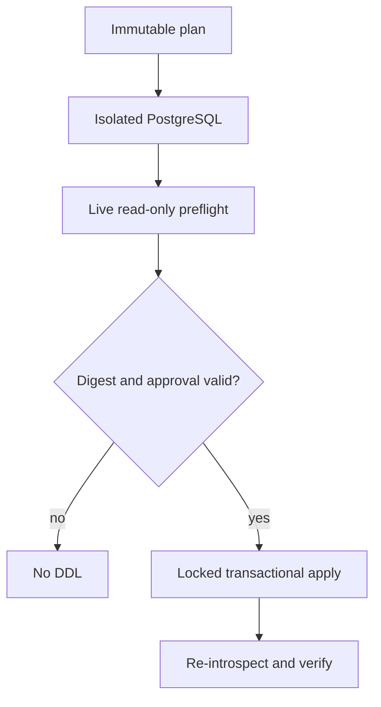

# Technical Requirements: Safe Forward Engineering

## Document control

- **Status:** Approved target architecture; Phase 1 control plane partially implemented
- **Date:** 2026-08-09
- **Normative detail:** [Forward Engineering v1 contract](contracts/forward-engineering-v1.md)
- **Decisions:** [ADR index](adr/README.md)
- **Architecture:** [Root architecture](../ARCHITECTURE.md), [UML](UML.md), and
  [data model](DATA_MODEL.md)

This TRD separates repository truth from target design. **Implemented** means
code exists in the current branch. **Partially implemented** means a bounded
fail-closed subset exists. **Planned** means no runtime claim is permitted.

## Technical outcome

The graphical workflow must convert untrusted semantic intent into a
server-owned, immutable, target-bound plan and later execute that exact plan
through an isolated validation and durable apply plane. The browser never owns
executable SQL, safety classification, approval truth, or recovery state.

## Current architecture and implementation boundary

### Implemented in Phase 1

- `app.forward.schema_model`: PostgreSQL 14–18 canonical model validation,
  deterministic JSON, and SHA-256 digest.
- `SchemaModel` and `SchemaModelRevision`: project identity plus immutable
  numbered revision rows; save uses row locking and a strong revision-UUID
  `ETag`/`If-Match` token distinct from the model content digest.
- `app.forward.snapshot_adapter`: strict translation of the proven live
  introspection subset; unsupported semantics return sanitized `422`.
- `app.forward.migration_plan`: deterministic structured transactional plans,
  risks, privileges, dependencies, preconditions, blockers, review-only
  proposals for supported deltas in a blocked plan, and plan digest.
- `MigrationPlan`: immutable plan JSON bound to project, revision, connection,
  succeeded base snapshot, actor, compiler version, and 24-hour expiry.
- Role order `viewer < editor < deployer < owner`; persistent legacy
  `apply-sql` requires deployer authority.

### Planned and release-blocking

- plan retrieval, `MigrationRun`, and `MigrationRunEvent` APIs/tables;
- isolated disposable PostgreSQL execution and cleanup;
- bounded target read-only preflight and apply-time drift revalidation;
- stored-plan executor, transaction segmentation, locks, timeouts, approval,
  idempotency, cancellation, reconciliation, and post-apply verification;
- frontend graph/model adapters and `ForwardEngineeringModal`;
- real PostgreSQL integration, fault-injection, accessibility, and browser E2E.

The legacy `POST /api/connections/{db_connection_uuid}/apply-sql` remains a
transitional compatibility surface. Its `dry_run=true` runs DDL on the live
target and rolls it back; it is not the planned isolated dry run and is not used
by the graphical target architecture.

## Required invariants

| ID | Invariant | Current status |
|---|---|---|
| FE-TRD-001 | Browser requests contain model intent or plan/run IDs and expected digests, never graphical-workflow SQL. | **Implemented for plan creation; executor Planned** |
| FE-TRD-002 | Canonicalization preserves exact identifier semantics and rejects unknown or lossy fields. | **Implemented for current subset** |
| FE-TRD-003 | Every admitted base→target difference yields operations or blockers; any blocker suppresses executable statements while supported independent deltas remain in `proposed_statements` for review. | **Implemented for current canonical subset** |
| FE-TRD-004 | A plan binds exact project, model revision, connection, succeeded snapshot, compiler version, digests, actor, and expiry. | **Implemented** |
| FE-TRD-005 | Cross-project/missing/unauthorized identities do not reveal another tenant's resource existence. | **Partially implemented; full matrix gate remains** |
| FE-TRD-006 | Dry-run DDL executes only in a disposable isolated PostgreSQL environment; the metadata DB is never a sandbox. | **Planned** |
| FE-TRD-007 | Live preflight is read-only evidence; apply repeats fingerprint/data preconditions after locks on the execution connection. | **Planned** |
| FE-TRD-008 | V1 apply contains one transaction-capable segment; non-transactional operations block the whole plan. | **Plan subset implemented; executor Planned** |
| FE-TRD-009 | Queue payload contains only `migration_run_uuid`; secrets, DSNs, SQL batches, and row values are excluded. | **Planned** |
| FE-TRD-010 | Idempotency and compare-and-swap select one run; apply is never automatically replayed after an ambiguous boundary. | **Planned** |
| FE-TRD-011 | Known commit is followed by re-introspection; only exact target digest becomes `verified`. | **Planned** |
| FE-TRD-012 | Unknown versions/kinds, expired plans, incomplete evidence, and timeout are non-success states. | **Partially implemented; expiry is stored but run enforcement Planned** |

## Current persistence model

| Entity | Purpose | Mutability |
|---|---|---|
| `ProjectSpace` / `ProjectMember` | Tenant and role boundary | Existing product contract |
| `DbConnection` | Encrypted target connection record | Existing product contract |
| `SchemaSnapshot` / `SchemaSnapshotData` | Succeeded base/introspection evidence | Immutable capture payload |
| `SchemaModel` | Project-scoped desired-model identity/current revision pointer | Pointer and timestamps update |
| `SchemaModelRevision` | Canonical desired JSON, digest, base snapshot, actor | Append-only through API |
| `MigrationPlan` | Target-bound compiler output and expiry | No update route; immutable through API |
| `MigrationRun` / `MigrationRunEvent` | Durable attempt and append-only evidence | **Planned; absent** |

Database schema truth is defined in `backend/app/models.py` and Alembic revisions
`0008_schema_model_revision` and `0009_migration_plan`. See
[DATA_MODEL.md](DATA_MODEL.md) for actual and planned ERDs.

## Current HTTP contract

| Method and route | Authority | Behavior | Status |
|---|---|---|---|
| `POST /api/schema-models/by-project/{project_space_uuid}` | editor+ | Create identity and revision 1 | **Implemented** |
| `GET /api/schema-models/{schema_model_uuid}` | member | Current immutable revision, IDOR-masked | **Implemented** |
| `PUT /api/schema-models/{schema_model_uuid}` + strong revision-UUID `If-Match` | editor+ | Idempotent no-op for identical content/base or append successor; stale/weak token `409`; responses expose `ETag` through CORS | **Implemented** |
| `POST /api/schema-model-revisions/{revision_uuid}/migration-plans` | editor+ | Validate exact tenant/connection/snapshot binding, compile, bound, persist | **Implemented** |
| `GET /api/migration-plans/{plan_uuid}` | member | Immutable preview, IDOR-masked | **Implemented** |
| `POST /api/migration-plans/{plan_uuid}/dry-runs` | editor+ | Exact-digest idempotent durable dry run | **Planned** |
| `POST /api/migration-plans/{plan_uuid}/apply-runs` | deployer+ | Exact passed evidence + typed/destructive confirmation | **Planned** |
| `GET /api/migration-runs/{run_uuid}` | member | Poll bounded durable state/evidence | **Planned** |

Implemented limits: model input is at most 2 MiB; a persisted plan is at most
1,000 executable plus proposed statements and 4 MiB; plans expire 24 hours
after creation. Current errors
use sanitized FastAPI `{"detail": ...}` JSON. The target contract will adopt
stable machine codes consistent with RFC 9457 without exposing credentials.

## Compiler v1 capability matrix

| Construct/change | Current behavior | Runtime execution status |
|---|---|---|
| Create schema/table; table drop | Structured statement; schema removal blocks | Control plane **Implemented** |
| Add/drop column | Structured statement; required add has `table_is_empty` precondition | Control plane **Implemented** |
| Type/nullability change | Type aliases normalize to catalog spelling; serial pseudo-types reject; type changes carry conservative destructive/data-loss/scan/rewrite evidence | Control plane **Implemented** |
| Primary key on new table | Preserves name, order, and deferrability | Control plane **Implemented** |
| Nullable primary-key column | Rejected before planning to preserve catalog convergence | **Implemented boundary** |
| Existing primary-key change | Explicit blocker | **Implemented blocker** |
| Table/column comments | Explicit blocker; no silent omission | **Implemented blocker** |
| Existing/non-append column order | Explicit blocker | **Implemented blocker** |
| Defaults, identity, generated columns | Fail closed at model/snapshot boundary | **Rejected for v1 subset** |
| Unique/check/foreign-key constraints | Fail closed at current subset boundary | **Rejected for v1 subset** |
| Secondary/expression/partial indexes | Fail closed; only verified PK backing index is filtered | **Rejected for v1 subset** |
| Views, triggers, partitions, tablespaces, RLS, domains, extensions, distributed tables | Fail closed before planning | **Rejected for v1 subset** |
| Concurrent/non-transactional DDL and DML | Not admitted | **Rejected for v1** |

Failing the snapshot/model boundary currently returns `422` rather than a
persisted plan blocker because no trustworthy target model can be constructed.
The UI must present that as unsupported input, not as success.

Only snapshots carrying the current capability-contract version may plan.
Catalog reads share one read-only repeatable-read transaction; dropped column
slots are captured and rejected until ordinal semantics can be preserved.

## Planned validation and execution plane

- Sandbox and live-preflight evidence bind the same plan/base digest but are
  separate evidence classes.
- Apply obtains a deterministic target advisory lock and sorted object locks,
  sets bounded lock/statement/transaction timeouts, then repeats drift and data
  preconditions on the same connection.
- V1 executes one transaction-capable segment. A statement or postcondition
  failure rolls the entire segment back.
- Loss of commit acknowledgement enters reconciliation. The worker never
  retries DDL automatically; fresh introspection decides `verified`,
  `not_applied`, or `outcome_unknown`.

Exact state tokens, confirmation inputs, and terminal claims are normative in
the [v1 contract](contracts/forward-engineering-v1.md) and
[ADR-0004](adr/ADR-0004-durable-runs-and-recovery.md).

## Security and operational requirements

- Reuse guarded DNS resolution, pinned IP, TLS hostname verification, encrypted
  DSN handling, CSRF, rate limiting, and project authorization.
- Sandbox has no target credentials or route to production; live-preflight has
  no DDL authority; metadata PostgreSQL is never the sandbox.
- Log/event fields are bounded identifiers, digest prefixes, counts, states,
  durations, and sanitized error classes. High-cardinality IDs do not become
  metric labels.
- Apply has an operator kill switch for new run creation. Cancellation before
  apply is compare-and-swap; after execution starts it becomes reconciliation,
  not a success or blind retry.
- `outcome_unknown` requires operator evidence collection and blocks automatic
  successors on the same target until reconciled.

See the [threat model](security/forward-engineering-threat-model.md) and
[runbook](runbooks/forward-engineering.md).

## Requirement-to-evidence traceability

| Requirement | Current implementation | Current tests | Remaining gate |
|---|---|---|---|
| FE-TRD-001–004 | `app/forward/*`, schema-model/plan APIs, models, migrations | `test_forward_*`, `test_api_schema_models.py`, `test_api_migration_plans.py` | Real PostgreSQL round trip |
| FE-TRD-005 | Uniform masking in schema-model/plan routes; project roles | API/permission tests | Full HTTP IDOR matrix |
| FE-TRD-006–008 | Structured risk/precondition/transaction metadata only | Compiler unit tests | Sandbox, live preflight, executor integration |
| FE-TRD-009–012 | Design/ADR/contract only; expiry stored | Documentation contract | Durable run tables/workers, crash and concurrency tests |
| FE-NFR-006 | Existing modal accessibility utilities only | Existing dialog tests | Forward workflow accessibility/E2E |

The detailed per-file matrix and open gaps are maintained in
[DOCUMENTATION_AUDIT.md](DOCUMENTATION_AUDIT.md) and
[TEST_STRATEGY.md](TEST_STRATEGY.md).

## Exact-head release gates

Before the end-to-end feature is production-complete, the exact release commit
must pass:

1. backend formatting/lint, mypy, full tests, owned production coverage, and
   Alembic upgrade/downgrade/integration checks;
2. frontend typecheck, unit/component tests, owned production coverage, and
   production build;
3. ephemeral PostgreSQL execution, drift, lock, timeout, rollback, crash,
   reconciliation, and convergence tests;
4. keyboard/accessibility and composed browser E2E for success and every
   material failure/uncertainty path;
5. repository security, dependency, and secret scans;
6. documentation contract and link/diagram validation.

Passing Phase 1 unit tests does not satisfy gates 2–6 and must not be described
as a production-ready live migration workflow.
