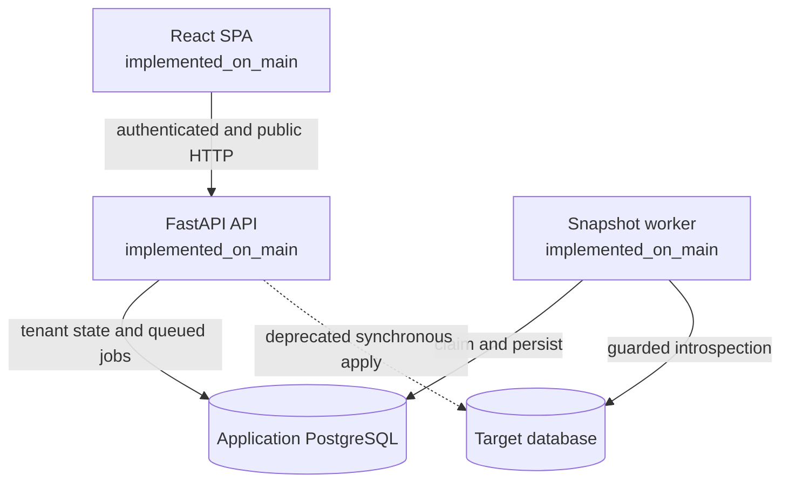
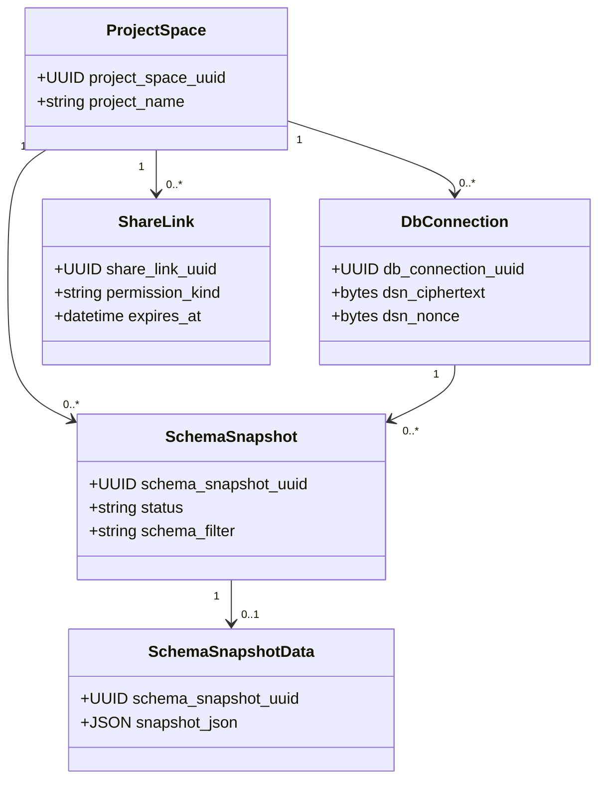
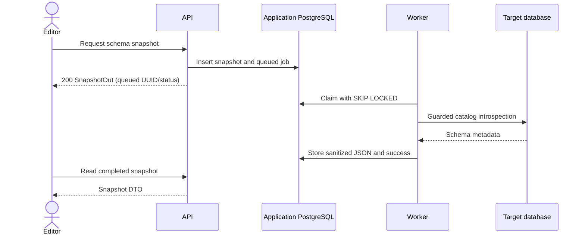
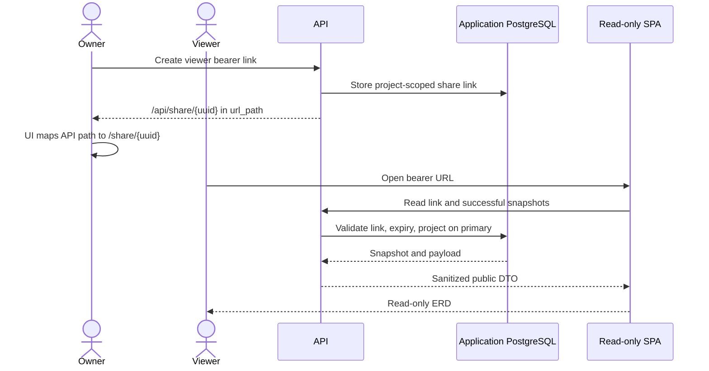
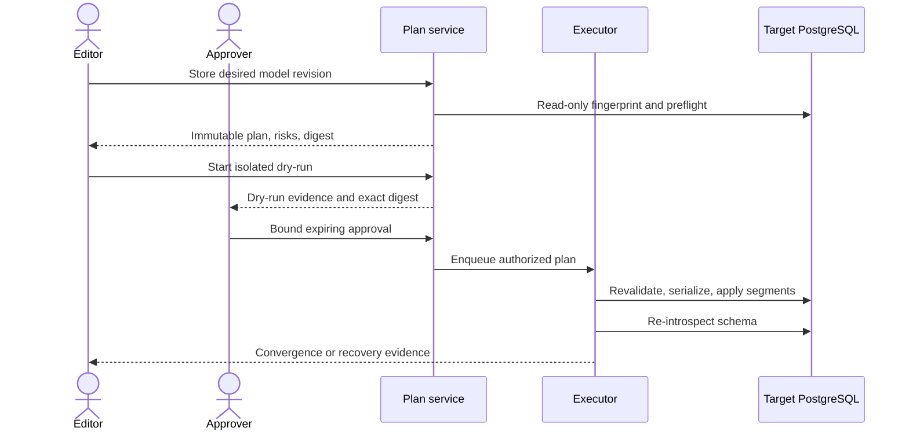
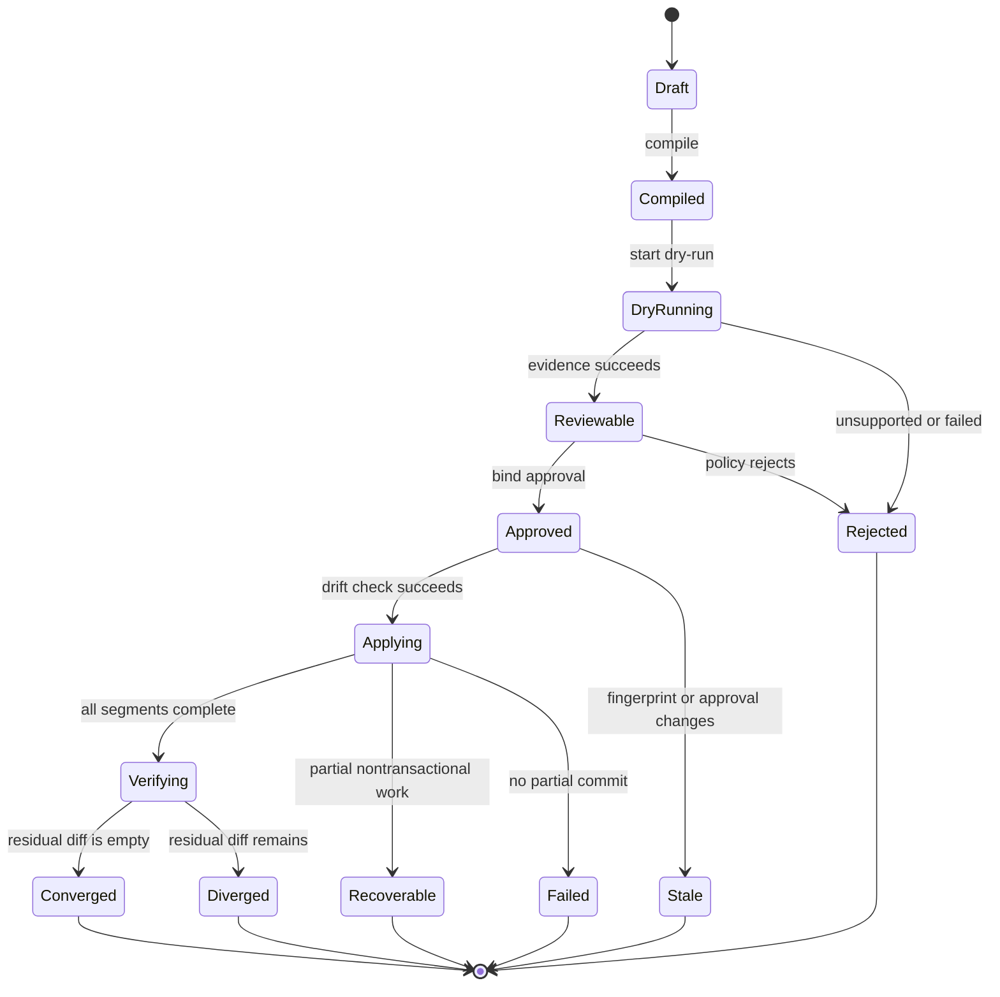
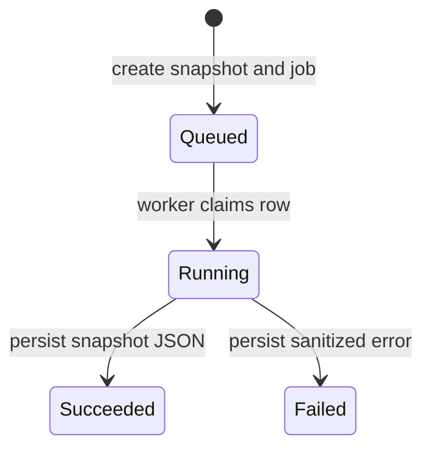
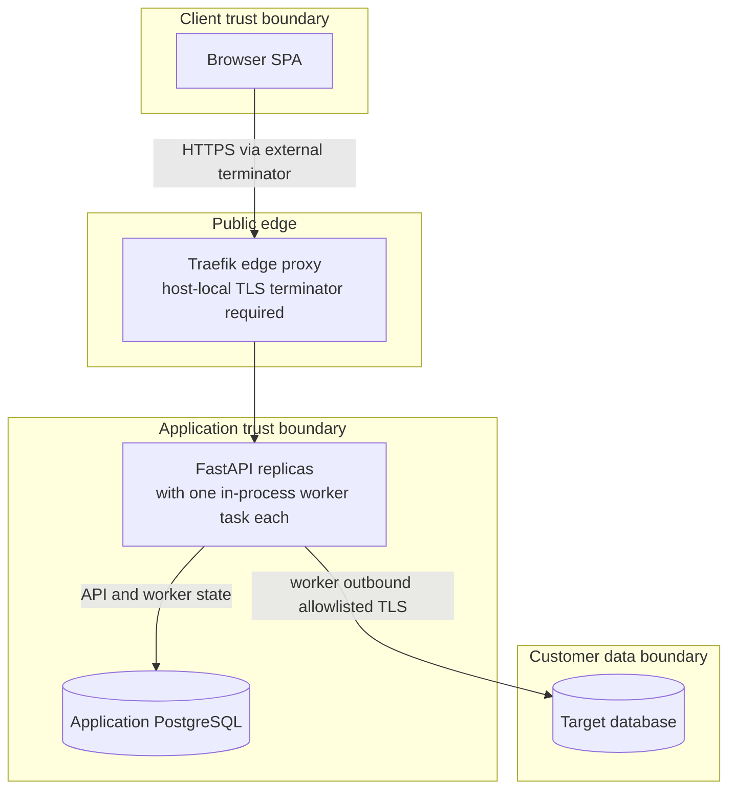

# UML and Behavioral Architecture

Status date: 2026-08-09
Notation: UML-shaped Mermaid diagrams; lifecycle labels are normative

These views separate the running system from the accepted but unimplemented
Forward Engineering target. Diagram presence is not implementation evidence.

## Current component view

The SPA currently persists neither its complete edited schema intent nor a
version binding between layout/groups and a successful snapshot. `diagram_view`
and `table_annotation` APIs exist on main but are not integrated by the current
frontend. Public share in PR #824 renders sanitized snapshot state, not an
unsaved local edit.

## Current domain class view

The complete relational view is in [ERD](ERD.md); this class view intentionally
shows only the core discovery/share aggregate.

## Reverse-engineering sequence (`implemented_on_main`)

## Public-share sequence (`active_pr` #824)

## Governed Forward Engineering sequence (`planned`)

## Planned migration job state

`Recoverable` is intentionally distinct from `Failed`: after a committed
non-transactional segment the system must never claim a global rollback.

## Current snapshot state (`implemented_on_main`)

There is no current `Running` → `Queued` reclaim transition. A worker crash can
strand both job and snapshot state until operator intervention or future lease
recovery is implemented.

## Deployment view

The committed production stack routes HTTP internally and requires TLS
termination outside the stack on the same host because Traefik is published on
loopback only. The trust allowlist must contain the minimal direct-peer CIDR
Traefik actually observes after Docker NAT (commonly the Compose bridge gateway),
not an assumed pre-NAT terminator address. Traefik appends that peer to the chain;
the backend selects the second hop from the right for logging and rate limits.
Production credentials are currently loaded through environment-backed settings,
a documented deviation in `AGENTS.md`.
Migration to a credential registry is `planned`; this diagram does not imply
either external control is already deployed.

## Diagram change rule

Any change to trust boundaries, persisted aggregates, job state, public-share
surface, or Forward Engineering ordering updates this document, the relevant
ADR, [TRD](TRD.md), [ERD](ERD.md), and
[traceability matrix](traceability-matrix.md) in the same pull request.
