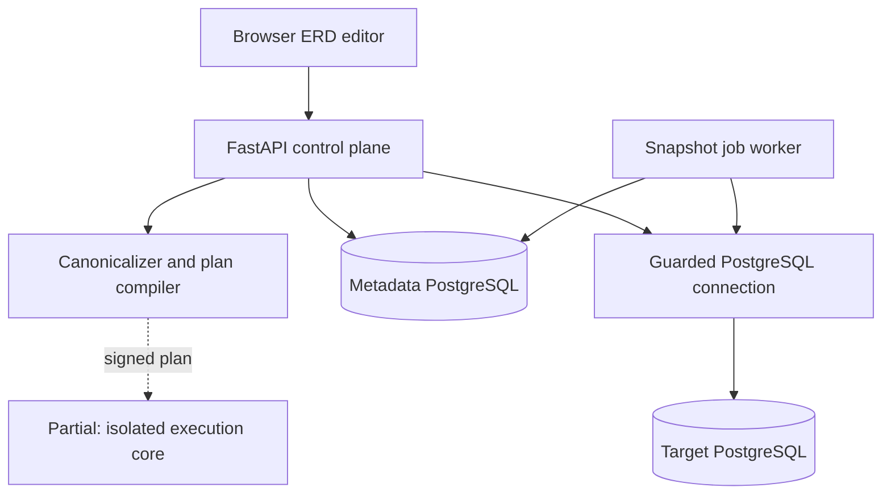
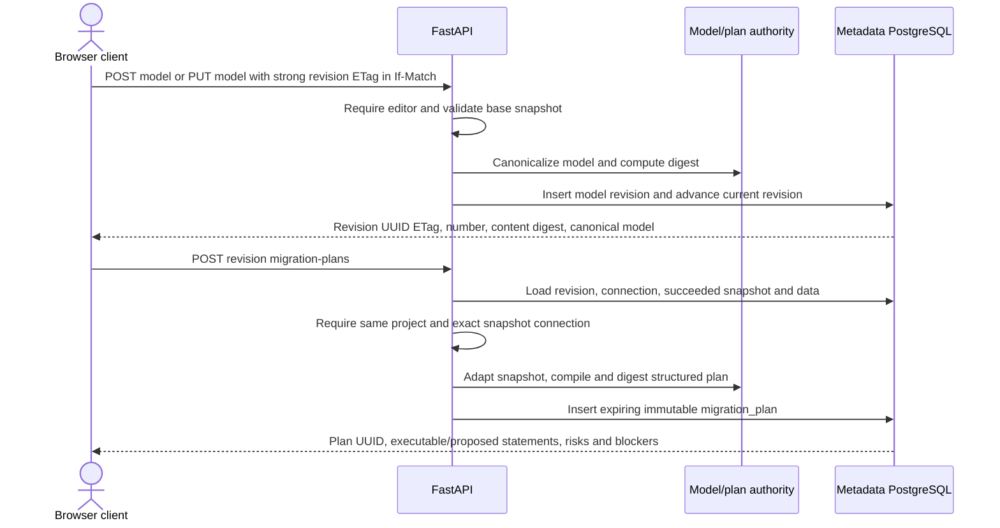
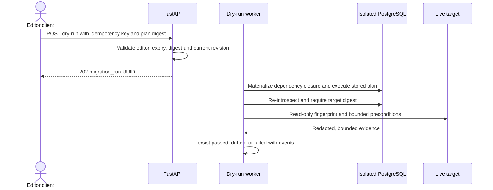
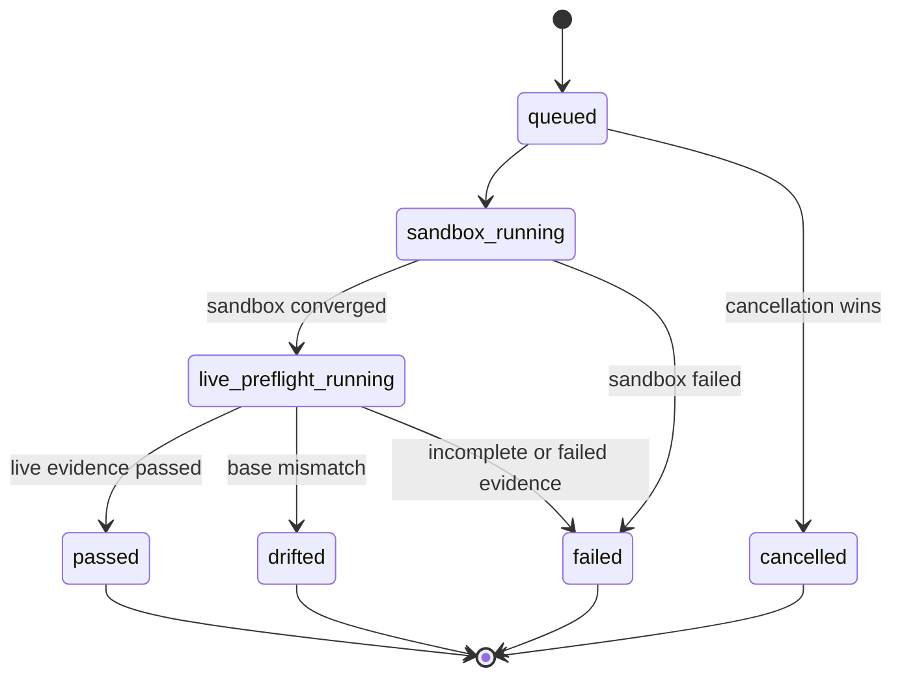
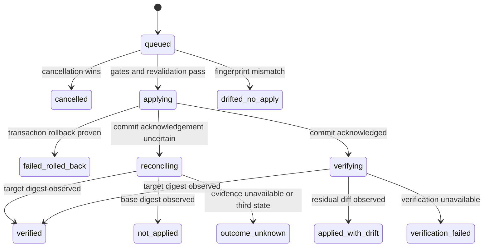

# Forward Engineering UML

- **Document status:** Current implementation and accepted target design
- **Runtime status:** Partially implemented; not production-ready
- **Last reconciled with the working tree:** 2026-08-12

The repository Mermaid diagrams in this document are authoritative. The
[FigJam companion board](https://www.figma.com/board/MLWimuWoOWhatQ239QihfP)
is useful for review workshops, but it does not override code, migrations,
ADRs, or these diagrams.

## Status legend

| Label | Meaning |
|---|---|
| **Implemented** | The component or transition exists in source and has repository tests. |
| **Partially implemented** | A bounded subset exists, while documented release gates remain. |
| **Planned** | Accepted design only; no runtime claim is permitted. |
| **Rejected** | Deliberately excluded from the target workflow. |

## Current component view

**Status: Partially implemented.** The model/revision/plan control plane and
snapshot worker exist. The target is contacted by guarded introspection and by
the transitional `apply-sql` compatibility endpoint. A bounded isolated
validator core now verifies and executes a signed plan on a caller-owned
sandbox connection and requires strict target-digest convergence. There is no
sandbox lifecycle, structured live-apply executor, or migration-run worker yet.



Current authority boundaries:

- The browser submits model JSON. It is not trusted as executable SQL
  authority for the model-to-plan path.
- `app.forward.schema_model` validates, canonicalizes, and digests the model.
- `app.forward.snapshot_adapter` rejects snapshots it cannot represent
  losslessly in compiler v1.
- `app.forward.migration_plan` renders quoted SQL and structured risk data on
  the server. `migration_plan.plan_json` is immutable through the current API.
- `app.forward.isolated_dry_run` accepts only that digest-bound plan plus a
  caller-owned sandbox connection, validates version/base/transaction
  contracts, executes one bounded transaction, and requires a strict fresh
  target snapshot to converge. It does not provision or clean the sandbox.
- `app.pg_introspect.dsn_guard` applies a configured host allowlist, rejects
  restricted addresses, resolves DNS, and pins the validated IP used to
  connect. Verified-hostname TLS is applied when the DSN requests
  `sslmode=verify-full`.
- `POST /api/connections/{uuid}/apply-sql` still accepts a conservative
  allow-listed SQL subset. It is **Implemented legacy compatibility**, not the
  accepted production workflow.

Components deliberately absent from this current diagram are **Planned**:
isolated sandbox provisioning/materialization/cleanup, durable live-preflight
worker/attempt/credential binding, live plan execution, reconciliation, and
post-apply convergence verification. `execute_bound_live_preflight` binds a
caller-owned fresh-capture callback and checks to one read-only repeatable-read
transaction; `complete_live_preflight` strictly derives its terminal durable
CAS classification. `complete_isolated_dry_run` similarly revalidates exact
sandbox success against the stored plan and derives only the fixed next CAS.
The metadata layer now provides hashed, lease-bound durable attempt ownership.
Consumer-to-attempt binding is **Implemented** by an execution-neutral adapter,
but application startup wiring, credentials, and worker execution remain
**Planned**.
Durable `migration_run`/event/outbox persistence and this execution-neutral,
bounded read-only primitive are **Partially implemented**; neither constitutes
worker execution or dry-run success evidence.

## Current model-revision-plan sequence

**Status: Implemented control-plane slice.** Planning reads a persisted
succeeded snapshot; it does not contact the target during this request.



The create route is currently
`POST /api/schema-models/by-project/{project_space_uuid}`. The older design
spelling `POST /api/projects/{project_uuid}/schema-models` is **Planned**, not
an implemented alias. A blocked plan is persisted and returned with
`can_dry_run=false`; the compiler sets executable `statements=[]` when a
blocker exists. Independently supported deltas remain visible only in
`proposed_statements` for review, and `risk_summary` includes those proposals.
Proposals are never executor input while the plan is blocked.
Within each statement, structured `object_ref` and `dependency_refs` are
authoritative; joined target/dependency labels are display-only.

## Target dry-run sequence

**Status: Planned.** A successful dry run requires two separately identified
evidence classes. The sandbox executes the exact stored plan; the live target
receives read-only introspection and bounded precondition queries only.



**Rejected:** running DDL on the production target and rolling it back as
proof of dry-run safety. The rollback-only mode of legacy `apply-sql` is
transitional and does not satisfy this sequence.

## Target apply and verification sequence

**Status: Partially implemented.** The API-side confirmed apply intent is
Implemented and deliberately non-dispatched. The worker/executor sequence is
Planned and must consume only the stored structured plan; it must not accept a
replacement SQL string from the browser or queue payload.

```mermaid
sequenceDiagram
  actor Client as Deployer client
  participant API as FastAPI
  participant Worker as Apply worker
  participant Target as Live target
  participant DB as Metadata PostgreSQL

  Client->>API: POST apply-run with exact plan and dry-run evidence
  API->>API: Verify role, confirmations, expiry and idempotency
  API->>DB: Persist queued intent and confirmation digest; no dispatch
  API-->>Client: 202 migration_run UUID
  Note over API,DB: Implemented boundary ends here
  Worker->>Target: Lock, recheck fingerprint and data preconditions
  Worker->>Target: Execute one transactional segment and commit
  Worker->>Target: Re-introspect target after commit
  Worker->>DB: Persist verification snapshot, result and events
  DB-->>Client: Polled terminal evidence
```

If commit acknowledgement is lost, the worker re-introspects instead of
replaying: target digest means `verified`, unchanged base digest means
`not_applied`, and unavailable or third-state evidence means
`outcome_unknown`.

## Target run state machines

### Dry run

**Status: Partially implemented.** Durable persistence, authorized creation,
integrity-checked polling, cancellation intent, and bounded transition cores
exist. Deployed sandbox/preflight worker execution, cancellation propagation,
and terminal-state orchestration remain **Planned**.



### Apply and recovery

**Status: Partially implemented.** Confirmed queued intent persistence exists;
all executor transitions remain Planned. Cancellation may stop a queued run. After `applying`
begins, a cancellation request cannot produce a claim that execution stopped;
reconciliation and verification continue.



Only `verified` asserts that a persisted verification snapshot equals the
approved `target_digest`. `applied_with_drift`, `verification_failed`, and
`outcome_unknown` must never be rendered as success or “unchanged.”

## Related authority

- [Architecture](../ARCHITECTURE.md)
- [Forward-engineering v1 contract](contracts/forward-engineering-v1.md)
- [Data model and ERD](DATA_MODEL.md)
- [ADR index](adr/README.md)
- [Threat model](security/forward-engineering-threat-model.md)
- [Operational runbook](runbooks/forward-engineering.md)
