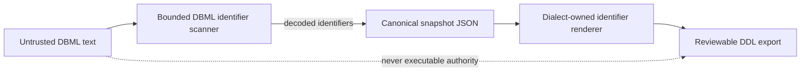

# DBML identifier-to-DDL boundary

## Status and scope

This boundary is **Implemented** for the authenticated DBML conversion path.
It is an export safety contract, not live-apply authority. The parser decodes
each DBML identifier once into the snapshot representation; the PostgreSQL DDL
renderer then delimits each identifier and doubles embedded quotes. Identifier
text is never interpreted as a SQL fragment.

The parser fails closed for NUL, unterminated quoted identifiers, empty or
ambiguous path segments, more than `schema.table.column` in references, more
than `schema.table` in table declarations, total input over 524,288 characters,
more than 10,000 lines, individual lines over 4,096 characters, and identifiers
over PostgreSQL's default 63-byte UTF-8 limit. Fixed API `422`
errors do not reflect rejected identifier text. Valid reserved words, Unicode,
whitespace, dots, semicolons, comment markers, and embedded quotes represented
as doubled DBML quotes remain data.

Generated primary-key and foreign-key names are bounded deterministically. A
name that would exceed 63 bytes retains the longest complete UTF-8 prefix that
fits plus a SHA-256-derived suffix, so PostgreSQL never silently truncates it.

## Data and authority flow

Parsing, canonical storage, and dialect rendering are deliberately separate.
The DBML API neither opens a target connection nor grants a browser-provided
statement execution authority. Value parameterization remains required in
database-query paths; bind parameters cannot replace identifier delimiters in
DDL, so identifiers use the renderer instead.

## Acceptance evidence

- `backend/tests/test_dbml_import.py` covers ordinary, Unicode, reserved-word,
  whitespace, embedded-quote, dot, semicolon, comment-marker, NUL, malformed,
  overlength, multi-segment, resource-bound, and derived-name cases.
- `backend/tests/test_api_dbml.py` proves a fixed non-reflecting `422` response.
- `backend/tests/test_fuzz_properties.py` provides an optional Hypothesis
  parse/decode/render round trip when Hypothesis is installed.
- `backend/tests/test_postgres_migration_run_integration.py` executes hostile-looking
  quoted names on each ephemeral PostgreSQL 14–18 matrix target and verifies
  that only the intended relation exists.

The real-version matrix, repository CI/security checks, exact-head review, and
protected-branch policy are authoritative. Local focused tests alone are not a
production-readiness claim. CodeGraph was unavailable in the implementation
runtime, so `rg`-based source/sink tracing supplemented direct inspection; the
exact-head review remains required to challenge that impact map.

## Monitoring and rollback

Monitor fixed `422 invalid DBML identifier` counts without logging DBML bodies
or rejected names. A rise can indicate incompatible producer output or hostile
input. Rollback must revert parser, renderer, tests, and this contract together;
do not retain permissive parsing with raw constraint rendering.

## References

Open Worldwide Application Security Project. (2026). *SQL injection prevention
cheat sheet*. OWASP Cheat Sheet Series.
https://cheatsheetseries.owasp.org/cheatsheets/SQL_Injection_Prevention_Cheat_Sheet.html

PostgreSQL Global Development Group. (2026). *PostgreSQL 18 documentation:
Lexical structure*. https://www.postgresql.org/docs/18/sql-syntax-lexical.html
