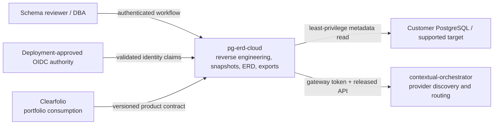

# Product and technical Gap baseline

Last reconciled: 2026-09-20

This ledger describes protected `main@8dc746920c12988f082e914879d95e13c9693535`
and the active documentation generation in
[PR #824](https://github.com/ContextualWisdomLab/pg-erd-cloud/pull/824).
It is a planning and acceptance record, not evidence of a deployment, published
Pages site, immutable release, certification, or completed Forward Engineering
product. Merge and release decisions must re-fetch the final exact head, base,
reviews, required Checks, artifacts, and public endpoints.

## Evidence boundary

| Evidence | Current authority | Status |
| --- | --- | --- |
| Protected product source | `main@8dc746920c12988f082e914879d95e13c9693535` | `implemented_on_main` only where code/tests say so |
| Active documentation and share hardening | PR #824, exact head re-fetched at decision time | `active_pr`; never protected or released evidence |
| Product requirements | [PRD](PRD.md) | Mixed `implemented_on_main`, `active_pr`, and `planned` |
| Technical contract | [TRD](TRD.md) and [Architecture](../ARCHITECTURE.md) | Current/target split is explicit |
| Public landing | [README](../README.md) and [docs index](index.md) | Must not claim Pages or release publication |
| License grant | [Apache License 2.0](https://github.com/ContextualWisdomLab/pg-erd-cloud/blob/8dc746920c12988f082e914879d95e13c9693535/LICENSE) | Repository source grant; not third-party clearance |

Transient queue, review, and Check state belongs to GitHub. It is not committed
here as durable GREEN evidence.

## PRD, TRD, UML, and ERD status

| Surface | Authority | Current state | Acceptance boundary |
| --- | --- | --- | --- |
| PRD | [docs/PRD.md](PRD.md) | Buyer journeys and requirement IDs exist | Planned requirements remain visibly planned |
| TRD | [docs/TRD.md](TRD.md) | Current runtime and target Forward Engineering are separated | No target design is marketed as shipped |
| UML | [docs/UML.md](UML.md) | Structure, interaction, state, class, and deployment views exist | Diagrams follow lifecycle labels and executable evidence |
| ERD | [docs/ERD.md](ERD.md) | Current application model and planned migration model are separated | Planned tables are not assumed to exist |
| ADR | [docs/adr/README.md](adr/README.md) | Decision index exists | A later decision supersedes contradictions explicitly |
| Traceability | [docs/traceability-matrix.md](traceability-matrix.md) | Requirements map to code, tests, and PR evidence | Final exact-head evidence is reacquired after every mutation |

## Context Map

pg-erd-cloud owns schema acquisition, snapshot identity, ERD collaboration, and
its API boundary. It does not own the target database, identity-provider
lifecycle, LLM provider selection, or Clearfolio's portfolio truth. Integrations
use released contracts and ACLs; they do not read sibling source or databases.

## Gap, Action, and Status

| Gap | Evidence | Action | Status |
| --- | --- | --- | --- |
| Public docs implied that a share bearer could invoke paid live LLM work | PR #824 predecessor `docs/index.md` | State that `llm-draft` exists only on the authenticated project route; keep public share deterministic | `active_pr` repair |
| Package-facing license evidence followed mutable `main` | PR #824 predecessor `docs/index.md` | Pin the link to the reviewed protected-base license blob and regression-test it | `active_pr` repair |
| No canonical product/technical Gap ledger | Repository tree at PR #824 predecessor | Maintain this PRD/TRD/UML/ERD/Context Map/Gap/Action/Status record | `active_pr` |
| Application LLM client remains provider-shaped and has a finite default timeout | `backend/app/settings.py`, integration guide | Production deployment must use contextual-orchestrator's released gateway contract, gateway token, `orchestrator/free`, and no application-selected paid fallback; separately replace elapsed-time termination with explicit user/provider/admin semantics | Open product/runtime Gap |
| Durable Forward Engineering admission and recovery are incomplete | PRD/TRD/ADR-0004 | Implement immutable model, plan, approval, dry-run, apply, recovery, and convergence evidence before production claims | `planned` |
| Claimed jobs have no complete lease/reclaim proof | Architecture/TRD | Add restart, duplicate-delivery, idempotency, and recovery acceptance | Open reliability Gap |
| Browser OIDC product flow is incomplete | PRD and current SPA | Complete product-owned login/session UX against the deployment-approved identity authority | `planned` |
| GitHub Pages publication is not verified | Repository reports `has_pages=false` at reconciliation | Publish only through the organization-owned deployment path; verify the final HTTPS artifact before mentioning it as live | Missing publication |
| No immutable GitHub Release exists | Release inventory was empty at reconciliation | After protected exact-head acceptance, publish version, changelog, SBOM, provenance, dependency notices, rollback, and recovery evidence | Missing release |
| Third-party notice scope is not yet bound to a release artifact | Root Apache-2.0 license exists; no root NOTICE was present | Generate the dependency/license inventory from the final wheel/container/frontend assets and add only required, source-backed attribution | Open licensing Gap |

## Release and licensing boundary

The root Apache-2.0 text is evidence of the repository's source-license grant.
It is not evidence that every dependency, bundled asset, container layer, or
published artifact has been cleared. No rights holder, copyright statement, or
NOTICE obligation is inferred.

A commercial release is accepted only after the same immutable candidate is
bound to version and changelog, terminal exact-head Checks and independent
review, dependency inventory, required notices, SBOM, provenance,
reproducibility, deployment/recovery evidence, and rollback instructions.
The absence of a GitHub Release or verified Pages endpoint remains a missing
artifact, not a documentation-only completion.
