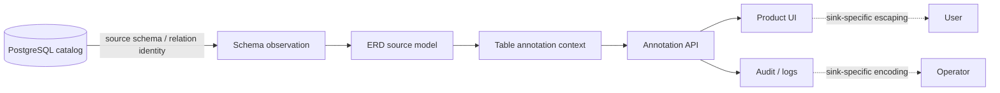

# Product–technical gap baseline

This document is the code-current product/technical baseline for **pg-erd-cloud**. It records buyer-visible capability gaps and the exact contracts required to close them. It is not a release claim, security certification, or substitute for current-head CI and independent review.

## Product boundary

pg-erd-cloud reverse-engineers PostgreSQL schema truth and presents it through ERD, DDL-sharing, and collaborative metadata workflows. PostgreSQL source-object identity and product-authored display metadata are separate domain concepts.

### Ubiquitous language and ownership

| Concept | Owner | Invariant |
| --- | --- | --- |
| Source object identity | PostgreSQL/source-schema observation boundary | Preserve the source identifier losslessly whenever PostgreSQL can represent it; do not rewrite it to satisfy a UI/log policy. |
| Product display label | pg-erd-cloud product metadata | Reject control characters that have no product-label meaning before persistence/rendering. |
| Table annotation | pg-erd-cloud collaboration context | Key annotation lookup by project + exact schema identity + exact relation identity. |
| Render/log representation | The concrete UI/log/audit sink | Escape or encode characters at the sink if that sink interprets them; never mutate source identity as a generic logging workaround. |

The boundary follows PostgreSQL 18: quoted identifiers can contain any character except code zero, while PostgreSQL character types cannot store NUL. Product labels therefore have a deliberately narrower admission contract than externally owned PostgreSQL identity.

## Current repair lineage

PR #1126 (`fix(schema): preserve PostgreSQL source identifier truth`) owns the current repair. At the time this baseline is created, the branch is Draft and not release-authorized.

The source contract is:

- `TableAnnotationUpsertIn.schema_name` and `relation_name` reject NUL but preserve other source characters accepted by the PostgreSQL identity contract.
- `DiagramViewCreateIn.name` and `ApiKeyCreateIn.key_name` retain the product-label C0/DEL restriction.
- `test_schema_identifier_boundaries.py` fixes the admission boundary in regression tests.
- `test_api_annotations.py::test_annotation_source_identifiers_survive_write_and_read_mapping` verifies that accepted source identity reaches the annotation persistence adapter unchanged and is returned unchanged by the application read mapping.

The application mapping test is **not** evidence of a real PostgreSQL storage round trip. That distinction is intentional.

## Gap ledger

### G-001 — PostgreSQL source-identity preservation

**Problem.** A single generic control-character regex for both product labels and external PostgreSQL identifiers destroys valid source truth and violates the source-schema bounded context.

**Decision.** Separate admission policies by ownership. NUL remains invalid for PostgreSQL-backed character identity; product labels keep the narrower control-character policy. Generic log/terminal concerns are handled at the actual interpretation sink.

**Current acceptance evidence.** Schema-level regression and application write/read mapping regression exist on PR #1126. Repository CI for the previous exact generation was green, but every source/document change requires new exact-head evidence.

**Close only when.** The unchanged PR head has terminal repository CI, SAST and security evidence; delegated CodeQL is settled for that exact identity; current-head review has no valid unresolved finding; and a real PostgreSQL integration test proves a representative accepted non-NUL identifier survives write/read without normalization.

### G-002 — Real PostgreSQL round-trip evidence

**Problem.** Unit/application mapping tests can prove that pg-erd-cloud itself does not rewrite a value, but they cannot prove driver/database/encoding behavior.

**Required RED.** A PostgreSQL-backed integration test must exercise an identifier containing a representative non-NUL character outside the product-label policy and fail if any storage/readback layer rewrites or rejects it contrary to the documented PostgreSQL contract.

**Required GREEN.** Create/read through the production persistence path on the supported PostgreSQL version returns the exact same identifier; cleanup leaves no residual test object; the test is included in normal release evidence rather than a manual-only probe.

### G-003 — Central delegated CodeQL settlement

**Problem.** Repository CodeQL compatibility jobs have been observed to terminalize before the authoritative current-head dispatch is available. This is a shared CI/control-plane concern, not a pg-erd-cloud source workaround.

**Owner boundary.** `.github` owns reusable CI/review/security/release. pg-erd-cloud must not weaken the gate, publish a synthetic status, or make a no-op source change to retrigger it.

**Required GREEN.** The canonical owner must bind an authenticated verdict to exact repository/PR/head/base/run/language identity before consumer settlement, or the consumer must bounded-wait/reconcile that exact identity. Stale/malformed identity, actual scan failure and cancellation remain fail-closed.

## Product/release decisions

- **Draft remains correct** while G-001 exact-head evidence and G-002 database evidence are incomplete.
- No version, tag, package, immutable release, SBOM/provenance claim, deployment, or rollback claim is created by this repair alone.
- If a downstream UI, log or audit sink proves unsafe for a legal PostgreSQL identifier, fix the sink with escaping/encoding and add a hostile regression there. Do not expand source admission restrictions as a shortcut.
- A later material UI that displays these identities must additionally verify normal/loading/empty/error/permission states, keyboard and accessible naming behavior, responsive widths, and KO/EN/JA/ZH/VI/ES/DE/FR text behavior before its Delivery Gate can pass.

## Traceability

| Evidence | Purpose |
| --- | --- |
| `backend/app/schemas.py` | Admission policy separating external source identity from product labels. |
| `backend/app/api/annotations.py` | Exact source identity used for annotation lookup/create and output mapping. |
| `backend/tests/test_schema_identifier_boundaries.py` | Schema admission regression. |
| `backend/tests/test_api_annotations.py` | Application write/read mapping regression. |
| PR #1126 | Review, exact-head checks, repair lineage and acceptance state. |
| PostgreSQL 18 §4.1 Lexical Structure | Primary source for quoted-identifier character contract. |
| PostgreSQL 18 §8.3 Character Types | Primary source for NUL prohibition in PostgreSQL character data. |

## References

PostgreSQL Global Development Group. (2026). *PostgreSQL 18 documentation: 4.1. Lexical structure*. https://www.postgresql.org/docs/18/sql-syntax-lexical.html

PostgreSQL Global Development Group. (2026). *PostgreSQL 18 documentation: 8.3. Character types*. https://www.postgresql.org/docs/18/datatype-character.html
