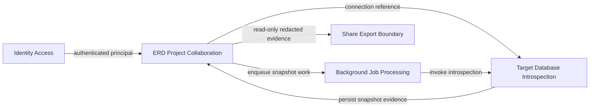
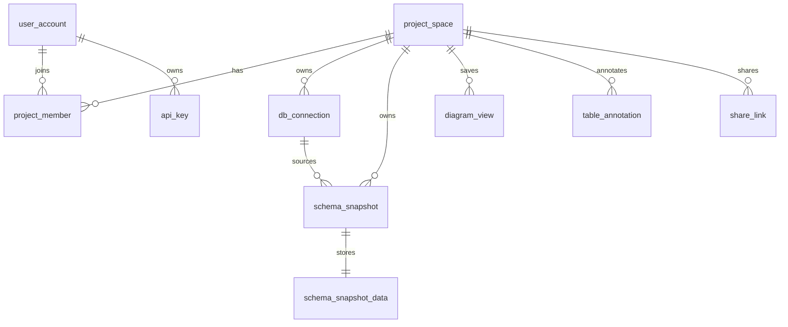

# Product and technical gap baseline

Status: active baseline for `ContextualWisdomLab/pg-erd-cloud`.

## Buyer PRD

`pg-erd-cloud` is the ecosystem's PostgreSQL-first ERD collaboration product for developers and data architects. It reverse-engineers database structure into persisted schema snapshots, renders interactive ERDs, supports project/member collaboration, exposes controlled read/export sharing, and derives DDL/diff/spec artifacts from persisted snapshots rather than repeatedly accessing a live target database.

Buyer-visible outcomes:

- understand an unfamiliar PostgreSQL/Snowflake schema quickly;
- save and revisit diagram layouts without losing project context;
- collaborate on project-scoped schema analysis without exposing target-DB credentials;
- export reviewable DDL, DBML, Mermaid, diffs, migration analysis, and reversing specifications;
- share read-only project evidence while preserving redaction and authorization boundaries.

## TRD and deployable boundaries

The repository has three deployable responsibility areas:

1. `backend/`: FastAPI, async SQLAlchemy, Alembic, schema introspection, snapshot/job processing, authorization, exports, and metadata persistence.
2. `frontend/`: React/Vite ERD workspace and export UX.
3. `deploy/traefik/`: production edge routing and security-header policy.

The application PostgreSQL database is the source of truth for users, projects, encrypted connection metadata, snapshots, job queue state, saved diagram views, annotations, share links, and API keys. Optional Valkey is a wake-up signal rather than job truth. Long-running target-DB introspection remains asynchronous.

## DDD bounded contexts and context map

### ERD Project Collaboration — core subdomain

Ubiquitous language: `project_space`, `project_member`, `db_connection`, `schema_snapshot`, `diagram_view`, `table_annotation`, `share_link`.

Key aggregates:

- `ProjectSpace`: project ownership/membership and child-resource authorization boundary.
- `SchemaSnapshot`: immutable-ish captured schema identity plus processing state and associated snapshot payload.
- `DiagramView`: saved canvas representation keyed by `diagram_view_uuid`; invariant: owned display-name vocabulary is `diagram_name`, while historical HTTP `name` is only a compatibility alias.
- `TableAnnotation`: one project/schema/relation annotation identity enforced by a unique constraint.

Domain events are currently implicit in request/job transitions rather than a persisted event bus. Introducing event publication would require an ADR and explicit idempotency/outbox contract.

### Target Database Introspection — supporting subdomain

Anti-corruption boundary around PostgreSQL/Snowflake metadata sources. Target data is introspected into the repository-owned snapshot model; exports operate on the snapshot rather than leaking live provider-specific structures through the product core.

### Background Job Processing — supporting subdomain

`JobQueue` in PostgreSQL is authoritative; optional Valkey reduces wake-up/poll pressure. Worker claim paths use transactional locking and must preserve fail-closed concurrency semantics.

### Identity and Access — generic/supporting subdomain

OIDC/API-key authentication and project membership authorize product actions. Authentication/provider vocabulary is translated into project-owned authorization decisions rather than becoming the core domain model.

### Context map

## Core persistence ERD

## Naming contract baseline

Organization-owned identifiers should encode at least two lexical concepts when a bounded-context qualifier is available; casing follows the implementation language. Multiword `snake_case`, camelCase, and PascalCase are all acceptable. Externally mandated/genuinely established wire names may remain at explicit adapter boundaries.

Database-owned objects use semantically specific multiword `snake_case`. Current verified gap/remediation:

| Surface | Current generic name | Target / status |
| --- | --- | --- |
| Saved Diagram View DB/ORM/API internals | `name` | `diagram_name` — active PR; HTTP alias `name` preserved |
| Schema snapshot persistence/API | `status` | Gap remains; requires snapshot-state compatibility migration |
| Background job queue persistence/worker SQL | `status` | Gap remains; high-concurrency migration requires worker/index/locking-safe plan |
| Table annotation persistence/API | `body` | Gap remains; lower blast radius than queue/status work |

Do not conflate this invariant with casing-only lint. Existing meaningful multiword identifiers are not naming debt merely because they use camelCase/PascalCase.

## Security, test, and operability baseline

- Required PR evidence includes backend/frontend CI plus central Strix/OpenCode/coverage and supply-chain gates under branch protection.
- Security findings are repaired at source; gates are not weakened or suppressed.
- Runtime secrets/config are intended to move from direct environment reads to the organization credential/KV boundary; `backend/app/settings.py` remains a documented migration gap.
- Backend public definitions/docstrings are governed by the repository's 100% interrogate baseline; tests must accompany behavior/contract changes.
- Database migrations are committed with model changes and run before backend startup. Lock-heavy DDL must bound wait time or use a compatible phased migration.
- `diagram_view.name` → `diagram_name` is metadata-only but takes a strong table lock; revision `0008_diagram_view_semantic_name` applies a transaction-local five-second `lock_timeout` and documents that mixed-version backend processes must be drained before the rename.
- No Rust-owned mathematical/data-science core computation is introduced by the saved-view naming change.

## Current product/technical gap status

1. **Naming precision:** active. Saved Diagram View repair is implemented; snapshot/queue/annotation generic persisted fields remain prioritized by operational blast radius.
2. **Runtime credential source:** open. Existing `Settings(BaseSettings)` environment sourcing conflicts with organization KV/credential-registry policy and needs a dedicated migration.
3. **Database queue operability:** open. PostgreSQL is authoritative and Valkey is signal-only; any `job_queue.status` rename must preserve `FOR UPDATE SKIP LOCKED`, queue indexes, worker claims, retries, and rolling deployment safety.
4. **Architecture-document consolidation:** partial. `CLAUDE.md` currently carries most architecture detail; this baseline provides the product/DDD/gap index but does not replace a future canonical `ARCHITECTURE.md`.
5. **UI evidence:** not affected by the saved-view naming repair because the customer-facing `name` JSON contract and frontend behavior remain unchanged. Future visual changes require Storybook/screenshot/accessibility evidence.

## Exact-head evidence discipline

Every gap row is descriptive until a canonical PR makes the owning change. A repair is complete only when its unchanged current PR head has fresh required checks, valid review findings resolved, current qualifying independent approval, and ordinary branch protection permits merge. Base/predecessor/model-only evidence does not transfer.

## Research and standards traceability

Feitelson, D. G., Mizrahi, A., Noy, N., Ben Shabat, A., Eliyahu, O., & Sheffer, R. (2022). How developers choose names. *IEEE Transactions on Software Engineering, 48*(1), 37–52. https://doi.org/10.1109/TSE.2020.2976920

PostgreSQL Global Development Group. (2026). *PostgreSQL 18 documentation: ALTER TABLE*. https://www.postgresql.org/docs/18/sql-altertable.html

PostgreSQL Global Development Group. (2026). *PostgreSQL 18 documentation: Client connection defaults (`lock_timeout`)*. https://www.postgresql.org/docs/18/runtime-config-client.html

Schankin, A., Berger, A., Holt, D. V., Hofmeister, J. C., Riedel, T., & Beigl, M. (2018). Descriptive compound identifier names improve source code comprehension. In *Proceedings of the 26th Conference on Program Comprehension* (pp. 31–40). Association for Computing Machinery. https://doi.org/10.1145/3196321.3196332
