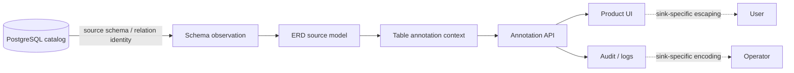

# Product–technical gap baseline

This document is the code-current product/technical baseline for **pg-erd-cloud**. It records buyer-visible capability gaps and the exact contracts required to close them. It is not a release claim, security certification, or substitute for current-head CI and independent review.

## Product boundary

pg-erd-cloud reverse-engineers PostgreSQL schema truth and presents it through ERD, DDL-sharing, and collaborative metadata workflows. PostgreSQL source-object identity and product-authored display metadata are separate domain concepts.

### Ubiquitous language and ownership

| Concept | Owner | Invariant |
| --- | --- | --- |
| Source object identity | PostgreSQL/source-schema observation boundary | Preserve the source identifier losslessly whenever PostgreSQL can represent it; do not rewrite it to satisfy a UI/log policy. |
| Product display label | pg-erd-cloud product metadata | Reject control characters that have no product-label meaning before persistence/rendering. |
| Table annotation | pg-erd-cloud collaboration context | Key annotation lookup by project + exact schema identity + exact relation identity. |
| Render/log representation | The concrete UI/log/audit sink | Escape or encode characters at the sink if that sink interprets them; never mutate source identity as a generic logging workaround. |

The admission boundary follows PostgreSQL 18 documentation: quoted identifiers can contain any character except code zero, while PostgreSQL character types cannot store NUL. Product labels therefore have a deliberately narrower admission contract than externally owned PostgreSQL identity. The current runtime acceptance lane uses the repository's supported PostgreSQL 16 image from `compose.yaml`; documentation version and tested runtime version are not conflated.

## Current repair lineage

PR #1126 (`fix(schema): preserve PostgreSQL source identifier truth`) owns the current repair and remains Draft / not release-authorized.

The source and acceptance contracts are:

- `TableAnnotationUpsertIn.schema_name` and `relation_name` reject NUL but preserve other source characters accepted by the PostgreSQL identity contract.
- `DiagramViewCreateIn.name` and `ApiKeyCreateIn.key_name` retain the product-label C0/DEL restriction.
- `test_schema_identifier_boundaries.py` fixes the admission boundary in regression tests.
- `test_api_annotations.py::test_annotation_source_identifiers_survive_write_and_read_mapping` verifies that accepted source identity reaches the annotation persistence adapter unchanged and is returned unchanged by the application read mapping.
- `test_postgres_identifier_roundtrip.py` drives the production annotation write/read functions through a real `AsyncSession`, closes the session between write and read, and verifies byte-for-byte source identity after PostgreSQL persistence.
- The CI backend lane starts the same pinned PostgreSQL 16 image used by `compose.yaml`, applies Alembic migrations, and activates the PostgreSQL integration test as normal PR evidence.

### Integration RED → repair candidate

Commit `6d9804ffa172f9ba7ce0eeb680644f7bcf80ccc4` activated the new PostgreSQL round-trip test before a database fixture existed. Hosted CI run `34582422611`, backend job `103208841676`, reached the test step and failed. That is a real acceptance-infrastructure RED: the repository previously had no PostgreSQL-backed PR lane capable of proving the documented storage contract.

Commit `3970e64e36632b9e81818b1032434d4fc2a1a9cc` added the causal database fixture rather than skipping the test: a health-checked pinned PostgreSQL service plus `alembic upgrade head` before pytest. The next hosted generation exposed a second causal defect instead of reaching pytest. On exact head `def3d55c803ffbed84a232cc0301829e61c67eea`, CI run `34582691173`, backend job `103209685132`, PostgreSQL was healthy but Alembic failed immediately with `ModuleNotFoundError: No module named 'app'` while importing `backend/alembic/env.py`. The migration command is a console-script entry point, so its import path did not inherit the backend working directory as the application package root.

Commit `b4d6e18d11bd830fdb9e25e326e7e87476537c03` is the minimal causal repair: `PYTHONPATH: .` is set only on the backend Alembic step, matching the existing mypy/pytest package boundary. No migration, source model, database fixture, or gate is weakened. This remains a GREEN candidate until a fresh unchanged-head generation proves migrations and the PostgreSQL round-trip test terminally pass.

## Gap ledger

### G-001 — PostgreSQL source-identity preservation

**Problem.** A single generic control-character regex for both product labels and external PostgreSQL identifiers destroys valid source truth and violates the source-schema bounded context.

**Decision.** Separate admission policies by ownership. NUL remains invalid for PostgreSQL-backed character identity; product labels keep the narrower control-character policy. Generic log/terminal concerns are handled at the actual interpretation sink.

**Current acceptance evidence.** Schema-level regression, application write/read mapping regression, and a PostgreSQL-backed round-trip test are present on PR #1126. The database test is not accepted until the unchanged current head has terminal CI evidence.

**Close only when.** The unchanged PR head has terminal repository CI, SAST and security evidence; delegated CodeQL is settled for that exact identity; current-head review has no valid unresolved finding; and the PostgreSQL integration lane proves the representative accepted non-NUL identifier survives write/read without normalization.

### G-002 — Real PostgreSQL round-trip evidence

**Problem.** Unit/application mapping tests can prove that pg-erd-cloud itself does not rewrite a value, but they cannot prove driver/database/encoding behavior.

**Observed RED.** `6d9804ffa172f9ba7ce0eeb680644f7bcf80ccc4` made the integration contract executable in ordinary CI and exposed the absence of any PostgreSQL fixture/migration stage: backend CI failed when pytest reached the activated database test. After adding the fixture, `def3d55c803ffbed84a232cc0301829e61c67eea` exposed the next concrete infrastructure defect: the Alembic console script could not import `app` because the backend package root was absent from `PYTHONPATH`.

**Repair candidate.** The lane now provisions the repository's pinned PostgreSQL 16 image, runs Alembic migrations with the backend package root explicitly available, and executes the test through production annotation functions. The test closes and reopens the application session before readback and removes its user/project/annotation rows in `finally` cleanup.

**Required GREEN.** A fresh unchanged-head PR generation must show the PostgreSQL-backed backend job terminal GREEN; source identity returned after persistence must exactly equal the submitted value; cleanup must complete; and the test must remain part of normal PR/release evidence rather than a manual-only probe.

### G-003 — Central delegated CodeQL settlement

**Problem.** Repository CodeQL compatibility jobs have been observed to terminalize before the authoritative current-head dispatch is available. This is a shared CI/control-plane concern, not a pg-erd-cloud source workaround.

**Owner boundary.** `.github` owns reusable CI/review/security/release. pg-erd-cloud must not weaken the gate, publish a synthetic status, or make a no-op source change to retrigger it.

**Required GREEN.** The canonical owner must bind an authenticated verdict to exact repository/PR/head/base/run/language identity before consumer settlement, or the consumer must bounded-wait/reconcile that exact identity. Stale/malformed identity, actual scan failure and cancellation remain fail-closed.

## Product/release decisions

- **Draft remains correct** while current-head G-001/G-002 evidence or G-003 delegated settlement is incomplete.
- No version, tag, package, immutable release, SBOM/provenance claim, deployment, or rollback claim is created by this repair alone.
- If a downstream UI, log or audit sink proves unsafe for a legal PostgreSQL identifier, fix the sink with escaping/encoding and add a hostile regression there. Do not expand source admission restrictions as a shortcut.
- A later material UI that displays these identities must additionally verify normal/loading/empty/error/permission states, keyboard and accessible naming behavior, responsive widths, and KO/EN/JA/ZH/VI/ES/DE/FR text behavior before its Delivery Gate can pass.

## Traceability

| Evidence | Purpose |
| --- | --- |
| `backend/app/schemas.py` | Admission policy separating external source identity from product labels. |
| `backend/app/api/annotations.py` | Exact source identity used for annotation lookup/create and output mapping. |
| `backend/tests/test_schema_identifier_boundaries.py` | Schema admission regression. |
| `backend/tests/test_api_annotations.py` | Application write/read mapping regression. |
| `backend/tests/test_postgres_identifier_roundtrip.py` | Real PostgreSQL persistence/readback acceptance through the production annotation path. |
| `.github/workflows/ci.yml` | Pinned PostgreSQL CI fixture, Alembic migration stage with explicit backend import path, and normal activation of the database acceptance test. |
| `compose.yaml` | Current supported/pinned PostgreSQL runtime image used by the product stack. |
| CI run `34582422611`, job `103208841676` | Hosted RED showing the new acceptance test could not be satisfied without an actual database fixture. |
| CI run `34582691173`, job `103209685132` | Hosted RED isolating Alembic package-import failure after PostgreSQL became healthy. |
| PR #1126 | Review, exact-head checks, repair lineage and acceptance state. |
| PostgreSQL 18 §4.1 Lexical Structure | Primary source for quoted-identifier character contract. |
| PostgreSQL 18 §8.3 Character Types | Primary source for NUL prohibition in PostgreSQL character data. |

## References

PostgreSQL Global Development Group. (2026). *PostgreSQL 18 documentation: 4.1. Lexical structure*. https://www.postgresql.org/docs/18/sql-syntax-lexical.html

PostgreSQL Global Development Group. (2026). *PostgreSQL 18 documentation: 8.3. Character types*. https://www.postgresql.org/docs/18/datatype-character.html
