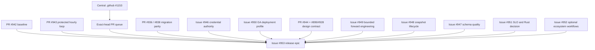

# Product and technical gap baseline

- **Snapshot date:** 2026-08-20
- **Repository:** `ContextualWisdomLab/pg-erd-cloud`
- **Protected-main evidence:** `8dc746920c12988f082e914879d95e13c9693535`
- **Open-PR evidence:** GitHub REST search returned **61** open pull requests; exact heads remain mutable.
- **Package evidence:** backend and frontend both declare version `0.1.0`.
- **Status:** broad pre-GA product; no commercial release candidate is proven by this document.
- **Purpose:** convert product, architecture, research, issue, PR, review, check, migration, design, and operability evidence into one executable completion backlog.

## Product boundary

pg-erd-cloud is a standalone PostgreSQL-focused ERD collaboration product. It accepts an authorized database connection, creates immutable schema snapshots asynchronously, renders and edits an ERD, stores project-scoped views and annotations, computes diffs and migration-risk evidence, and exports DDL, DBML, Mermaid, Prisma, data dictionaries, and reversing specifications.

It must remain independently runnable and consumable as a module by the CWL ecosystem. Authority is split deliberately:

- pg-erd-cloud owns ERD projects, membership, encrypted connection metadata, snapshots, views, annotations, sharing, API keys, migration-plan/run metadata, and its PostgreSQL job queue;
- `keyverse` or an external issuer owns identity and lifecycle provisioning;
- `clearfolio` owns document conversion and viewing;
- `contextual-orchestrator` owns model discovery, routing, fallback, orchestration, and LLM evaluation;
- `naruon` owns its PIM/knowledge-graph control plane and may consume explicit pg-erd-cloud evidence contracts;
- central `.github` owns reusable review, security, Strix, Noema, and merge-governance workflows.

The product must not silently become a general-purpose graph database, document viewer, identity provider, object store, or LLM gateway.

## Initial GA claim boundary

The first defensible release target is **`single_tenant_managed`**: one customer organization per deployment/database, project RBAC, OIDC organization binding, customer-controlled network/secrets/backup policy, and no cross-customer SaaS claim.

`multi_tenant_saas` is non-GA until issue #950 proves tenant authority on every persisted, queued, cached, exported, and connector object; database-enforced isolation; identity provisioning/deprovisioning; tenant-scoped encryption; backup/restore; residency; and adversarial cross-tenant tests.

Forward-engineering persistent apply is also non-GA until issue #949 closes. DDL export and execution-neutral planning may ship earlier only when the release notes state that persistent apply remains disabled.

## Current evidence map

| Area | Current evidence | What it proves | What remains unproved |
|---|---|---|---|
| Backend | `backend/app/api/`, `backend/app/pg_introspect/`, `backend/app/ddl/`, `backend/app/diff/`, `backend/app/spec/` | A broad standalone API and schema-analysis surface exists | Complete buyer E2E, support matrix, SLOs, and safe live apply |
| Persistence | `backend/app/models.py`, Alembic revisions, PR #936 and #838 | Core metadata is relational and migration drift is being addressed | Clean upgrade/downgrade evidence, full 3NF assessment, hot-partition plan |
| Background work | `backend/app/jobs/worker.py`, `job_queue`, `FOR UPDATE SKIP LOCKED`, optional Valkey wake-up | Long-running snapshot work is separated from HTTP requests | Fairness, partition rollover, back-pressure, restart/region recovery, large-schema capacity |
| Security | encrypted DSNs, target guards, OIDC/JWT work, API keys, CSRF/CORS/share controls | Multiple concrete trust boundaries exist | Auditable runtime secret authority, rotation/re-encryption, complete tenant claim, release security evidence |
| Frontend | React/Vite/React Flow, Vitest tests, PR #944 Storybook/token inventory | Core canvas, navigation, exports, accessibility, polling, and visual-token work are testable | Protected-main Storybook/browser E2E, full repeated-component inventory, large-graph virtualization |
| Forward engineering | exports/diffs plus the large execution-neutral stack in PR #834 | A sophisticated plan/dry-run/recovery foundation is being built | Bounded production consumer, sandbox lifecycle, approval, apply, convergence, recovery |
| Snapshot lifecycle | immutable payload and timestamped snapshots | Captures can be retained and compared | Promotion, valid/system time, derivation lineage, retention, legal hold, recovery workflow |
| Ecosystem | connector documentation and active LLM/Clearfolio work | Optional integration intent is explicit | Durable tenant/purpose contracts, failure UX, grounded verification, standalone contract tests |
| Design | live Figma files, `docs/ui-ux/`, PR #944, issues #899/#928 | Reviewed visual intent and a component-contract path exist | Merged Figma ↔ token ↔ Storybook ↔ production traceability |
| Governance | protected main, central ruleset, required checks, PR #943, issue #865 | Exact-head review/security/merge policy is explicit | A release-shaped queue and a reconciled Actions registry |
| Packaging | backend/frontend `0.1.0`, Docker/Compose profiles | Installable development and production-style profiles exist | Signed release, SBOM, provenance, reproducible artifacts, backup/restore rehearsal |

## Definition of product completion

A release may be called complete only when every applicable gate has immutable evidence, not merely a document or an old successful check.

| Gate | Required evidence |
|---|---|
| Buyer journey | Clean login → project → authorized connection → async snapshot → ERD work → diff/export → share/revoke → history → backup/restore browser/API E2E |
| Data integrity | ORM/migration parity, clean install/upgrade rehearsal, encrypted-DSN recovery, queue recovery, deterministic snapshot/export contracts |
| Security | Threat model, OIDC/JWT/CSRF/CORS/API-key/share/SSRF/TLS/secret tests, purpose/access controls, incident and rotation runbooks |
| Quality | Production statement and branch coverage 100%, public API/docstring coverage 100%, real PostgreSQL integration, property/fuzz and accessibility/i18n/UI action tests |
| Operability | Readiness/liveness, OpenTelemetry, SLI/SLO, dashboards, alerting, capacity, backup/restore, rollback/compensation, support matrix |
| UX/design | Figma authority, design tokens, Storybook inventory, keyboard/focus/zoom/forced-colors/reduced-motion, exact-value alternatives for graphs |
| Supply chain | Reproducible artifacts, dependency/action policy, SPDX/CycloneDX SBOM, SLSA v1.2 provenance, image digest, license notices, signed tag |
| Commercial truth | Versioned GA/beta/experimental claims, known limits, release notes, upgrade policy, security/support contacts, no unproved multi-tenant/apply claim |
| Ecosystem | Optional signed/versioned connectors with tenant/purpose/provenance/failure contracts; core product remains usable with every connector disabled |

## Executable gap and issue map

| Priority | Canonical issue/PR | Buyer-visible gap | Closure boundary |
|---|---|---|---|
| P0 | #953 | No coherent commercial release candidate across 61 open PRs | Exact-head release shaping, product/migration/backup/security/accessibility/operability evidence, version/tag/SBOM/provenance |
| P0 | #949 and PR #834 | Forward engineering stops before production apply authority and recovery | Decomposed plan → sandbox → preflight → approval → apply → convergence → recovery stack; persistent apply stays default-deny until complete |
| P0 | PR #936 / #838 | ORM and Alembic metadata can drift | Real PostgreSQL clean install, upgrade/downgrade rehearsal, deterministic no-drift contract, dependency order |
| P0 | #946 | Runtime configuration lacks one auditable secret lifecycle | Bootstrap-only transport, credential-provider contract, rotation/revocation, DSN re-encryption, standalone file provider |
| P0 | #950 | Project membership is not proof of multi-tenant SaaS isolation | Explicit single-tenant GA profile; database-enforced tenant authority before any SaaS claim |
| P0 | central `.github` #1153; target PRs #724/#745 | Bounded Strix context can create false or incomplete evidence | Merge canonical central repair, refresh immutable workflow pin, rerun affected exact heads |
| P1 | #948 | Snapshot timestamps/diffs are not a lifecycle | Bitemporal promotion, typed lineage, retention/legal hold, metadata recovery, provenance export |
| P1 | #947 | Schema quality is advisory and no hot-partition contract exists | Evidence-classified dependency/normalization assessment, waivers, workload-backed partition candidates |
| P1 | #951 | No enterprise capacity envelope or measured Rust boundary | Reproducible large-schema profiles, SLO/SLI, browser/backend traces, Rust only for proven hotspots |
| P1 | #952 | Clearfolio/contextual-orchestrator/naruon are not complete buyer workflows | Tenant/purpose-scoped durable connector receipts, grounded LLM verification, failure/retry/revocation UX, standalone fallback |
| P1 | PR #944, issues #899/#928 | Repeated web controls lack a merged executable design-system contract | Shared tokens, Storybook states, CSS/interaction/accessibility tests, Figma mapping |
| P1 | #865 | GitHub Actions registry advertises orphaned active workflow identities | Exact-main audit, safe disablement, immutable before/after ledger, central prevention |
| P2 | doctoring file and all issues above | Research and standards traceability is incomplete | APA 7 mapping from requirement → owner → contract → test → limitation; licensed artifacts are not copied unlawfully |

## Dependency order



Not every P1 item must block the first `single_tenant_managed` GA. Issue #953 must classify each item as `release_blocker`, `post_ga_committed`, `experimental`, or `not_planned`, with buyer-facing rationale. Core data integrity, secret safety, truthful deployment scope, backup/restore, operability, and release provenance cannot be deferred silently.

## Design authority

The visual source of intent is recorded in ADR-0002:

- **Figma File ID:** `csnpEEJfmqFWB0vNUoTkWA`
- **Supplemental Figma File ID:** `OTN0rBGtnVy0P7yq4Iv9Si`

Figma does not replace executable behavior. Storybook stories, shared tokens, component/accessibility tests, browser interaction tests, and production code are the executable contract. Screenshots are QA evidence only. Figma, Storybook, product requirements, implementation, tests, current PRs, and review findings must have explicit traceability.

## Current open PR inventory

The live REST query returned 61 open PRs. The heads below are a dated triage snapshot, not reusable merge evidence. PR #942 is self-referential and therefore records `self`; its final head must always be refetched after this document changes.

| PR | Captured exact head | Current purpose |
|---:|---|---|
| #944 | `d393bf655171fb31de0a8cc6c9517ba69aa3c9fc` | Storybook design-token inventory |
| #943 | `a968d54daf1ddd663b801628a7817f4c5bf459ba` | hourly PR review repair scheduler |
| #942 | `self` | product and technical gap baseline |
| #941 | `18a91beac732f2cf41f3971087adf76ad283318c` | API key hashing |
| #940 | `9fb1c3b221a066de4b5ccba6d474a9695683720d` | Snowflake constraint grouping |
| #939 | `3ca5db715db50ee01f061131c02f57e82493f85e` | ERD export handle validation |
| #938 | `dc50a22140c636ba9ca1f58bb8b769d1eb3ff33d` | MySQL introspection grouping |
| #936 | `5e73610f345535ce19f993561b728cfeb54f92e0` | ORM metadata and migration reconciliation |
| #933 | `ec54f20321b9caf5d7a29f84b4c608dd0f6f552d` | automatic column mapping |
| #930 | `aaffad0a8c126ce089e873d323cbc70797aef5e8` | required form-field indicators |
| #926 | `369d82c491d3e029bcaff80487fc5885d87d7c2d` | control-character schema rejection |
| #915 | `34e088c0a93928a9902a13a0e1b4ad3d8e544f03` | table-delete confirmation |
| #914 | `df336c0dec6177b5c67299591c789dcbdb555a33` | CodeQL analyze update |
| #913 | `d70622107200a998b36a761666f74ea2c70b5efd` | CodeQL init update |
| #912 | `802441e60f21769711d6bf93b8b797bd697fc7b3` | CodeQL autobuild update |
| #910 | `5c1412bf3ec1236b3de879345fca2bc724af2212` | jest-dom update |
| #909 | `d3faffdd5407892148939eb1e278fd9150de573c` | Snowflake connector update |
| #907 | `c6131676e4dfa79230e8ea4b61e8e8485d710552` | setuptools update |
| #906 | `3c6db17b4943508c384761716a0f7d19f9aed5b3` | SQLAlchemy update |
| #905 | `0070a2967b9dacf5f9033b62a530b65b638ff695` | Starlette update |
| #904 | `4a80d4ec41f818a74268cad86fa493fc0e292e0b` | Python image update |
| #903 | `3c7a574799bf7e6a3b5a6ee8a1066eaba15c87e1` | Prisma collision-free identifiers |
| #902 | `57ff32131c7a28d9d5ed146325a327c687b1ea49` | NVIDIA NIM OpenCode routing |
| #901 | `eeef7b7170a21e8f191482b6913f75356341c0ec` | business-group color radiogroup |
| #900 | `ed12e8d6e2ae75e4591827fe4315d4d7a53b9374` | adaptive LLM orchestration |
| #895 | `8436cb4b8ce7f5bdda897f8c13c2aa51ea9511e8` | JWT critical-header rejection |
| #894 | `f67f8888d917b27107f68d17f9b13f1ab429d7bf` | Prisma relation index |
| #890 | `a04935ded27fb4817a76682c3b6e01c63e03e32c` | authenticated project-list contract |
| #889 | `f7cd3c62c5ea69df3607481519264251d6d81510` | CodeQL backfill inputs |
| #888 | `6f47fe0f29135699101ac4179cb668acd8b423ca` | Valkey sentinel host contract |
| #887 | `d221ab7951047ec84c11bc5707faaf4571269909` | log-breaking identifier rejection |
| #886 | `c7a45292dbb6ad26f9d0cfef83bd9d5d9ecb1635` | current-user HTTP contract |
| #884 | `4499ab534ce3b3d7d09aa45a24565c165f24dde1` | ERD handle-array removal |
| #882 | `b924d0917e3ab4d2de674be4277d1634f03860db` | modal action ARIA labels |
| #881 | `5a8ce593bc8b94c89c4cab0b9af36784a0dd472a` | immutable search memoization |
| #874 | `a0c816003b13f4d6cb6f016ca739a9012e424dac` | DBML index evidence |
| #868 | `d9f1b9478492595937b7382f6876e0a4c134dda9` | server-local DSN rejection |
| #858 | `a34b35e59bf76d8b311be041e040f0f1148b63e3` | unavailable toolbar actions |
| #857 | `63424a49e4345f5f8305d85188d9a46349d407fe` | bounded Unity Catalog introspection |
| #856 | `322d543386c2658e563ae383780847f51f767fb9` | relationship-aware ERD layout |
| #855 | `b94eb617708782ccda5e5a3c199c749fbbf32a80` | OIDC organization binding |
| #850 | `682f107782bd7a9d5b5605de7d78402dc71cdd21` | ERD column-name resolution |
| #838 | `d5b52f80ca24480c0000d20d75b568ff9a62b9a4` | Alembic dependency update |
| #835 | `423564054a82e4158219cf56a9348652265e12da` | native form submission paths |
| #834 | `eebf6ddf8eb8403c5c67c2ce4c0c9dd27c79f8b9` | forward-engineering plan authority and execution-neutral foundation |
| #832 | `35c12f43a045040c7b10f527528039cd014a678d` | non-text multiline SQL rejection |
| #827 | `e99129920ba981ecd3a529451756489aaa3f7f5a` | concurrent pooler detection |
| #824 | `e34f69c2099d0e37cd04efe5b974515d0678476d` | live Figma and sharing architecture |
| #782 | `5057b01e0b1aaae3fab7852360dd4b99dd49b732` | PostgreSQL SYSTEM_USER naming |
| #774 | `20afa6790cf8191173639d98c23b549de64e8a23` | PostgreSQL identifier inference |
| #772 | `b6bf1d460c43d801b725f7e3600512c90588a02c` | dead relationship lookup removal |
| #768 | `03d637684658ed4f501ef7a0c9d7a101b5123e40` | missing-column rendering test |
| #745 | `7c8afef1fde51e6c5086aa342f008f7aadbf4796` | DSN secret redaction |
| #744 | `409343ce286f49b5a700200b6cca1a5d7e159f0c` | supported CORS methods |
| #738 | `43d594c9d955b273875c3234c02333439a819878` | diagram-data deflake |
| #737 | `8e58fc0867ab909d427724064daefa1397bac48e` | ecosystem names and review policy |
| #725 | `203dce1b0ad4e79e709ce0c796c457d065db4fae` | FastAPI and Redis lock synchronization |
| #724 | `dbc315867013fbf0481853039ec53d75e6101743` | trusted local PostgreSQL snapshot CLI |
| #723 | `2a65c8263d325c5e4fcef51d95ee57e411cf4e49` | saved-layout update contract |
| #704 | `5f10da2a4bf4b4db93762281a5886650b74887a3` | unavailable table-save accessibility |
| #698 | `00eb7938217eeae51ed12c7188c85b36e5414174` | unavailable export accessibility |

## Exact-head verification loop

1. Refetch protected `main`, the ruleset, and required contexts.
2. Refetch every PR exact head, mergeability, draft state, review submissions, unresolved threads, and all check runs.
3. Classify source-actionable failures separately from provider queue/limit/control-plane failures.
4. Repair only the current head. Do not transfer approval or check evidence from a predecessor SHA.
5. Run focused tests, then the full proof proportional to the change; include real PostgreSQL/browser evidence when the contract crosses those boundaries.
6. Push normally and refetch the new exact head. Do not force-push over concurrent agents.
7. Merge only through normal protected-branch semantics. Otherwise advance to the next eligible PR or product gap.
8. After each merge/closure wave, refresh this baseline, #953, CHANGELOG, and release scope.

Suggested evidence commands from a clean authenticated checkout:

```bash
gh api 'search/issues?q=repo:ContextualWisdomLab/pg-erd-cloud+is:pr+is:open&per_page=1'
gh api 'repos/ContextualWisdomLab/pg-erd-cloud/pulls?state=open&per_page=100'
gh api repos/ContextualWisdomLab/pg-erd-cloud/commits/<exact-head>/check-runs?per_page=100
gh api repos/ContextualWisdomLab/pg-erd-cloud/pulls/<number>/reviews?per_page=100
gh api repos/ContextualWisdomLab/pg-erd-cloud/pulls/<number>/comments?per_page=100
```

PR #943 is the repository's proposed hourly entry point into the central OpenCode review/fix loop. It cannot approve, bypass, or merge around the ruleset. After central `.github` #1153 merges, refresh the immutable reusable-workflow pin and rerun affected Strix heads.

## Release gate

No release candidate exists until all statements below are true at one protected-main commit:

- the intended code, migrations, docs, and release manifest are present;
- every remaining open PR is explicitly outside release scope or the in-scope queue is merged/closed with canonical rationale;
- required backend, frontend, coverage, security, Strix, OpenCode, dependency, filesystem/container, Scorecard, migration, and browser checks are terminal-success;
- zero valid unresolved review/security threads remain and qualifying independent approval exists;
- clean install, upgrade, backup/restore, queue recovery, real PostgreSQL, and buyer browser E2E pass;
- the selected deployment profile, supported dialects/versions, live-apply status, connector status, limits, and non-goals are stated truthfully;
- production coverage/docstring and frontend interaction/accessibility/i18n/design-token contracts meet organization policy;
- capacity/SLO evidence and incident/runbook coverage exist;
- version, CHANGELOG, signed tag, artifact hashes, image digest, SBOM, SLSA provenance, licenses, and rollback instructions identify the release;
- this baseline and `docs/doctoring/product-technical-gap-baseline.md` are refreshed from the final commit.

## Research and standards

See `docs/doctoring/product-technical-gap-baseline.md` for APA 7 references and requirement-to-decision traceability. A citation supports a decision; it does not close an implementation gap or establish certification.