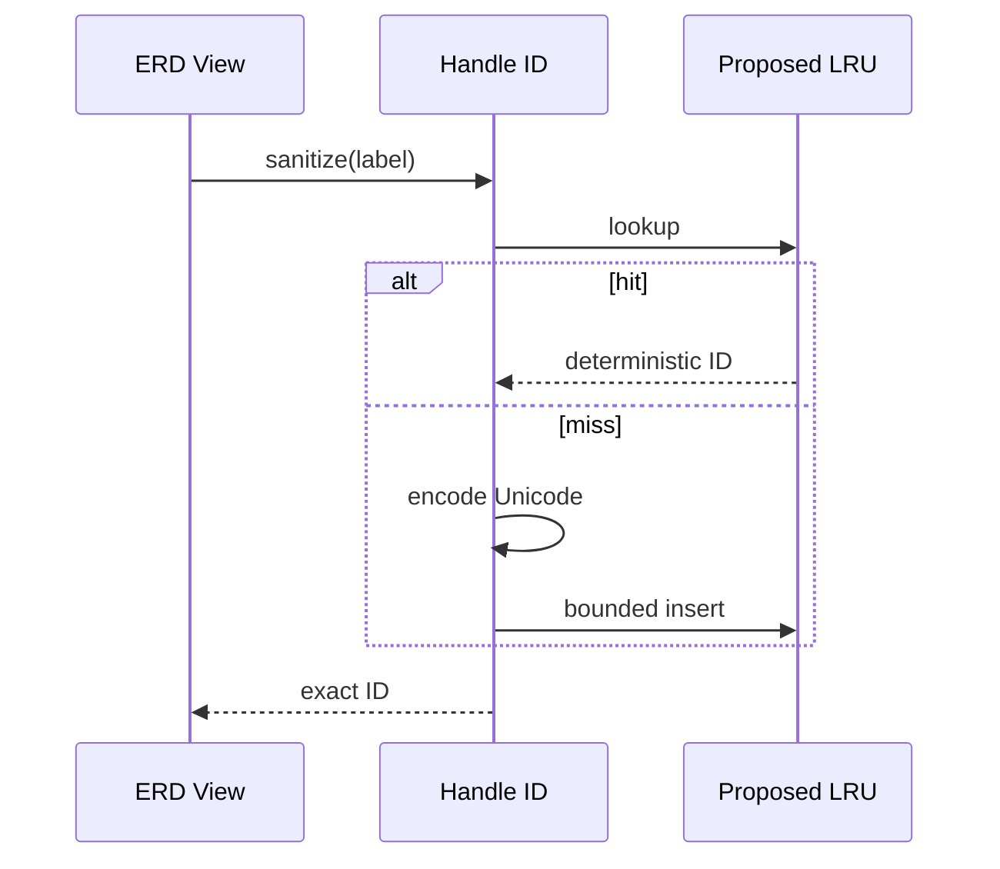

# Product–Technical Gap Baseline

Status: Proposed  
Evidence date: 2026-09-26  
Product PR: [#1222](https://github.com/ContextualWisdomLab/pg-erd-cloud/pull/1222)  
Source exact head before this document: `d4c057e95653980b19670237f8b53d21f8214920`

## PRD

Goal: keep ERD interaction and export responsive without changing deterministic handle identifiers, Unicode behavior, or graph semantics.

Scenes: an editor pans, zooms, resizes, reconnects, exports, and reloads a large ERD. Cache eviction, lifecycle changes, stale state, or Unicode input must not change identifiers or retain unbounded memory. Offline, permission, read-only, stale, conflict, retry, and busy states require a structured table/list alternative.

## TRD

The proposed implementation places a bounded LRU inside `sanitizeHandleId`. It is not accepted performance architecture. Compare it with no cache and simpler caller-level/native memoization on the real React Flow render and export paths.

Record hardware/runtime, dataset shape, warm-up, sample size, failure denominator, cache hit/miss/eviction rate, retained heap, median, p95, and lifecycle cleanup. Functional tests alone do not establish a performance gain.

## Context Map

- **ERD Editor:** owns interaction, deterministic handle IDs, import/export, persistence, recovery.
- **React Flow:** external rendering boundary behind the product adapter.
- **Browser Runtime:** heap, GC, main-thread, layout, paint, pointer/touch/keyboard.
- **Translation Authority:** supplies ko/en/ja/zh/vi/es/de/fr screen strings; ontology labels remain separate.

## UML

## ERD

No persistent entity is added. Cache entries are ephemeral `source_text -> sanitized_handle_id` pairs, never domain truth or export data, and must be discardable without changing persisted ERDs.

## Exact-head acceptance matrix

| Dimension | Current evidence | Merge acceptance | Status |
|---|---|---|---|
| Determinism | Focused tests exist | Same exact ID with cache off/on and after reload/export | FAIL |
| Unicode/collision | Partial tests | Astral, combining, RTL, empty, long, collision fixtures | FAIL |
| Semantics | Production diff | Cache state never becomes domain truth | PROPOSED |
| Accessibility | None current | WCAG 2.2 AA; pointer/touch/keyboard; reduced motion; AT | FAIL |
| Responsive | None current | 320/768/desktop and intermediate widths | FAIL |
| Locales | None current | ko/en/ja/zh/vi/es/de/fr wrapping/font fallback | FAIL |
| Performance | Unmeasured | Real render/export median+p95, heap/GC, hit/miss/eviction | FAIL |
| Large data | None current | Representative small/median/large ERDs | FAIL |
| Import/export | None current | Exact IDs and graph equivalence after round trip | FAIL |
| Recovery | None current | reload/crash/rollback/stale/conflict/retry cleanup | FAIL |
| Dependency | +1,660 lockfile lines | Justify or ordinary-forward remove unrelated delta | FAIL |
| Hosted validation | Not GREEN | exact-head CI/security/SBOM/provenance and approval | FAIL |

## Gap and action

| Gap | Action | Owner | Status |
|---|---|---|---|
| Unsupported performance claim | Reproducible real-path benchmark | pg-erd-cloud | Proposed |
| Hand-rolled LRU complexity | Compare no-cache/caller/native alternatives | pg-erd-cloud | Proposed |
| Lifecycle risk | Retained-heap and cleanup contract | pg-erd-cloud | Proposed |
| Lockfile expansion | Explain dependency graph or remove delta | dependency owner | Proposed |
| Missing UX evidence | Browser/AT/responsive/8-locale matrix | pg-erd-cloud | Proposed |

## Decision

Keep #1222 Draft. Preserve valid source and tests while rejecting unmeasured performance claims. Accept only after this exact-head matrix is GREEN; otherwise retain a feature boundary or remove the cache with an ordinary-forward commit.
