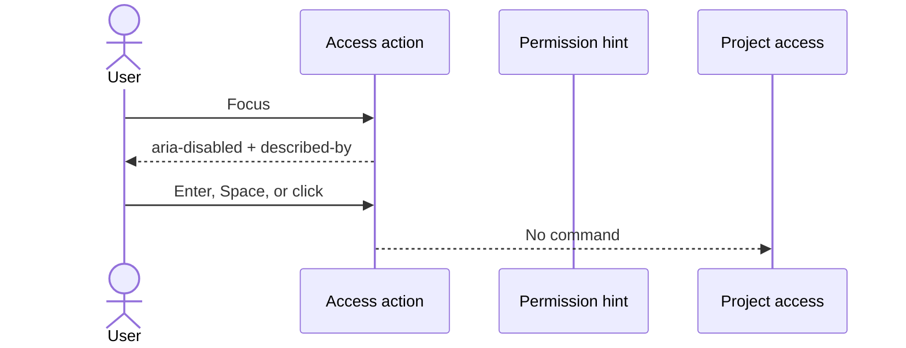

# Product Technical Gap Baseline

Status: Proposed
Canonical owner: `ContextualWisdomLab/pg-erd-cloud`
Tracked change: [PR #1153](https://github.com/ContextualWisdomLab/pg-erd-cloud/pull/1153)
Evidence ancestor: `825246d7e21c5b412c1d880e2d5ea39a4e3320ff`

## Goal / PRD

A user who cannot manage share access must be able to focus the unavailable action, read why it is unavailable, and activate it without any side effect. The visual treatment must remain recognizably disabled without hiding the guidance from keyboard or assistive-technology users.

## Technical requirements / TRD

- The product-owned `ExportModal` keeps the access action in the tab order with `aria-disabled="true"`.
- `aria-describedby` binds the action to the exact project-permission guidance.
- Pointer and keyboard-generated activation are inert and do not bubble to modal ancestors.
- Component-scoped CSS preserves the existing disabled opacity, cursor, muted surface, and text tokens.
- Native export actions retain their existing `disabled` semantics; this exception applies only to discoverable guidance.
- No presentation state creates or mutates project-access domain truth.

## UML interaction

```mermaid
sequenceDiagram
    actor User
    participant Button as Access action
    participant Hint as Permission hint
    participant Domain as Project access
    User->>Button: Focus
    Button-->>User: aria-disabled + described-by
    User->>Button: Enter, Space, or click
    Button-->>Domain: No command
```

## ERD impact

None. This proposal changes presentation semantics only. Project, membership, and permission records remain owned by the existing access-control domain and API.

## Context Map

- **Export presentation:** owns focus, accessible description, inert activation, and disabled visual state.
- **Project access control:** owns authorization truth and any future management API.
- **Boundary:** the modal may explain the unavailable capability but must not synthesize permission or replace domain state with a presentation DTO.

## Exact-head acceptance matrix

| Concern | Current evidence | Gate |
|---|---|---|
| Determinism | Focused component test fixes exact name, description ID, state, and cancelled click | Source PASS |
| Semantics | `aria-disabled` remains focusable; no access command exists on this control | Source PASS |
| Accessibility | Label/description/focus and component-scoped visual state are tested; real AT replay absent | Partial |
| Pointer/touch/keyboard | Click cancellation is tested; real pointer, touch, Enter, Space and focus-visible replay absent | FAIL |
| Responsive | 320/768/desktop screenshots absent | FAIL |
| Locales | ko exists; en/ja/zh/vi/es/de/fr wrapping and fallback evidence absent | FAIL |
| Loading/empty/error/offline/permission/read-only/stale/conflict/retry/busy | Permission/read-only guidance is represented; remaining states need applicability decisions | Partial |
| CTA to API | Intentional no-op is bounded; a future management CTA requires a released access-control API | PASS for no-op |
| Large-data performance | Not applicable to this single control; modal render median/p95 is unmeasured | N/A / Open |
| Import/export and recovery | Export actions are unchanged; focus/reload recovery and rollback evidence absent | FAIL |

## Gap / Action / status

| Gap | Action | Status |
|---|---|---|
| Real-browser semantics | Chromium, Firefox, WebKit pointer and keyboard replay; verify exact accessibility tree | Open |
| Touch and motion | Verify 44px target, touch cancellation, and reduced-motion applicability | Open |
| Responsive | Capture 320px, 768px, and desktop normal/focus/disabled states | Open |
| Eight locales | Provide versioned ko/en/ja/zh/vi/es/de/fr resources and wrapping/CJK/expansion evidence | Open |
| Recovery | Verify close/reopen, reload, focus restoration, and concurrent permission change | Open |
| Approval and checks | Require current-head required checks and independent approval | Open |

Do not mark this PR merge-ready until every applicable FAIL is repaired or explicitly bounded by an accepted decision.
