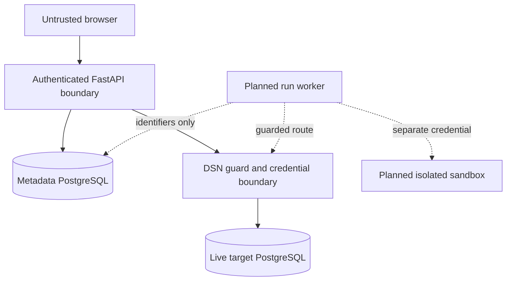

# Forward Engineering Threat Model

- **Threat-model status:** Active design review
- **Runtime status:** Partially implemented; production apply workflow is not ready
- **Scope:** PostgreSQL 14–18 model, plan, dry-run, apply, and convergence path
- **Last reconciled with the working tree:** 2026-08-09

This document evaluates the accepted forward-engineering workflow, not a claim
of certification against any external standard. Status labels are normative:
**Implemented**, **Partially implemented**, **Planned**, and **Rejected**.

## Security objectives

1. An untrusted browser cannot turn model input into arbitrary target SQL.
2. A user cannot read or mutate another project's model, plan, connection, run,
   or evidence by guessing an identifier.
3. A plan cannot execute against a different revision, project, connection,
   snapshot, target fingerprint, or compiler contract than the reviewed one.
4. Dry run causes no DDL, lock, scan, or rewrite on the production target.
5. Live DDL requires distinct deployer authority and evidence-bound,
   plan-specific intent.
6. A worker failure or ambiguous commit never causes automatic DDL replay.
7. Success means a persisted verification snapshot equals the approved target
   digest; a commit acknowledgement alone is insufficient.
8. DSNs, decrypted credentials, raw SQL batches, and sampled row values do not
   cross into browser, queue, event, metric, or diagnostic payloads.

## Assets and impact

| Asset | Required property | Representative impact if lost |
|---|---|---|
| Target schema and stored data | Integrity, availability, recoverability | Data loss, invalid application behavior, prolonged blocking or outage |
| Target credentials | Confidentiality, least privilege, rotation | Unauthorized introspection or DDL on every reachable database |
| Canonical model revisions | Integrity, provenance, tenant isolation | Review/apply mismatch or attacker-controlled desired state |
| Immutable migration plans and digests | Integrity, authenticity, expiry | Executing different SQL or risk than the deployer reviewed |
| Dry-run, approval, and preflight evidence | Integrity, freshness, non-replay | Unsafe apply accepted using stale or fabricated evidence |
| Run state and audit events | Durability, ordering, accurate outcome | Duplicate apply or false success/rollback claim |
| Metadata PostgreSQL | Confidentiality, integrity, availability | Cross-project leakage, workflow outage, loss of provenance |
| Browser and API session | Authentication, CSRF resistance | Actions attributed to the wrong actor |

## Trust boundaries

| Boundary | Inputs crossing it | Current or target rule | Status |
|---|---|---|---|
| Browser → API | Model JSON, UUIDs, digests, `If-Match`, CSRF token, confirmations | Treat every field as untrusted; authorize server-side; never accept replacement execution SQL on the graphical path. | Partially implemented |
| API → metadata database | Canonical JSON, digests, actor/tenant IDs, encrypted DSN | Parameterized ORM access; project binding; append-only revision/plan convention. Database immutability enforcement remains absent. | Partially implemented |
| API/worker → credential boundary | Connection UUID | Decrypt DSN only in process memory after authorization; redact failures. | Implemented for current connection/snapshot/legacy paths |
| Credential boundary → live target | Pinned validated IP, optional verified-hostname TLS, introspection or DDL | Configured host allowlist and restricted-range rejection; PostgreSQL 14–18 CI proves a separate ephemeral preflight login lacks database CREATE/TEMP and is denied DDL. Deployed workers still require independently managed read-only preflight and execution identities. | Partially implemented |
| Worker → sandbox | Exact stored structured plan and compatible schema closure | No production credential or route; disposable lifecycle; re-introspect and require target digest. | Partial execution core with dedicated ephemeral integration database; worker, closure service, deployed route isolation, and lifecycle Planned |
| API → outbox → queue → worker | Run identity | `migration_run_dispatch` is an identifier-only transactional outbox; due-order lock-scoped claim, opt-in scheduled dedicated-key publication of only `migration_run_uuid`, exact-attempt publish CAS, rollback on failure, fixed non-secret logging, cooperative relay shutdown, monotonic exact-token lease renewal plus ready/processing primitives, and an execution-neutral consumer contract are implemented. The future worker reloads and verifies the stored plan and owns automatic heartbeat. | Outbox persistence/claim/scheduled publisher/signal lease/consumer contract Implemented; application consumer wiring/worker and deployment failover Planned |
| Worker → browser/log/metrics | Bounded state and evidence | Identifiers, hashes, counts, durations, classified diagnostics only. | Run evidence canonicalization and verified polling Implemented; worker/log integration Planned |

## Threat actors and assumptions

- An authenticated viewer, editor, or deployer may be malicious or may make a
  destructive mistake.
- A browser, extension, or intercepted request may alter UUIDs, hashes, model
  fields, confirmations, or SQL preview text.
- A target hostname or DNS answer may attempt SSRF, DNS rebinding, or TLS name
  confusion.
- A target database may be slow, adversarial, drift concurrently, or expose
  surprising catalog constructs.
- A worker may crash before a transaction, during execution, after commit but
  before acknowledgement, or during verification.
- External database writers do not honor pg-erd-cloud advisory locks.
- The metadata database, application process, sandbox, and live target are
  separate failure and privilege domains in the target deployment.

Compromise of the application host or `APP_SECRET` is not contained by the
current at-rest DSN encryption, because decryption authority runs in the same
application trust domain. Key separation or an external secret manager is a
future hardening opportunity, not an implemented guarantee.

## Abuse cases, controls, and residual risk

| ID | Abuse case | Current control | Target control / decision | Status and residual risk |
|---|---|---|---|---|
| TM-01 | Inject SQL through a model identifier, type, default, or unknown field. | Canonicalizer enforces identifier/type bounds, rejects defaults and unknown fields; compiler quotes identifiers server-side; live-preflight accepts only three structured query kinds and prepares each server-owned query before reading boolean evidence. Hostile type/default tests exist. | Executor dispatches known structured operation kinds and version; it never executes browser text. | **Partially implemented:** compiler and read-only preflight boundaries exist; apply executor compatibility enforcement is Planned. |
| TM-02 | Send arbitrary SQL directly from the browser. | Legacy `apply-sql` parses a small ASCII, unquoted snake-case DDL allowlist and requires deployer for persistent apply. | Browser-authored SQL is **Rejected** on the model-to-apply path; only a stored server plan is executable. | **High residual risk:** the transitional endpoint still exists, has no plan/dry-run/evidence binding, and must be separately gated and retired. |
| TM-03 | Treat rollback-on-production as a safe dry run. | Legacy endpoint defaults to a transaction that rolls back. The forward preflight primitive accepts only three structured boolean reads and opens a read-only transaction, but is not worker-wired. | **Rejected:** exact DDL runs only in an isolated sandbox; live dry-run work is read-only. | **High residual risk until complete:** rollback can still lock, scan, rewrite, exhaust resources, or trigger external effects; sandbox and independently constrained live worker remain absent. |
| TM-04 | Cross-project IDOR using model, plan, connection, or snapshot UUIDs. | Membership checks and uniform 404 masking exist on current model/plan/connection/run-polling paths; binding rejects mismatched project/connection/snapshot inputs. | Apply the same masking and binding to every future run mutation/evidence route. | **Partially implemented:** focused route tests exist, but create/cancel/apply and the full HTTP integration matrix do not. |
| TM-05 | An editor self-authorizes production DDL. | Role order is `viewer < editor < deployer < owner`; persistent legacy apply requires deployer. | Apply requires deployer plus exact passed dry run, typed target name, plan digest, and separate destructive acknowledgement. | **Partially implemented:** capability split exists; evidence-bound approval is Planned. |
| TM-06 | Reuse approval after model edit, plan expiry, or target drift. | Revisions use `If-Match`; plans bind revision, target, base snapshot/digests and store 24-hour expiry; the internal idempotent dry-run writer rejects expired/tampered plans; terminal preflight CAS revalidates plan integrity, requires the canonical observed digest, persists it, rejects match/outcome contradictions, and rejects worker-authored aliases of the reserved digest evidence field. | Expose authorized worker capture; bind the fresh target connection/attempt; re-introspect immediately before execution; acquire deterministic locks and repeat data preconditions. | **High residual risk:** fresh worker capture/connection binding, apply-time fingerprint revalidation, and lock service do not exist. |
| TM-07 | Silently omit an unsupported object and apply a partial schema. | Snapshot adapter and canonicalizer reject unsupported constructs; a blocker makes executable `statements` empty. Supported deltas remain only as `proposed_statements`, and their risk still appears in `risk_summary`. | Executor rejects blocked plans and never promotes proposals; a real PostgreSQL corpus proves complete dependency detection for every admitted construct. | **Partially implemented:** compiler proposal/blocker fixtures exist; realistic and adversarial catalog integration coverage and executor enforcement remain release gates. |
| TM-08 | SSRF or DNS rebinding through a stored DSN. | Host allowlist is mandatory; loopback/private/link-local/reserved targets are rejected; resolved IPs are pinned into the connection. Query `host`/`hostaddr` values are also validated. | Revalidate for every new connection and worker path; network egress policy restricts reachable targets. | **Partially implemented:** application guard is tested; deployment-level egress evidence is absent. |
| TM-09 | Intercept credentials or connect to the wrong TLS peer. | DSN is AES-GCM encrypted at rest and decrypted in memory. `sslmode=verify-full` uses verified hostname context. | Require an approved TLS policy per environment and separate sandbox/live credentials. | **Residual risk:** verified TLS is conditional on DSN configuration; key authority is co-located with the app. |
| TM-10 | Exfiltrate DSN or row data through errors, logs, events, or metrics. | DSN-derived error redaction and fuzz/property tests exist; run evidence recursively rejects SQL/credential field names and PostgreSQL connection-string values; `migration_run_dispatch` has no payload column; the dedicated ready queue receives only the run UUID while the exact lease-token is isolated in processing metadata; the execution-neutral consumer replaces handler exceptions with a fixed code; the generic durable worker persists fixed failure codes instead of exception text or unknown job-type values; the live-preflight primitive returns only boolean check outcomes or canonical digests and replaces transaction creation/start, query, commit, and rollback-cleanup exceptions with one fixed message without chaining driver detail. | Queues prohibit secrets, SQL batches, and row values; handler-specific evidence and worker log review tests enforce bounds. | **Partially implemented:** identifier-only outbox/publisher/signal lease/consumer-contract primitives, run storage/polling, generic worker failure-storage boundaries, and execution-neutral preflight result sanitization exist; application migration consumer wiring/worker/metrics paths remain Planned. |
| TM-11 | Exhaust API, metadata storage, sandbox capacity, or target locks. | API rate limiting exists; model payload is capped at 2 MiB; plan is capped at 1,000 statements and 4 MiB; live preflight caps reads at 1,000 and applies a parameter-bound transaction-local statement timeout plus a client timeout; legacy SQL is capped at 25 statements/256 KiB. | Per-project run quotas, sandbox admission control, bounded lock/statement/transaction timeouts, and operator kill switch. | **Partially implemented:** preflight query/statement timeout bounds exist; run quotas, worker transaction/lock timeouts, target lock bounds, and kill switch are Planned. |
| TM-12 | Duplicate apply after queue retry or an uncertain commit. | No structured apply worker exists. | Durable idempotency, compare-and-swap states, no automatic replay after `applying`, and reconciliation by re-introspection. | **Planned release blocker.** `outcome_unknown` requires operator handling. |
| TM-13 | Forge, reorder, or erase audit evidence. | Sequenced run events carry a versioned predecessor digest; the run anchors the latest digest; CAS writers and polling verify the canonical chain and fail closed on partial mutation. | Add retention protection and an independently anchored or signed audit sink for resistance to full metadata-database rewrite. | **Partially implemented:** in-database tamper evidence exists; privileged full-history rewrite and deletion remain residual risks. |
| TM-14 | Misrepresent commit or verification failure as success. | Plan compilation does not claim execution success. | Only a persisted verification snapshot equal to `target_digest` yields `verified`; all other terminal states use distinct UI semantics. | **Planned release blocker.** |
| TM-15 | Bypass controls through unsupported MySQL/Snowflake or non-transactional DDL. | Forward compiler is PostgreSQL 14–18 only and rejects unsupported model features. | MySQL/Snowflake live apply and non-transactional v1 operations remain **Rejected**. | **Residual risk:** every future compiler version needs a new compatibility and recovery review. |

## Authorization and approval requirements

| Action | Minimum role | Additional evidence | Status |
|---|---|---|---|
| Read model/current plan | Project member | Uniform cross-project 404 | Partially implemented |
| Create or revise model | Editor | Valid model; strong revision-UUID `ETag` in `If-Match` | Implemented |
| Compile a plan | Editor | Exact revision, same-project target and succeeded snapshot captured from that target | Implemented |
| Queue dry-run intent | Editor | Unexpired plan, exact digest, bounded idempotency key | Implemented; no worker authority |
| Execute isolated dry run | Worker identity | Queued intent, governed sandbox, compatible PostgreSQL version | Partial execution core only; worker-governed invocation Planned |
| Request live apply | Deployer | Matching passed dry run, exact plan/digest/revision, typed connection name, and destructive acknowledgement when applicable | Planned |
| Persistent legacy `apply-sql` | Deployer | Conservative SQL parser only | Implemented transitional; not accepted target authority |

The security-sensitive legacy apply endpoint resolves connection membership and
role from the primary metadata session; a lagging read replica is never an
authorization source for live DDL.

Frontend visibility is never authorization. Mutations retain the repository's
authentication, credentialed CORS, and CSRF boundary. The `If-Match` header is
included in the current CORS allowlist and `ETag` is exposed to browser clients.

## Threat-driven release gates

Production enablement remains denied until all of the following are evidenced:

- Real PostgreSQL 14–18 integration fixtures demonstrate lossless admitted
  snapshot conversion and fail-closed dependency detection.
- The browser cannot submit execution SQL; plan/run requests bind exact
  identifiers and digests, and the worker reloads immutable state.
- Sandbox and live-target credentials, routes, and database privileges are
  independently verified; live preflight is technically incapable of DDL.
- Drift, expiry, IDOR, CSRF, role, tamper, destructive-confirmation,
  double-submit, and cancellation tests produce no unauthorized DDL.
- Fault injection before execution, before commit, after commit, and during
  verification produces the specified terminal state without automatic replay.
- Operational limits, alerts, kill switch, evidence retention, and the
  [forward-engineering runbook](../runbooks/forward-engineering.md) are exercised
  in a non-production environment.
- The legacy persistent apply route is disabled for the product workflow and
  has an explicit retirement decision.

## Residual risk ownership

No current document accepts production data-loss, unbounded blocking, stale
apply, automatic replay, or false verification risk. Until the gates above are
closed, forward engineering remains **Partially implemented** and disabled as a
production-safe workflow. Any exception requires a new ADR naming the owner,
scope, expiry, detection, containment, and recovery evidence.

## Related authority

- [Architecture](../../ARCHITECTURE.md)
- [Forward-engineering v1 contract](../contracts/forward-engineering-v1.md)
- [UML and state machines](../UML.md)
- [Data model](../DATA_MODEL.md)
- [ADR index](../adr/README.md)
- [Test strategy](../TEST_STRATEGY.md)
- [Operational runbook](../runbooks/forward-engineering.md)
